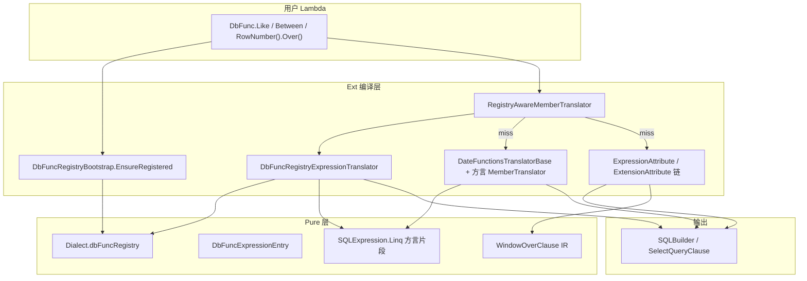
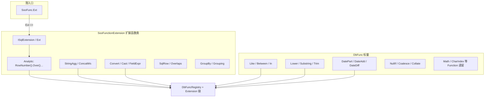
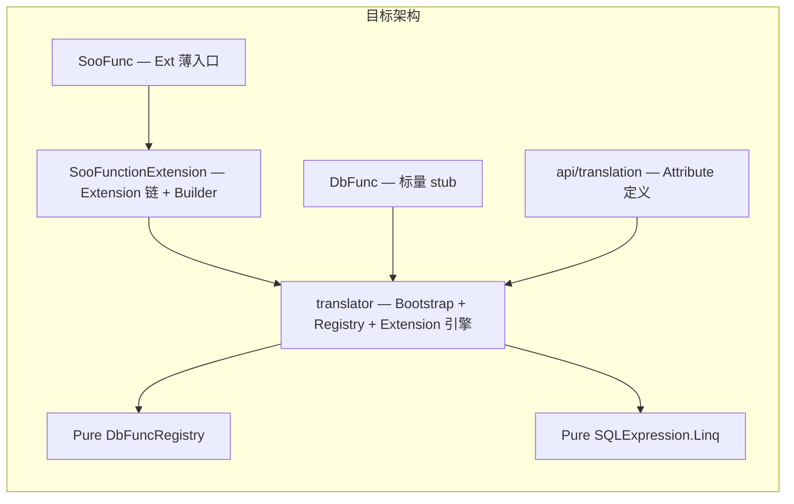

# DbFunc 功能结构分析与清理融合计划

## 1. 总体架构（当前状态）

DbFunc 是 Ext LINQ 在 Lambda 中使用的**数据库函数静态 API**（对标 EF.Functions / SqlSugar.SqlFunc），处于 **Phase D/E 已完成、Phase F 进行中** 的去 linq2db 迁移阶段。



**三层职责边界**（已落地）：

| 层 | 路径 | 职责 |
|----|------|------|
| **Pure 存储 + 方言 SQL** | [`pure/src/ado/translation/`](pure/src/ado/translation/)、[`pure/src/ado/data/dialect/SQLExpression.Linq.cs`](pure/src/ado/data/dialect/SQLExpression.Linq.cs) | `DbFuncRegistry`、`DbFuncExpressionEntry`、各方言 SQL 片段、`WindowOverClause` |
| **Ext 公开 API** | [`ext/src/linq/src/api/dbfunc/`](ext/src/linq/src/api/dbfunc/) | `DbFunc` partial 方法体（客户端 stub / throw） |
| **Ext 属性 + 运行时引擎** | [`ext/src/linq/src/api/translation/`](ext/src/linq/src/api/translation/) | `[Expression]`/`[Extension]`/`[Function]` 定义 + Extension 链编译引擎 |
| **Ext 注册 + 翻译** | [`ext/src/linq/translator/`](ext/src/linq/translator/) | Bootstrap、Registry 翻译器、MemberTranslator 装饰 |
| **Ext 方言 override** | [`ext/src/provides/dialect/*Express.cs`](ext/src/provides/dialect/) | 覆盖 `datePart*`/`dateDiff*`/`collate` 等 |

**Fast LINQ**（`pure/src/linq`）**不使用** DbFuncRegistry，仅 Ext LINQ（`useQueryable`）走此路径。

### 1.1 目标三类分工（用户确认）

| 类 | 职责 | 翻译路径 | 目录 |
|----|------|----------|------|
| **`DbFunc`** | 标量 / 谓词 / 遗留 `[Function]` | registry-first 为主 | `api/dbfunc/`（瘦身） |
| **`SooFunc`** | 函数族**薄入口**（`Ext` 转发、可选 registry 头别名） | 委托至 `SooFunctionExtension` | `api/soofunc/SooFunc.cs` |
| **`SooFunctionExtension`** | 类型 B **Extension 链**全部实现（Analytic Over、StringAgg、Convert、Row、GroupBy） | `[SooFunctionExtension.Extension]` Token 链 | `api/soofunc/SooFunctionExtension.*.cs` |

命名与现有 `SooQuery`、`SooRepository` 一致；**Extension 链与标量/入口分离**，避免 `SooFunc` 膨胀。



**用户调用约定**：

```csharp
// 推荐 — 入口 SooFunc，链式实现在 SooFunctionExtension
SooFunc.Ext!.RowNumber().Over().OrderBy(x => x.Id).ToValue()
// RowNumber/Over/OrderBy 为 SooFunctionExtension 上的 extension 方法

// 标量 — 仍用 DbFunc
.Where(o => DbFunc.Like(o.Name, "%x%"))
```

**类结构示意**：

```csharp
// SooFunc.cs — 仅入口，无 Extension 实现
public static partial class SooFunc
{
    public static SooFunctionExtension.ISqlExtension? Ext
        => SooFunctionExtension.Ext;
}

// SooFunctionExtension.cs — Extension 基础设施 + partial 根
public static partial class SooFunctionExtension
{
    public interface ISqlExtension { }
    public static ISqlExtension? Ext => null;
    // ISqExtensionBuilder、IExtensionCallBuilder、AggregateModifier 等 enum
}

// SooFunctionExtension.Analytic.cs — 原 AnalyticFunctions 全部方法
public static partial class SooFunctionExtension
{
    public static IAggregateFunctionSelfContained<int> Count(this ISqlExtension? ext, ...) { ... }
    public static IAnalyticFunctionSelfContainedWithoutWindow<int> RowNumber(this ISqlExtension? ext) { ... }
    // Over / PartitionBy / OrderBy 接口与 extension 方法
}

// SooFunctionExtension.Aggregate.cs — 原 StringAggregateExtensions
public static partial class SooFunctionExtension { /* OrderBy/ThenBy/ToValue 链 */ }
```

---

## 2. 代码分布统计

### 2.1 `api/dbfunc/` — 14 个文件（canonical 目录名，Windows 上 `DbFunc`/`dbfunc` 为同一路径）

| 文件 | 行数 | 内容 |
|------|------|------|
| [`DbFunc.cs`](ext/src/linq/src/api/dbfunc/DbFunc.cs) | ~1490 | 主 partial：Common、String、Math、DateTime、GroupBy、Collate、Types 等 |
| [`DbFunc.Analytic.cs`](ext/src/linq/src/api/dbfunc/DbFunc.Analytic.cs) | ~1254 | `AnalyticFunctions` + Over 链接口/Builder |
| [`DbFunc.Row.generated.cs`](ext/src/linq/src/api/dbfunc/DbFunc.Row.generated.cs) | ~1010 | T4 生成 `SqlRow<T1..T10>` |
| [`DbFunc.Expressions.cs`](ext/src/linq/src/api/dbfunc/DbFunc.Expressions.cs) | ~594 | Convert/Cast/FieldExpr 链 |
| [`DbFunc.Strings.cs`](ext/src/linq/src/api/dbfunc/DbFunc.Strings.cs) | ~294 | StringAgg/ConcatWs + 多方言 Builder |
| [`DbFunc.Aggregate.cs`](ext/src/linq/src/api/dbfunc/DbFunc.Aggregate.cs) | ~172 | `StringAggregateExtensions` OrderBy 链 |
| [`DbFunc.DateTime.cs`](ext/src/linq/src/api/dbfunc/DbFunc.DateTime.cs) | ~142 | DatePart/DateAdd/DateDiff overload |
| [`DbFunc.TableID.cs`](ext/src/linq/src/api/dbfunc/DbFunc.TableID.cs) | ~87 | TableAlias/TableName |
| 其余 | 小 | `DateOnly`/`DateTimeOffset`、`Row.cs`/`Row.tt`、文档 |

**已删除的 stub**（R18–R22）：`Between.cs`、`Collate.cs`、`Types.cs`、`Ordinal.cs` 等 — 逻辑已合并进 `DbFunc.cs`；**`GroupBy` 将迁出至 `SooFunctionExtension`**。

### 2.1b `api/soofunc/` — 目标目录（新建）

| 源文件 | 目标文件 | 迁出内容 | 目标类 |
|--------|----------|----------|--------|
| — | **`SooFunc.cs`** | 仅 `Ext` 入口转发 | `SooFunc` |
| `DbFunc.Analytic.cs` | **`SooFunctionExtension.Analytic.cs`** | 原 `AnalyticFunctions` 全部方法、Over 接口、窗口 Builder、enum | `SooFunctionExtension` partial |
| `DbFunc.Strings.cs` | **`SooFunctionExtension.Strings.cs`** | StringAgg/ConcatWs/Median + 多方言 Builder | 同上 |
| `DbFunc.Aggregate.cs` | **`SooFunctionExtension.Aggregate.cs`** | 原 `StringAggregateExtensions`（OrderBy/ThenBy 链） | 同上 |
| `DbFunc.Expressions.cs` | **`SooFunctionExtension.Expressions.cs`** | Convert/Cast/FieldExpr Builder | 同上 |
| `DbFunc.Row.*` | **`SooFunctionExtension.Row.*`** | T4 `SqlRow<T>`、`Row()`、`Overlaps` | 同上 |
| `DbFunc.cs` #GroupBy | **`SooFunctionExtension.GroupBy.cs`** | `IGroupBy`、`Grouping()` | 同上 |
| `ExtensionAttribute.cs`（部分） | **`SooFunctionExtension.cs`** + `translation/` | `ISqlExtension`、`Ext`、`ISqExtensionBuilder`、`IExtensionCallBuilder` | `SooFunctionExtension` partial |

**原独立扩展类归并规则**：

| 原类名 | 迁后形态 |
|--------|----------|
| `AnalyticFunctions` | 删除独立类；方法并入 **`SooFunctionExtension` partial**（`SooFunctionExtension.Analytic.cs`） |
| `StringAggregateExtensions` | 删除独立类；OrderBy 链并入 **`SooFunctionExtension` partial**（`Aggregate.cs`） |

**保留在 `DbFunc` 的文件**（迁出后）：

| 文件 | 保留内容 |
|------|----------|
| `DbFunc.cs` | Common、String 标量、Math、DateTime GetDate、Types、Collate、Between/Like/NullIf 等 |
| `DbFunc.DateTime*.cs` | DatePart/DateAdd/DateDiff overload |
| `DbFunc.TableID.cs` | TableAlias/TableName（SQL 元数据，非函数族） |

### 2.2 `api/translation/` — 11 个文件

| 文件 | 行数 | 性质 |
|------|------|------|
| [`DbFunc.ExtensionAttribute.cs`](ext/src/linq/src/api/translation/DbFunc.ExtensionAttribute.cs) | **~1131** | **混合体**：属性定义 + `GetExtensionAttributes` + `BuildSqlExpression` 运行时引擎 + `ExtensionBuilderExtensions` |
| [`DbFunc.ExpressionAttribute.cs`](ext/src/linq/src/api/translation/DbFunc.ExpressionAttribute.cs) | ~583 | Expression 模板翻译 |
| 其余 9 个 | 小 | Function/Property/Enum/Table* 属性、`IsNullableType`、`DbFuncExpressionAttribute` 别名 |

### 2.3 `translator/` — DbFunc 相关 4 个核心文件

- [`DbFuncRegistryBootstrap.cs`](ext/src/linq/translator/DbFuncRegistryBootstrap.cs) — **唯一** `registry.Register` 入口
- [`DbFuncRegistryExpressionTranslator.cs`](ext/src/linq/translator/DbFuncRegistryExpressionTranslator.cs) — registry 运行时翻译
- [`RegistryAwareMemberTranslator.cs`](ext/src/linq/translator/RegistryAwareMemberTranslator.cs) — registry-first 装饰器
- [`DateSqlTemplateResolver.cs`](ext/src/linq/translator/DateSqlTemplateResolver.cs) — DatePart/DateAdd 模板解析（与 MemberTranslator 共享）

### 2.4 Pure 层

- [`DbFuncRegistry.cs`](pure/src/ado/translation/DbFuncRegistry.cs)、[`DbFuncExpressionEntry.cs`](pure/src/ado/translation/DbFuncExpressionEntry.cs)
- [`SQLExpression.Linq.cs`](pure/src/ado/data/dialect/SQLExpression.Linq.cs)、[`WindowOverClause.cs`](pure/src/ado/data/dialect/WindowOverClause.cs)

### 2.5 测试契约

- [`DbFuncTranslationMatrixTests.cs`](Tests/src/TestExt/DbFuncTranslationMatrixTests.cs) — **88+** 编译矩阵（registry 边界、方言 express、Over IR）
- [`ExtLinqPhaseFGETests.cs`](Tests/src/TestExt/ExtLinqPhaseFGETests.cs) — Phase F/G 边界
- 维护规则：[`DbFuncTranslationMatrix.README.md`](Tests/src/TestExt/DbFuncTranslationMatrix.README.md)

---

## 3. 按功能类型的分类与处置建议

### 类型 A — Registry-first（Phase D 已完成，**保留 + 维持**）

**翻译路径**：Bootstrap → `DbFuncRegistry` → `DbFuncRegistryExpressionTranslator` → `SQLExpression.Linq`

| 函数族 | Bootstrap 机制 | Pure 片段 | 所在文件 |
|--------|----------------|-----------|----------|
| Like / Like+Escape | `SqlTemplate` | `expression.like` | `DbFunc.cs` |
| Between / NotBetween | `SqlTemplate` | `between` / `notBetween` | `DbFunc.cs` |
| In / NotIn | `IsInListPredicate` | 列表展开 | [`utils/Tools/SqlExtensions.cs`](ext/src/linq/src/utils/Tools/SqlExtensions.cs) |
| Substring / Length / Lower / Upper / Trim | `SqlTemplate` | `expression.*` | `DbFunc.cs` |
| Concat | `IsConcatPredicate` | `expression.concat` 链 | `DbFunc.cs` |
| NullIf | `IsNullIfPredicate` | `expression.nullIf` | `DbFunc.cs` |
| Coalesce | `SqlTemplate` | `expression.coalesce` | `DbFunc.cs` |
| DateDiff | `IsDateDiffPredicate` | `dateDiff*` | `DbFunc.DateTime*.cs` |
| DateAdd | `IsDateAddPredicate` | `dateAdd*` | `DbFunc.DateTime*.cs` |
| DatePart | `IsDatePartPredicate` | `datePart*` | `DbFunc.DateTime*.cs` |
| Collate | `IsCollatePredicate` | `collate` / `collateDb2` | `DbFunc.cs` |
| Count/Sum/Avg 头 | `IsAggregate` + template | 聚合模板 | **`SooFunctionExtension.Analytic.cs`**（Bootstrap 注册 `SooFunctionExtension.Count` 等） |
| RowNumber 头 | `IsWindowFunction` | `ROW_NUMBER()` | **`SooFunctionExtension.Analytic.cs`** |

**Member 并行路径**（不经 registry）：`dt.Year` / `.AddDays()` → `DateFunctionsTranslatorBase` → `DateSqlTemplateResolver` → 同一 Pure 片段。

**处置**：无需删 API；文档已锁定无方法级 `[Extension]`（矩阵 `Matrix_RegistryFirst_CommonDbFuncs_NoAttributes`）。

---

### 类型 B — Extension 链函数族（**迁入 `SooFunctionExtension`**，Phase F 保留 Extension 机制）

**翻译路径**：`[SooFunctionExtension.Extension]` Token 链 → `GetExtensionAttributes` → `BuildSqlExpression`  
**用户入口**：`SooFunc.Ext` → `SooFunctionExtension.Ext` → extension 方法链

| API 族 | 原因 | 当前 → **目标** | ADR |
|--------|------|-----------------|-----|
| **Analytic Over 链** | Token 链语法 | `DbFunc.Analytic.cs` → **`SooFunctionExtension.Analytic.cs`** | [`ADR-PhaseF-AnalyticOver-IR.md`](ext/src/linq/core/ADR-PhaseF-AnalyticOver-IR.md) |
| **StringAgg / ConcatWs / Median** | `WITHIN GROUP (ORDER BY …)` | Strings + Aggregate → **`SooFunctionExtension.Strings/Aggregate.cs`** | [`ADR-PhaseF-StringAggregate-Deferral.md`](ext/src/linq/core/ADR-PhaseF-StringAggregate-Deferral.md) |
| **Convert / Cast 链** | 类型转换 Builder | Expressions → **`SooFunctionExtension.Expressions.cs`** | Extension-Retention ADR |
| **Row 生成列** | T4 + Overlaps | Row.* → **`SooFunctionExtension.Row.*`** | T4 改名 `SooFunctionExtension.Row.tt` |
| **Grouping** | `GROUPING(...)` | GroupBy region → **`SooFunctionExtension.GroupBy.cs`** | Extension-Retention ADR |

**P2/P3**：Over 链 IR 迁移在 **`SooFunctionExtension`** 侧进行。

**处置**：消灭 `AnalyticFunctions` / `StringAggregateExtensions` 等**独立扩展类**；统一为 `SooFunctionExtension` partial；`SooFunc` 仅保留入口；**DbFunc.Ext → SooFunc.Ext** 双层 `[Obsolete]` 转发。

---

### 类型 C — `[Function]` / `[Expression]` 遗留（**最大清理面**）

**翻译路径**：方法级属性 → `GetExpressionAttribute` → `ConvertExtensionToSql`（registry miss 后 fallback）

集中在 [`DbFunc.cs`](ext/src/linq/src/api/dbfunc/DbFunc.cs) 各 `#region`：

| #region | 代表 API | 多方言 `[Function]` 数量 | 迁移/清理建议 |
|---------|----------|--------------------------|---------------|
| **String Functions** | CharIndex, Left/Right, Replace, Pad, SoundEx, Stuff | 高（DB2/MySQL/SapHana/ClickHouse/Firebird…） | 按 [`Dialect-Capability-Matrix`](ext/src/linq/core/Dialect-Capability-Matrix.md) **主方言优先** registry 化；legacy 方言属性可标记 deprecated |
| **Math Functions** | Abs, Sin, Cos, Floor, Power… | 中 | 可批量 registry（模板统一 `{0}`）或迁入 Pure `SQLExpression` |
| **DateTime Functions** | GetDate, SysDateTimeOffset, AddMilliseconds | 中 | 与 registry DateAdd 重复概念；评估合并 |
| **Binary / Byte[]** | Length, Substring | 低 | 与 string 函数类似，低优先级 |
| **Guid Functions** | NewGuid | 1 | **客户端执行**（`Guid.NewGuid()`），非 server-side — 文档标注或迁 MemberTranslator |
| **Convert Functions** | TryConvert, NoConvert | Extension+Function 混合 | 长期 Extension（ADR 决策） |
| **Identity Functions** | CurrentIdentity, IdentityStep | internal, SqlServer only | 保留 internal；无计划公开 |
| **Common** | AllColumns, Default, AsSql, IsDistinctFrom | Expression/Extension | SQL 元语法，保留 |
| **Types** | `DbFunc.Types.*` | 无属性，SQL 类型字面量 | 保留 |
| **IsNullOrWhiteSpace** | 谓词 | Expression | 可 registry 化（类似 Like） |

**处置策略**：
1. 先 inventory：grep `[Function(` / `[Expression(` 按 region 统计
2. 与 TestLinq / 矩阵对照：**无测试 + 非主方言** 的属性 overload 列为「候选删除」
3. 高频函数（CharIndex、Replace、Math）按单函数 + 矩阵增量迁入 registry

---

### 类型 D — 基础设施 / 工具（**应重组，非丢弃**）

| 组件 | 当前位置 | 建议目标 | 说明 |
|------|----------|----------|------|
| `IsNullableType` | `api/translation/` | `utils/` 或 Pure | 纯枚举辅助，无 DbFunc 业务 |
| `ExprParameterAttribute` / `ExprParameterKind` | `ExtensionAttribute.cs` 头部 | `api/translation/` 独立小文件或 `utils/extensions/` | 被 Analytic/Aggregate 广泛引用 |
| `ExtensionBuilderExtensions` | `ExtensionAttribute.cs` | `translator/` 或 `utils/SqlQuery/` | IR 构建 helper（Add/Mul/Div…） |
| Extension **运行时引擎**（`GetExtensionAttributes`、`BuildSqlExpression`、`ExcludeExtensionChain`） | `ExtensionAttribute.cs` ~800 行 | `translator/SqlExtensionTranslator.cs` | **与属性定义分离** — 最大结构收益 |
| `ExpressionAttribute.GetExpression` 管线 | `ExpressionAttribute.cs` | 可部分与 `DbFuncRegistryExpressionTranslator` 合并 | 减少双路径 |
| `SqlExtensions.In/NotIn` | 已在 `utils/Tools/` | **保持** | 已是正确位置 |
| `DateSqlTemplateResolver` | `translator/` | 短期保持；长期可上移 Pure | 与 MemberTranslator 紧耦合 |

---

### 类型 E — 死代码 / 可丢弃项

| 项 | 位置 | 理由 |
|----|------|------|
| **`PreferExtensionAttribute` 标志** | `DbFuncExpressionEntry` + Translator 分支 | Bootstrap **从未** `= true`（R10 后 DateDiff 已 registry-only）；可删字段 + 分支 |
| **`ResolveDateDiffFormat` 重复** | `DbFuncRegistryExpressionTranslator` 内联 | 应 Consolidate 到 `DateSqlTemplateResolver` |
| **Predicate.cs 二次 registry 尝试** | `ClauseSqlTranslator.SqlBuilder.Predicate.cs` | registry-first API 已无属性，冗余无害但可删噪声 |
| **Git 路径大小写 `DbFunc` vs `dbfunc`** | git index | Linux CI 风险；须 `git mv DbFunc dbfunc-tmp && git mv dbfunc-tmp dbfunc`（[Roadmap 已文档化](ext/src/linq/core/Phase-D-E-Roadmap.md)） |
| **已删 stub 的 git 索引残留** | glob 仍见 `Between.cs` 等 | 物理已不存在；清理 git 跟踪 |
| **非主方言 `[Function]` overload** | `DbFunc.cs` CharIndex/Math 等 | Access/Informix/Sybase/SqlCe 等若不在产品支持矩阵 — **待确认后** 批量删除 |

---

## 4. 翻译决策树（运行时）

```
MethodCallExpression
  ├─ registry.Resolve(method) 命中?
  │    ├─ IsInListPredicate → InList 展开
  │    ├─ IsDateDiff/Add/Part → DateSqlTemplateResolver / inline
  │    ├─ IsNullIf/Concat/Collate → 专用翻译
  │    └─ SqlTemplate → ExpressionWord（或 RegistryBackedExpressionAttribute）
  ├─ GetExpressionAttribute → ConvertExtensionToSql
  ├─ GetExtensionAttributes → BuildSqlExpression（Over/StringAgg/Convert）
  ├─ MemberTranslator（dt.Year 等）
  └─ 客户端求值 / 报错
```

三入口均走 registry-first：LINQ 编译、SQLBuilder 谓词、SQLClip 嵌入（矩阵三入口 18 组快照）。

---

## 5. 与现有架构体系的融合目标



| 原则 | 说明 |
|------|------|
| **三类分工** | `DbFunc` = 标量；`SooFunc` = 入口；`SooFunctionExtension` = 全部 Extension 链实现 |
| **SQL 片段归 Pure** | 新函数先加 `SQLExpression.Linq` virtual + 方言 override |
| **注册归 Bootstrap** | 注册 `DbFunc.*` 标量 + `SooFunctionExtension.*` 的 registry 头（Count/RowNumber） |
| **API 层薄** | `SooFunc` 仅 1 个文件；Builder/接口均在 `SooFunctionExtension` partial |
| **Extension 仅 SooFunctionExtension** | Over、StringAgg、Convert、Row、GroupBy 的 Token 链与 Builder 集中于此 |
| **测试驱动** | 每迁移一模块 → 矩阵 +1 → TestLinq 全绿 |

### 5.1 SooFunctionExtension 迁移技术要点

**属性与基础设施**

- Extension 基础设施（`ISqlExtension`、`Ext`、`ISqExtensionBuilder`、`IExtensionCallBuilder`、相关 enum）迁至 **`SooFunctionExtension` partial**（`SooFunctionExtension.cs`）。
- 类型 B 方法标注 **`[SooFunctionExtension.Extension]`**（nested attribute，与现有 `DbFunc.ExtensionAttribute` 同引擎；或提取 neutral `SqlExtensionAttribute` 至 `translation/`）。
- `ExtensionBuilderExtensions` 参数类型改为 `SooFunctionExtension.ISqExtensionBuilder`。
- **`SooFunc` 不含任何 `[Extension]` 方法** — 仅 `Ext` 属性。

**Bootstrap 变更**（[`DbFuncRegistryBootstrap.cs`](ext/src/linq/translator/DbFuncRegistryBootstrap.cs)）

```csharp
// 迁前
typeof(AnalyticFunctions).GetMethod(nameof(AnalyticFunctions.Count),
    ..., new[] { typeof(DbFunc.ISqlExtension) }, ...)

// 迁后
typeof(SooFunctionExtension).GetMethod(nameof(SooFunctionExtension.Count),
    ..., new[] { typeof(SooFunctionExtension.ISqlExtension) }, ...)
```

- `RegisterAggregates` / `RegisterAnalyticRow` 反射目标改为 `typeof(SooFunctionExtension)`。
- registry 键为 `MethodInfo` — 兼容期不对旧 `AnalyticFunctions` 双注册（Obsolete 转发方法不参与 LINQ 编译）。

**编译层引用更新**

| 引用点 | 变更 |
|--------|------|
| `Expressions.cs` BCL 重映射 | Convert 链 → `SooFunctionExtension` |
| Row 顶层校验 | 消息改 `SooFunctionExtension.Row` |
| `InternalExtensions.ExcludeExtensionChain` | 识别 `SooFunctionExtension` Extension 链 |
| `Methods.cs` | 新增 `Methods.SooFunctionExtension` 反射缓存 |
| 测试矩阵 | `Matrix_SooFunctionExtension_*` + `Matrix_SooFunc_Ext_Forwards` |

**兼容转发链（DbFunc → SooFunc → SooFunctionExtension）**

```csharp
// DbFunc.cs
[Obsolete("Use SooFunc.Ext.")]
public static SooFunctionExtension.ISqlExtension? Ext => SooFunc.Ext;

// SooFunc.cs
public static partial class SooFunc
{
    public static SooFunctionExtension.ISqlExtension? Ext
        => SooFunctionExtension.Ext;
}
```

**T4 模板**：`DbFunc.Row.tt` → `SooFunctionExtension.Row.tt`；**`SqlRow<T>` 类型名保留**，工厂 `Row()` / `Overlaps` 在 `SooFunctionExtension` partial。

---

## 6. 建议的 phased 清理顺序

### Phase S — SooFunc + SooFunctionExtension 迁移（**优先于 Phase 0**）

**S0 — 脚手架**
- 新建 [`ext/src/linq/src/api/soofunc/`](ext/src/linq/src/api/soofunc/)
- `SooFunc.cs`：仅 `Ext` → `SooFunctionExtension.Ext`
- `SooFunctionExtension.cs`：partial 根 + `ISqlExtension`/`Ext`/Builder 接口
- 属性：`SooFunctionExtension.ExtensionAttribute` 共享现有 Extension 引擎

**S1 — 文件级迁移**（每步 TestLinq + 矩阵绿）
1. `SooFunctionExtension.Analytic.cs` ← `DbFunc.Analytic.cs`（**删除 `AnalyticFunctions` 独立类**，方法并入 partial）
2. `SooFunctionExtension.Strings.cs` + `Aggregate.cs` ← Strings/Aggregate（**删除 `StringAggregateExtensions`**）
3. `SooFunctionExtension.Expressions.cs` ← Expressions
4. `SooFunctionExtension.Row.tt` + generated ← Row.*
5. `SooFunctionExtension.GroupBy.cs` ← GroupBy region
6. Bootstrap 反射目标 → `typeof(SooFunctionExtension)`

**S2 — 兼容与文档**
- `DbFunc.Ext` → `SooFunc.Ext` → `SooFunctionExtension.Ext` 转发链
- `EXTENSION-REQUIRED.md` 三分边界：DbFunc 标量 / SooFunc 入口 / SooFunctionExtension Extension 链
- 矩阵：`Matrix_SooFunctionExtension_Analytic_OverChain_*`、`Matrix_SooFunc_Ext_Entry`

### Phase 0 — 结构卫生（低风险）
- Git 目录重命名 `DbFunc` → `dbfunc`（双步 `git mv`）
- 删除 `PreferExtensionAttribute` 死分支
- 合并 `ResolveDateDiffFormat` 到 `DateSqlTemplateResolver`
- 拆分 [`DbFunc.ExtensionAttribute.cs`](ext/src/linq/src/api/translation/DbFunc.ExtensionAttribute.cs)：属性留 `translation/`，引擎迁 `translator/SqlExtensionEngine.cs`

### Phase 1 — 工具类归位
- `IsNullableType` → `utils/`（或 Pure `translation/`）
- `ExprParameterAttribute` → 独立文件
- `ExtensionBuilderExtensions` → `translator/` 或 `utils/SqlQuery/`

### Phase 2 — `DbFunc.cs` 物理拆分（不改行为）
按 `#region` 拆 partial（便于后续 registry 迁移）：
- `DbFunc.Strings.Legacy.cs` — CharIndex/Replace/Pad 等 `[Function]` 遗留
- `DbFunc.Math.cs`
- `DbFunc.Common.cs` — AllColumns/AsSql/Types
- 主文件保留 registry-first API

### Phase 3 — Registry 扩展（按优先级）
1. **Math 单参数函数** — 批量 template registry
2. **CharIndex / Replace** — 主方言（SQLite/PG/MySQL/MSSQL/Oracle）
3. **IsNullOrWhiteSpace** — 谓词 registry
4. **Analytic Over** — IR → registry（Phase F P2/P3）
5. **StringAgg** — 延期至 ORDER BY IR 就绪

### Phase 4 — Legacy 方言裁剪
- 对照 `ProviderName` + TestLinq 覆盖，删除无测试的 `[Function(ProviderName.Xxx)]` overload
- 归档到 `legacy/` 或文档「不支持方言」

---

## 7. 功能点逐项要点（高频 / 关键）

| 功能 | 现状 | 下一步 |
|------|------|--------|
| **Like** | registry + 谓词 fast path 并存 | 可删 Predicate.cs 旧 Like 快路径 |
| **Between** | registry + Pure `Between` struct | 已完成，无动作 |
| **In/NotIn** | registry + `SqlExtensions` | 保持 utils 位置 |
| **DatePart/Add/Diff** | registry + Member 双路径 | Consolidate DateDiff resolver |
| **Collate** | R29 registry | 更新 Dialect-Capability-Matrix（仍写 Extension 处需修正） |
| **RowNumber** | 头 registry + Over Extension | **迁 `SooFunctionExtension`**；入口 `SooFunc.Ext` |
| **StringAgg** | Extension + Builder | **迁 `SooFunctionExtension`** |
| **Convert** | Extension 链 | **迁 `SooFunctionExtension`** |
| **NewGuid** | 客户端 | 文档标注或改 server-side registry |
| **Grouping** | Extension | **迁 `SooFunctionExtension.GroupBy`** |
| **SqlRow/Overlaps** | T4 + Extension | **迁 `SooFunctionExtension.Row.*`**；保留 `SqlRow` 类型名 |
| **TableID** | Expression | 保持 |

---

## 8. 不在此次清理范围

- `api/root/` 下 LinqExtensions（Insert/Merge/Includes）— 与 DbFunc 无关
- `OracleMappingPanel.cs` — 类型映射，**不参与** DbFunc 翻译
- Fast LINQ（`pure/src/linq`）— 独立轨道

---

## 9. 验收标准（清理完成后）

**SooFunc / SooFunctionExtension 迁移**
- [ ] `SooFunc.cs` 仅含 `Ext` 入口（无 Extension 方法）
- [ ] `SooFunctionExtension.*` 含 Analytic / Strings / Aggregate / Expressions / Row / GroupBy
- [ ] 无独立 `AnalyticFunctions`、`StringAggregateExtensions` 类
- [ ] Bootstrap 注册 `SooFunctionExtension` 的 Count/Sum/Avg/RowNumber `MethodInfo`
- [ ] `DbFunc.Ext` → `SooFunc.Ext` Obsolete 转发链
- [ ] 矩阵覆盖 `SooFunctionExtension` Over/StringAgg 链；TestLinq **162/162** 仍绿

**结构清理**
- [ ] 目录：`api/dbfunc/` + `api/soofunc/`（含 `SooFunctionExtension.*`）
- [ ] `api/translation/` 仅含 Attribute 定义（单文件 <200 行为主）
- [ ] Extension 运行时引擎在 `translator/`
- [ ] `PreferExtensionAttribute` 已移除
- [ ] [`EXTENSION-REQUIRED.md`](ext/src/linq/src/api/dbfunc/EXTENSION-REQUIRED.md) 三分边界：DbFunc 标量 / SooFunc 入口 / SooFunctionExtension Extension 链
