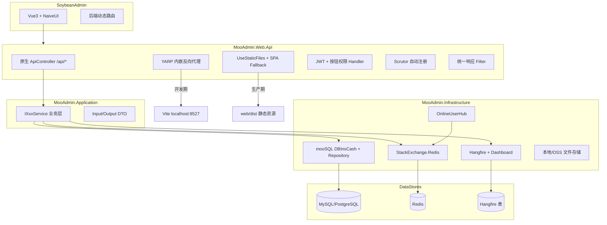

# mooAdmin 后台管理系统建设方案

> 完整可读版同时保存在：`G:\coding\gitee\my\moo-sqlm\mooAdmin\PLAN.md`

## 目标与约束

| 维度 | 决策 |
|------|------|
| 功能蓝本 | 本地 [Admin.NET](G:/coding/gitee/AdminSystem/admin.net2026/Admin.NET) 标准版覆盖度 |
| 首期排除 | 代码生成（`SysCodeGen*`）、可选插件（审批流/钉钉/GoView/ReZero 等） |
| 项目路径 | `G:\coding\gitee\my\moo-sqlm\mooAdmin\`（mooSQL 生态独立仓库） |
| ORM | [mooSQL.Ext](G:/coding/gitee/my/moo-sqlm/mooSQL2024/ext/mooSQL.Ext.csproj)（ProjectReference 源码引用） |
| 禁用 | Furion、SqlSugar |

## 架构总览



## 解决方案结构

```
mooAdmin/
├── mooAdmin.sln
├── src/
│   ├── MooAdmin.Shared/          # ApiResult、常量、枚举、分页基类
│   ├── MooAdmin.Core/            # 实体、接口、领域事件、Seed 定义
│   ├── MooAdmin.Application/     # Service 实现、DTO、Mapster 配置
│   ├── MooAdmin.Infrastructure/  # mooSQL/Redis/Hangfire/文件/SignalR 适配
│   └── MooAdmin.Web.Api/         # Program.cs、Controllers、JWT、YARP、SPA 静态托管
├── web/                          # Soybean Admin（git submodule 或 clone）
├── docker/                       # compose: web.api + mysql + redis
└── tests/
    └── MooAdmin.Tests/
```

**对标 Admin.NET 分层映射：**

| Admin.NET | mooAdmin |
|-----------|----------|
| `Admin.NET.Core` | `MooAdmin.Core` + `MooAdmin.Application` |
| `Admin.NET.Web.Core` | `MooAdmin.Web.Api`（中间件内聚，无 Furion Startup） |
| `Admin.NET.Web.Entry` | `MooAdmin.Web.Api`（单一 Host） |
| `Admin.NET.Application` | 配置合并进 `appsettings*.json` + `MooAdmin.Infrastructure` |
| `Web/` (vue-next-admin) | `web/` (Soybean Admin) |
| `docker/nginx` | `MooAdmin.Web.Api` 内嵌 YARP + `UseStaticFiles` + `docker/` |

## 技术栈替换对照

| 能力 | Admin.NET 现状 | mooAdmin 方案 |
|------|----------------|---------------|
| 宿主/配置 | Furion `Serve.Run` + JSON 分片配置 | 标准 `WebApplication.CreateBuilder` + `IOptions<T>` |
| API | `IDynamicApiController`（55 个 Service 即 API） | 显式 `[ApiController]`，Service 仅业务逻辑 |
| DI | `ITransient/IScoped/ISingleton` 标记接口 | **Scrutor** 扫描 `MooAdmin.Application` 程序集 |
| ORM | `SqlSugarRepository<T>` + 全局过滤器 | `DBInsCash` + `SooRepository<T>`，封装 `MooRepository<T>` |
| 分页 | `SqlSugarPagedList<T>` | `PagedResult<T>`（对齐 Soybean 列表结构） |
| 缓存 | NewLife.Redis | **StackExchange.Redis** + `IDistributedCache` 抽象 |
| 定时任务 | Furion.Schedule (Sundial) | **Hangfire**（SQL 存储，Dashboard `/hangfire`） |
| 反向代理 | docker nginx | **YARP** 内嵌于 `MooAdmin.Web.Api`（开发代理 Vite，生产托管 SPA） |
| 统一响应 | `AdminResultProvider`（code/message/result） | `ApiResult<T>`（**code/msg/data**，兼容 Soybean） |
| JWT | Furion `JwtHandler` | `Microsoft.AspNetCore.Authentication.JwtBearer` + 自定义 `PermissionAuthorizationHandler` |
| 雪花 ID | Yitter.IdGenerator | 沿用 Yitter.IdGenerator |
| 对象映射 | Mapster | 保留 Mapster |

## 首期功能模块（标准版，不含代码生成）

### P0 — 平台底座

- 认证、RBAC、组织、字典、系统配置、日志、文件、缓存管理

### P1 — 标准版扩展

- 多租户、Hangfire 定时任务、消息通知、在线用户、服务器监控、个人日程（可选）

### 明确后置

- 代码生成、APIJSON、ES、压力测试、第三方登录、Admin.NET 插件

## 核心实体（约 25 张表）

`SysUser`, `SysRole`, `SysMenu`, `SysUserRole`, `SysRoleMenu`, `SysRoleOrg`, `SysOrg`, `SysPos`, `SysDictType`, `SysDictData`, `SysConfig`, `SysLogVis`, `SysLogOp`, `SysLogEx`, `SysFile`, `SysFileProvider`, `SysTenant`, `SysTenantMenu`, `SysTenantConfig`, `SysNotice`, `SysNoticeUser`, `SysOnlineUser`, `SysSchedule`, `SysJobDetail`, `SysJobTrigger`

## mooSQL 集成要点

1. `MooSqlSetup.cs` 引导 `DBInsCash`
2. `MooRepository<T>` 封装 `SooRepository<T>`
3. `db.useWork()` 事务
4. `AuthBuilder` 数据权限
5. `IDbInitializer` 建表 + Seed
6. 参考 `moqp/HHNY.NET.Core/MooSQL/DBCash.cs`

## YARP 内嵌 Web.Api

- 开发期：YARP 代理非 API 到 Vite，单端口访问
- 生产期：`wwwroot/` 静态托管 SPA
- 无独立 Gateway 项目

## 实施分期

1. 脚手架（~1 周）
2. P0 RBAC（~2 周）
3. P0 基础设施（~1 周）
4. P1 扩展（~2 周）
5. Soybean 前端（~2-3 周，可并行）

## 验收标准

- 登录 + 动态菜单、RBAC CRUD、按钮权限、多租户隔离
- Hangfire、Redis、单端口 API+前端、日志可查询
