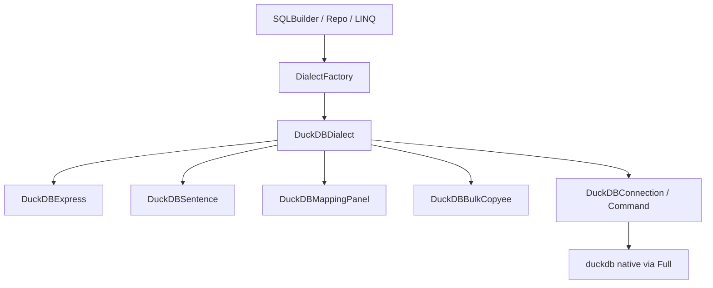

# DuckDB 方言适配

> 面向 **使用者**（如何配置与编写查询）与 **开发人员**（方言包结构、扩展点、TFM/驱动约定）。  
> 关联代码：`ext/src/provides/dialect/DuckDB/`、`DataBaseType.DuckDB`、`DialectFactory`；冒烟：`Tests/TestBug/src/TestExt/DuckDBDialectSmokeTests.cs`。

---

## 1. 概述

mooSQL 通过方言层接入 **DuckDB**（嵌入式分析库）。应用侧仍使用既有 **SQLBuilder / SQLClip / Repository / LINQ**，由 `DataBaseType.DuckDB` 选择 `DuckDBDialect` 完成 SQL 形态与 ADO 驱动差异。

| 项 | 说明 |
|----|------|
| 枚举 | `DataBaseType.DuckDB = 18` |
| 支持 TFM | **net6.0 / net8.0 / net10.0**（net451 / net462 不引用驱动、不编译方言） |
| ADO 包 | `DuckDB.NET.Data.Full`（自带 native） |
| 包版本 | net6 → **1.4.4**；net8 / net10 → **1.5.5**（按 TFM 分 ItemGroup，与 Npgsql/Sqlite 一致） |
| SQL 风格 | 偏 PostgreSQL：`"ident"`、`$name` 参数、`LIMIT/OFFSET`、SEQUENCE |
| 命名空间 | 方言类型统一 `mooSQL.data` |

---

## 2. 使用者指南

### 2.1 配置连接

```csharp
using mooSQL.data;

var client = new MooClient();
client.dialectFactory = new DialectFactory(); // Ext 默认工厂已注册 DuckDB

var dbConfig = new DataBase
{
    dbType = DataBaseType.DuckDB,
    // 推荐文件库；多语句 / 多连接需共享同一文件
    DBConnectStr = @"Data Source=D:\data\app.duckdb"
};

var db = new DBInstance { config = dbConfig, client = client };
db.dialect = client.dialectFactory.getDialect(dbConfig);
db.dialect.dbInstance = db;
db.dialect.db = dbConfig;
db.cmd = new CmdExecutor(db);
```

测试辅助（仓库内）：

```csharp
// 可执行（临时文件）
var db = DBTest.useDuckDB(); // 默认 Data Source=:memory: —— 见下节注意
// 或显式文件
var db = DBTest.BuildStandaloneInstance(DataBaseType.DuckDB, "Data Source=path\\to\\file.duckdb");

// 仅拼 SQL、不连库
var kit = DBTest.useDuckDBDialectOnly();
```

### 2.2 连接串注意（重要）

| 连接串 | 行为 | 建议 |
|--------|------|------|
| `Data Source=:memory:` | **每次新连接是独立内存库** | 仅适合单连接短生命周期；mooSQL 默认每语句可能新开连接，**多语句会丢表** |
| `Data Source=文件路径` | 多连接共享同一文件 | **生产 / 集成测试推荐** |
| MotherDuck 等 | 遵循 DuckDB.NET 文档 | 自行拼接 token 等参数 |

冒烟测试使用临时 `.duckdb` 文件，正是为了避免 `:memory:` 隔离问题。

### 2.3 常用写法（与其他库相同 API）

```csharp
// 分页 → LIMIT / OFFSET
var page = db.useSQL()
    .select("id, name")
    .from("t_users")
    .where("name", "alice")
    .orderBy("id")
    .setPage(20, 1)   // 或 skipTake(skip, take)
    .query();

// CRUD
db.useSQL().setTable("t_users").set("id", 1).set("name", "a").doInsert();
db.useSQL().setTable("t_users").set("name", "b").where("id", 1).doUpdate();
db.useSQL().setTable("t_users").where("id", 1).doDelete();
```

参数在 SQL 中为 **`$参数名`**（使用者无需手写前缀，SQLBuilder 按方言自动加）。

### 2.4 自增主键

DuckDB 引擎侧 **IDENTITY + PRIMARY KEY 组合不可用**（会报 `Constraint not implemented`）。mooSQL 约定：

1. DDL 自增列标记：`DEFAULT nextval('moo_auto_seq')`（`getTableAutoIdSQL`）  
2. `CreateTableBy` 若列定义含 `nextval`，会前置 `CREATE SEQUENCE IF NOT EXISTS moo_auto_seq;`  
3. 手写建表推荐：

```sql
CREATE SEQUENCE t_id_seq START 1;
CREATE TABLE t_id (
  id BIGINT PRIMARY KEY DEFAULT nextval('t_id_seq'),
  name VARCHAR
);

INSERT INTO t_id (name) VALUES ('x') RETURNING id;
```

插入后取 ID：可用 `RETURNING`，或自行查序列；方言 `_selectAutoIncrement` 为空（与 Npgsql 类似，不依赖 `last_insert_rowid`）。

### 2.5 批量写入

```csharp
using (var bulk = db.dialect.GetBulkCopy())
{
    bulk.TargetTableName = "t_bulk";
    // DataTable / DataRow[] / IDataReader
    var result = bulk.WriteToServer(table);
}
```

实现类 `DuckDBBulkCopyee`：优先 `DuckDBConnection.CreateAppender`；失败时回退为多行 `INSERT`。

### 2.6 MERGE / Upsert

DuckDB 支持 `MERGE INTO`。`SooRichRepo.SupportsMergeDialect` 已包含 `DataBaseType.DuckDB`，富仓储 Upsert 走 MERGE 路径时可选该库。

### 2.7 COPY 辅助（Sentence）

```csharp
var sent = (DuckDBSentence)db.dialect.sentence;
var exportSql = sent.BuildCopyToSql("SELECT * FROM t", @"D:\out.parquet", "PARQUET");
var importSql = sent.BuildCopyFromSql("t", @"D:\in.csv", "CSV");
db.ExeNonQuery(exportSql, null);
```

仅生成 SQL；执行与路径权限由调用方负责。

### 2.8 能力速查

| 能力 | DuckDB 行为 |
|------|-------------|
| 标识符 | `"name"`（内部 `"` 转义为 `""`） |
| 参数 | SQL 中 `$name`；绑定到驱动时去掉 `$` |
| 分页 | `LIMIT n OFFSET m`；`ProviderFlags` Take/Skip 已开 |
| 字符串 | `LENGTH` / `SUBSTRING` / `STRPOS` / `TRIM` |
| 日期差/截取 | `date_diff` / `date_part` |
| 日期加减 | `timestamp + interval` |
| 元数据 | `information_schema` + `duckdb_indexes()` 等 |
| CommandBuilder | **不支持**（`getCmdBuilder` 抛 `NotSupportedException`） |
| DataAdapter | 最小 `DuckDBDataAdapter`（`Fill` 走基类 + SelectCommand） |

---

## 3. 开发者指南

### 3.1 模块位置

```
ext/src/provides/dialect/DuckDB/
├── DuckDBDialect.cs              # ADO 工厂、参数、Bulk、版本表
├── DuckDBExpress.cs              # SQLExpression：DML/DDL/日期/字符串
├── DuckDBSentence.cs             # 元数据 SQL、COPY 辅助、断线启发式
├── DuckDBMappingPanel.cs         # CLR → DuckDB 类型
├── DuckDBSQLFunction.cs          # SooSQLFunction
├── DuckDBClauseTranslator.cs     # 对象名翻译
├── ado/DuckDBDataAdapter.cs      # 查询 Fill
├── entity/DuckDBBulkCopyee.cs    # Appender 批量
└── Translation/DuckDBMemberTranslator.cs  # Ext LINQ DatePart/DateAdd
```

全部类型命名空间：**`mooSQL.data`**（与 Dialect/Express 一致，不使用 `linq.DataProvider.*`）。

### 3.2 注册与条件编译

[`DialectFactory`](../../../ext/src/provides/DialectFactory.cs)：

```csharp
#if NET6_0_OR_GREATER
this.useDialect(DataBaseType.DuckDB, () => new DuckDBDialect());
#endif
```

方言源文件整体 `#if NET6_0_OR_GREATER`，保证 net451/net462 无 DuckDB 包也能编译 Ext。

[`MemberTranslatorResolver`](../../../ext/src/linq/translator/MemberTranslatorResolver.cs)：

```csharp
nameof(DuckDBDialect) => new DuckDBMemberTranslator(),
```

### 3.3 包引用约定

[`mooSQL.Ext.csproj`](../../../ext/mooSQL.Ext.csproj) / [`mooSQL.Ext.Core.csproj`](../../../ext/mooSQL.Ext.Core.csproj) 按 TFM 分 ItemGroup：

```xml
<!-- net6.0 -->
<PackageReference Include="DuckDB.NET.Data.Full" Version="1.4.4" />

<!-- net8.0 / net10.0 -->
<PackageReference Include="DuckDB.NET.Data.Full" Version="1.5.5" />
```

升级 net8/net10 驱动时 **不要** 动 net6 的 1.4.4（1.5.x 已无 net6 TFM）。方言代码按 **1.4.4 ∩ 1.5.5 API 交集** 编写。

### 3.4 设计对照（实现时参考）

| 关注点 | 参考方言 | DuckDB 落点 |
|--------|----------|-------------|
| 目录形状 / 嵌入式 | SQLite | 文件库、无独立 CREATE DATABASE |
| 引号 / 序列感 | Npgsql | `"`、SEQUENCE、`nextval` |
| 分页 | SQLite / Npgsql | `AppendLimitOffset` |
| Bulk | 自研 Appender | `DuckDBBulkCopyee`，Fallback 多行 INSERT |
| 参数前缀 | — | `_paraPrefix = "$"`；`AddCmdPara` **StripParaPrefix** |

### 3.5 参数绑定细节

SQLBuilder 在 SQL 文本中写入 `$kgwh_0_wp0` 等形式；`Parameter.key` 常带前缀。DuckDB.NET 要求 `DuckDBParameter.ParameterName` **不含** `$`，故：

```csharp
ParameterName = StripParaPrefix(para.key); // 去掉 $ @ : ?
```

漏 strip 会出现：`Values were not provided for the following prepared statement parameters: ...`。

### 3.6 测试

| 用例 | 位置 |
|------|------|
| CRUD / 分页 / 参数 / 自增 RETURNING / Bulk / MERGE | `DuckDBDialectSmokeTests`（`#if NET6_0_OR_GREATER`） |
| DatePart / DateDiff / DateAdd / CharIndex 矩阵 | `DbFuncTranslationMatrixTests` 中 `typeof(DuckDBDialect)` InlineData |
| 方言空连接别名 | `DBTest.useDuckDBDialectOnly`、`DBTestProviderTests` |

本地跑：

```bash
dotnet test Tests/TestBug/mooSQL.Tests.csproj -f net8.0 --filter "FullyQualifiedName~DuckDB"
dotnet test Tests/TestBug/mooSQL.Tests.csproj -f net6.0 --filter "FullyQualifiedName~DuckDB"
```

### 3.7 扩展清单（后续）

| 项 | 说明 |
|----|------|
| 每表独立 SEQUENCE 名 | 当前 DDL 默认 `moo_auto_seq`；可按表名生成 `seq_{table}_{col}` |
| 原生 DataAdapter/CommandBuilder | 驱动未提供；仅在需要 DataAdapter 高级能力时再补 |
| Appender 列映射与事务 | 与 DBInstance 会话连接复用可再优化 |
| 分析场景 API | Parquet/CSV 批量 COPY 可升为 SQLBuilder 扩展方法 |

---

## 4. 架构关系



---

## 5. 验收标准（适配完成时）

1. `dbType=DuckDB` 时工厂返回 `DuckDBDialect`（net6/net8/net10）。  
2. 文件库上完成 CRUD + 分页；SQL 含 `LIMIT`/`OFFSET`、参数为 `$...`。  
3. net451/net462 构建无 DuckDB 包、无编译错误。  
4. csproj：net6=1.4.4，net8/net10=1.5.5；冒烟双 TFM 通过。  
5. README / skill「支持的数据库」已列出 DuckDB 及驱动版本说明。

---

## 6. 相关链接

- 驱动文档：[duckdb.net](https://duckdb.net)  
- 方言能力矩阵：[`ext/src/linq/core/Dialect-Capability-Matrix.md`](../../../ext/src/linq/core/Dialect-Capability-Matrix.md)  
- 产品说明：仓库根目录 [README.md](../../../README.md)「Supported databases / 支持的数据库」
