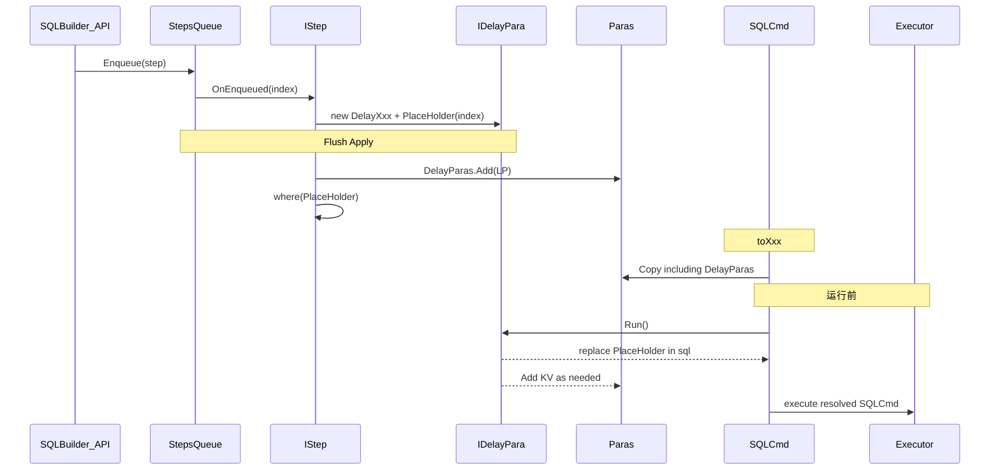

# SQLBuilder 延迟参数解析（IDelayPara / PlaceHolder）

> 面向 **mooSQL 项目开发人员**。承接 [SQLBuilder 延迟构造重构](./SQLBuilder-延迟构造重构.md) 与 [Step 标记与编排 Hash](./SQLBuilder-Step标记与编排Hash.md)。  
> 目标：对「随参数取值变化」的动态 SQL 片段建立 **延迟解析**，在编排期固化 **PlaceHolder** 并登记到 `Paras.DelayParas`，在 **SQLCmd 运行前** 再 `Run()` 产出可执行文本并写入参数；为后续 SQL 模板缓存（同结构复用）铺路。

---

## 1. 背景与动机

### 1.1 问题

今日部分构造 API 在 **Apply / StepBuilder 方法体** 内按参数值即时拼出 SQL（并可能写 `ps`），例如：

| API | 现状（内核） | 动态性 |
|-----|-------------|--------|
| `whereInGuid` | 遍历 OID，拼 `'guid',...` 或退化为 `1=2` | 列表长度/内容变 → SQL 文本变 |
| `whereFormat` | `{0}` 替换为参数名并 `addParaKV` | 槽位值变 → `ps` 变；模板结构相对稳 |

延迟构造落地后：

- **编排 Hash**（`OrchestrationHash`）刻意 **不含参数值内容**，只保证步骤磁带 + HasSql 0/1。  
- 但物化路径仍走「同名方法即时拼装」，动态片段无法与「稳定模板」分离，模板缓存难以挂接。

### 1.2 阶段二目标

| 目标 | 说明 |
|------|------|
| **可运行参数转换体** | 抽象 `IDelayPara`：携带运行时载荷，在 SQLCmd 运行前 `Run()` 产出最终片段 SQL |
| **编排位固化 PlaceHolder** | `Enqueue` 时赋予步骤 **编排索引**，据此生成稳定占位串，作为物化进 where 的结构壳 |
| **Apply 与同名方法解耦** | 动态 Step 的 `Apply` **不再**调用 `Inner.whereInGuid` / `Inner.whereFormat`，改为把 **PlaceHolder** 推入 where，并把 livePara **登记到 `Paras`** |
| **Paras 持有延迟体** | [`Paras`](../../pure/src/ado/data/context/Paras.cs) 增加 `List<IDelayPara>`；与普通 KV 参数并列 |
| **SQLCmd 运行前解析** | 执行前检查该集合，逐个唤起 `IDelayPara` 解析（`Run()` + 占位替换 / 写 KV） |
| **一期样本** | 落地 2 种：`DelayWhereInGuid`、`DelayWhereFormat` |

### 1.3 非目标（本期）

- 不一次性改造全部 where/set 动态 API（仅 2 样本 + 管道）。  
- 不实现完整 ScriptCache 存储/命中（见 Hash 文档 H4；本文只提供 PlaceHolder + Run 挂点）。  
- 不改变对外链式 API 签名（`whereInGuid` / `whereFormat` 调用方式不变）。  
- 不改 Dialect 拼装主干算法（仅插入「延迟片段解析」钩子）。

### 1.4 成功判据

1. `whereInGuid` / `whereFormat` 门面入队后，Flush→构建产出与改造前 **语义等价**（含空列表 → `1=2`、Format 参数键写入）。  
2. 同编排位置、仅参数值不同：步骤上的 **PlaceHolder 字符串相同**；`Run()` 结果可不同。  
3. `OrchestrationHash` 行为不回退（值内容仍不进 Hash；空/非空 In 的 0/1 规则保持）。  
4. 有单测覆盖：PlaceHolder 与索引绑定、空 GUID 列表、`whereFormat` 写 `ps`。  
5. `Paras.DelayParas` 在 Apply 后非空；`SQLCmd` 运行前 Resolve 后 sql 无残留 PlaceHolder，且重复 Resolve 幂等（或有 Resolved 标志）。

---

## 2. 概念定义

| 术语 | 含义 |
|------|------|
| **IDelayPara** | 可运行参数转换体；持有动态载荷，暴露 `Run()` 产出最终 SQL 片段 |
| **livePara** | 某 Step 上挂接的 `IDelayPara` 实例（编排期创建并登记 Paras，运行前执行） |
| **编排位索引（OrchestrationIndex）** | 步骤入队时在 `_steps` 中的序号（或单调分配的编排序号）；用于生成 PlaceHolder |
| **PlaceHolder SQL** | 按索引固化的占位片段，**不随参数值变化**；Apply 时推入 where 结构 |
| **延迟解析** | SQLCmd 运行前（或等价出口）遍历 `Paras.DelayParas`，`Run()` 产出文本并替换 SQL 中的 PlaceHolder，必要时写 KV |
| **DelayParas 集合** | `Paras` 上的 `List<IDelayPara>`；Apply/`whereLive` 时 `Add`，Clear/Copy 同步维护 |
| **静态片段** | 仍走原同名方法 / 字面 SQL 的 Step（本期不动） |

---

## 3. 总体数据流

```
编排期
  whereInGuid(key, oids)
    → new WhereInGuid*Step(key, oids)
    → Enqueue:
         index = 分配编排位索引
         step.OnEnqueued(index)  → 创建 livePara + PlaceHolder
         _steps.Add(step)

物化 Apply
  step.Apply(facade)
    → 不再 Inner.whereInGuid(...)
    → Inner.where( livePara.PlaceHolder ) / whereLive(livePara)
       （结构壳入 WhereCollection）
    → ps.DelayParas.Add(livePara)     // 登记到 Paras 集合

SQL 拼装（toXxx）
  → sql 文本中保留 PlaceHolder；普通 KV 可已部分写入
  → new SQLCmd(sql, ps)  // Copy 须带上 DelayParas

SQLCmd 运行前（改造点 3）
  → ResolveDelayParas(cmd)：
       foreach lp in cmd.para.DelayParas:
           frag = lp.Run()           // whereFormat 等在此写 KV
           cmd.sql = cmd.sql.Replace(lp.PlaceHolder, frag)
  → 再交给 DBExecutor / DBRunner 执行
```



---

## 4. 任务拆解

### 4.1 任务 1 — `IDelayPara` 与运行上下文

```csharp
/// <summary>可运行参数转换体：SQLCmd 运行前产出最终 SQL 片段。</summary>
public interface IDelayPara
{
    /// <summary>编排位固化的占位 SQL（Apply 推入 where 的结构壳）。</summary>
    string PlaceHolder { get; }

    /// <summary>运行前解析：产出替换 PlaceHolder 的最终文本；必要时写 Paras KV。</summary>
    string Run();
}
```

**锁定说明：**

- 一期接口保持精简：`PlaceHolder` + `Run()`。  
- `Run()` **无参**：所需 `key` / 集合 / `template` / `values` / `Paras` 访问器在 **构造 livePara 时捕获**（通过 `DelayParaContext` 或对 `Paras`/`StepBuilder` 的引用/回调）。  
- 写 KV 时上下文必须指向 **即将执行的 `SQLCmd.para`（或同源 ps）**，在 `ResolveDelayParas` 内调用，禁止编排期误写。

建议落点：

```
pure/src/ado/builder/delay/
  IDelayPara.cs
  DelayParaContext.cs          # 可选：提供 ps / paraSeed / dbstr
  DelayWhereInGuid.cs
  DelayWhereFormat.cs
  LiveParaMarks.cs             # PlaceHolder 格式常量
```

**PlaceHolder 格式（建议锁定）：**

```text
/*@lp:{orchestrationIndex}*/
```

- 仅含索引，**不含**参数值。  
- 可被正则 / 前缀扫描识别。  
- 同索引在同一次编排中唯一；`clear` 后队列重建，索引从 0 重计。

---

### 4.2 任务 2 — 一期两种动态类

#### 4.2.1 `DelayWhereInGuid`

对应内核 [`StepBuilder.whereInGuid`](../../pure/src/ado/builder/StepBuilderWhere.cs) 三种重载的拼装逻辑（Guid / Guid? / string+校验）。

`Run()` 语义对齐现实现（示意，以 `Guid?` 为例）：

```csharp
public string Run()
{
    var res = new StringBuilder();
    int cc = 0;
    res.Append("(");
    foreach (var oid in OIDs)
    {
        if (oid != null)
        {
            if (cc > 0) res.Append(",");
            res.Append("'");
            res.Append(oid);
            res.Append("'");
            cc++;
        }
    }
    res.Append(")");
    if (cc == 0)
        return "1=2";                    // 与现 where("1=2") 等价片段
    return key + " IN " + res.ToString();
}
```

| 项 | 约定 |
|----|------|
| 空/全无效 | 返回 `1=2`（不是再调 `where`，由推入通道保证是一条 where 条件） |
| 参数化 | 一期 **保持现行为**（字面 `'guid'` 内联）；若后续改真正参数化，另开任务，勿与 PlaceHolder 混淆 |
| 与 Step | `WhereInGuid*Step` 持有 `DelayWhereInGuid`；`ContributeHash` 仍按集合空/非空写 0/1，**不** Combine 元素 |

#### 4.2.2 `DelayWhereFormat`

对应 [`SqlGoup.whereFormat`](../../pure/src/ado/builder/SQLKit/SqlGoup.cs)：模板 `{i}` → 参数名 / `null`，并 `addParaKV`。

```csharp
public string Run()
{
    // 伪代码：与现 whereFormat 一致
    string key = template;
    for (int i = 0; i < values.Length; i++)
    {
        string reg = "{" + i + "}";
        var v = values[i];
        if (v == null)
            key = key.Replace(reg, " null ");
        else
        {
            string ke = ctx.GetPrefix() + "wf_" + ctx.Ps.Count + "_" + i;
            key = key.Replace(reg, ctx.DbStr + ke);
            ctx.AddParaKV(ke, v);
        }
    }
    return key;   // 作为 where 条件正文；paramed=false 路径
}
```

| 项 | 约定 |
|----|------|
| 写 `ps` | **仅在 `Run()`**（SQLCmd 运行前 Resolve），不在 Enqueue / Apply / build* |
| PlaceHolder | 仍按编排索引固化；模板字符串本身进 `OrchestrationHash` 结构量（既有 `WhereFormat*Step.ContributeHash` 行为保持） |
| 参数名稳定性 | 与今日一致依赖 `paraSeed` + `ps.Count` 时序；回归锁键序 |

---

### 4.3 任务 3 — 入队赋索引 + 创建 PlaceHolder

#### 4.3.1 Enqueue 挂钩

[`SQLBuilder.defer.cs`](../../pure/src/ado/builder/SQLBuilder.defer.cs) `Enqueue`：

```csharp
_steps.Add(step);
var index = _steps.Count - 1;   // 或独立 _orchestrationSeq++
step.OnEnqueued(index);         // 默认空实现；动态 Step 在此建 livePara
```

可选扩展（推荐，避免污染所有 Step）：

```csharp
public interface IStep
{
    // 既有成员...
}

public interface IIndexedStep : IStep
{
    void OnEnqueued(int orchestrationIndex);
}
```

- 仅动态 Step 实现 `IIndexedStep`；`Enqueue` 中 `as IIndexedStep` 后调用。  
- 或在 `StepBase` 提供虚方法 `OnEnqueued` 默认空。

#### 4.3.2 Step 内创建 livePara

```csharp
// WhereInGuid*Step
public override void OnEnqueued(int index)
{
    _live = new DelayWhereInGuid(key, OIDs, index); // PlaceHolder = /*@lp:{index}*/
}
```

**索引语义：**

| 议题 | 锁定 |
|------|------|
| 索引基值 | 0-based，等于入队后在 `_steps` 的下标 |
| clear/reset | 队列清空后重新从 0 分配 |
| 子查询子磁带 | **子队列独立** 0..n-1；PlaceHolder 建议带作用域前缀（如 `/*@lp:c{parentIndex}:{childIndex}*/`）——一期若只改顶层 whereInGuid/whereFormat，可先不做子作用域 |
| 双写 `useDeferred(false)` | 仍先 `OnEnqueued` 再立即 `Apply`，保证 PlaceHolder 已就绪 |

---

### 4.4 任务 4 — Apply 联合：推占位而非同名方法

#### 4.4.1 改造点

| Step | Apply 现状 | Apply 目标 |
|------|-----------|-----------|
| `WhereInGuid*Step` | `Inner.whereInGuid(Key, _OIDs)` | `Inner.where(_live.PlaceHolder)` 或 `Inner.whereLive(_live)` |
| `WhereFormatstringobjectArrStep` | `Inner.whereFormat(_template, _values)` | 同上 |

#### 4.4.2 内核入口（与 Paras 登记一体）

```csharp
// StepBuilder / SqlGoup
public StepBuilder whereLive(IDelayPara live)
{
    if (live == null) return this;
    ps.AddDelayPara(live);              // → Paras.DelayParas
    current.where(live.PlaceHolder);    // 结构壳进 where（文本含 /*@lp:n*/）
    return this;
}
```

- **权威注册表是 `Paras.DelayParas`**，不是 Frag 旁路字段（Frag 可不挂引用，避免双源）。  
- PlaceHolder 写入 SQL 文本，供运行前按集合替换。  
- 一期锁定：**whereLive = 登记 Paras + where(PlaceHolder)**。
#### 4.4.3 门控

- `Opened` / `paraRule`：仍在 Step `ContributeHash` / Apply 前由现有逻辑处理。  
- Apply 内若需跳过（ifs 关闭），与今日一致：不推 where。  
- `DelayWhereInGuid.Run()` 内的空列表 → `1=2` 属于 **值层** 决策，不影响编排期 HasSql（空集合 HasSql=0 的既有规则：若编排期已判不产出，则可不创建 live / 不 Apply；需与现 `WhereListStep` 行为对齐——**若 HasSql=0，Apply 应 no-op 或与 StepBuilder 跳过一致**）。

对齐建议（锁定）：

- 编排期 `ContributeHash`：空集合 → 0（已有）。  
- Apply：若本步编排期判定不产出，**不**调用 `whereLive`（与 `Opened`/paraRule 一致）。  
- 仅当会产出时，`Run()` 内仍保留 `cc==0 → 1=2` 作为防御（例如 Guid? 过滤后变空与编排期「有元素」边界——以回归用例钉死）。

---

### 4.5 任务 5（改造点 3）— `Paras` 持有集合 + SQLCmd 运行前解析

#### 4.5.1 `Paras` 扩展

落点：[`pure/src/ado/data/context/Paras.cs`](../../pure/src/ado/data/context/Paras.cs)

```csharp
public class Paras
{
    // 既有 value / Count / Add / Clear / Copy ...

    /// <summary>延迟参数转换体；SQLCmd 运行前统一解析。</summary>
    public List<IDelayPara> DelayParas { get; private set; }
        = new List<IDelayPara>();

    public void AddDelayPara(IDelayPara live)
    {
        if (live != null)
            DelayParas.Add(live);
    }

    public void Clear()
    {
        value.Clear();
        fmtIndex = 0;
        DelayParas.Clear();            // 与 KV 同步清空
    }

    public void Copy(Paras other)
    {
        // 既有 KV 拷贝 ...
        DelayParas.Clear();
        if (other?.DelayParas != null)
            DelayParas.AddRange(other.DelayParas);
    }
}
```

| 项 | 约定 |
|----|------|
| 登记时机 | `whereLive` / Apply 成功推占位时 `AddDelayPara` |
| Clear | `ps.Clear()` / Builder `clear` 路径清空 `DelayParas` |
| Copy | `SQLCmd(sql, paras)` / `para.Copy` **必须**拷贝 `DelayParas`，否则运行前集合为空 |
| 顺序 | 列表顺序 = 登记顺序；解析按序 `Run()`，保证 `whereFormat` 的 `ps.Count` 键名时序 |

#### 4.5.2 SQLCmd 运行前唤起

落点建议（择一主钩子，避免多处重复解析）：

| 候选 | 说明 |
|------|------|
| **`SQLCmd` 出口方法**（如 `EnsureResolved` / `ResolveDelayParas`） | 所有执行入口先调一次 |
| `DBExecutor` / `DBRunner.Take` 入口 | 执行前统一 Resolve |
| `toXxx` 末尾 | 生成 SQLCmd 后立刻 Resolve（则缓存模板需另存未解析 sql——见下） |

**一期锁定：SQLCmd 运行前解析**（贴近「命令已齐、即将执行」），示意：

```csharp
public static void ResolveDelayParas(SQLCmd cmd)
{
    if (cmd?.para?.DelayParas == null || cmd.para.DelayParas.Count == 0)
        return;

    var sql = cmd.sql ?? "";
    for (int i = 0; i < cmd.para.DelayParas.Count; i++)
    {
        var lp = cmd.para.DelayParas[i];
        if (lp == null) continue;
        var frag = lp.Run();                 // 可向 cmd.para 写 KV
        if (!string.IsNullOrEmpty(lp.PlaceHolder))
            sql = sql.Replace(lp.PlaceHolder, frag ?? "");
    }
    cmd.sql = sql;
    // 可选：解析后 Clear DelayParas，防止重复 Replace；或打 Resolved 标志
}
```

调用约定：

```
toSelect / query / doXxx / exe*
  → 得到 SQLCmd（sql 仍含 PlaceHolder，para.DelayParas 非空）
  → ResolveDelayParas(cmd)          // 运行前唯一必经
  → 绑定 DbParameter、执行
```

与模板缓存的关系：

- **未解析**的 `sql`（含 PlaceHolder）+ `OrchestrationHash` 可作为缓存壳。  
- 命中后：换上新 `DelayParas` 载荷（或复用同 PlaceHolder、换 live 实例）→ 再 `ResolveDelayParas`。  
- 若在 `toXxx` 末尾就 Resolve，则缓存须另存「解析前 SQL」副本——一期优先 **运行前 Resolve**，`toXxx` 可暂留占位串（测试断言执行路径或显式调用 Resolve）。

#### 4.5.3 顺序总览

```
Flush(Apply → whereLive → Paras.DelayParas.Add + where(PlaceHolder))
  → build* 拼出含 PlaceHolder 的 sql（不在此 Run）
  → new SQLCmd(sql, ps)   // Copy DelayParas
  → 【运行前】ResolveDelayParas
        foreach DelayParas: Run() + Replace
  → Executor
```

---

## 5. 与编排 Hash / 模板缓存的关系

| 层 | 内容 | 何时稳定 |
|----|------|----------|
| **OrchestrationHash** | StepId + 结构量 + HasSql 0/1（值不进） | 编排期 |
| **PlaceHolder 磁带** | 各动态步的 `/*@lp:i*/` 序列 | 入队后即稳定 |
| **Run() 文本 + KV** | 随参数变化 | SQLCmd 运行前 Resolve |

H4 缓存复合键可演进为：

```text
ScriptCacheKey = Hash(
  OrchestrationHash,
  PlaceHolderTapeHash,   // 可选：显式 Combine 各步 PlaceHolder
  (int)DataBaseType,
  ...
)
```

缓存命中后：**复用模板壳，仅重跑各 `IDelayPara.Run()` 填值/填 ps**（下期实现，本文只预留形状）。

---

## 6. 目录与类型落点

```
pure/src/ado/data/context/
  Paras.cs                     # List<IDelayPara> DelayParas；Add/Clear/Copy
pure/src/ado/builder/
  SQLBuilder.defer.cs          # Enqueue → OnEnqueued(index)
  steps/
    IStep.cs / StepBase.cs     # OnEnqueued 虚方法或 IIndexedStep
    where/WhereInGuid*.cs      # 持 livePara；Apply → whereLive
    where/WhereFormat*.cs
  delay/
    IDelayPara.cs
    DelayWhereInGuid.cs
    DelayWhereFormat.cs
  SQLKit/
    SQLCmd.cs                  # ResolveDelayParas（或静态辅助）
  StepBuilderWhere.cs          # whereLive → ps.AddDelayPara + where(PlaceHolder)
```

---

## 7. 实施阶段

| 阶段 | 内容 | 完成标志 |
|------|------|----------|
| **L0** | 本文入库；锁定 PlaceHolder、`Paras.DelayParas`、SQLCmd 运行前 Resolve | 评审通过 |
| **L1** | `Paras` 集合 + `ResolveDelayParas` 挂钩执行入口；`IDelayPara` + `DelayWhereInGuid` + Enqueue 索引 + Apply/`whereLive` | 等价 SQL 单测绿 |
| **L2** | `DelayWhereFormat` + Format Step + `ps` 键序回归 | 单测绿 |
| **L3** | Copy/Clear/幂等；可选未解析 sql 调试视图 | 联调 |
| **L4**（下期） | 模板缓存命中 + 只重跑 `Run()` | 另立项（Hash 文档 H4） |

---

## 8. 风险与缓解

| 风险 | 缓解 |
|------|------|
| `Run()` 写 ps 时机错乱 | 禁止 Enqueue/ContributeHash/build 调 `Run()`；**仅** SQLCmd 运行前 Resolve |
| `SQLCmd` Copy 丢 `DelayParas` | `Paras.Copy` / 构造函数强制拷贝列表 |
| 多入口漏 Resolve | 收敛到 Executor/`SQLCmd.EnsureResolved` 单点 |
| 重复 Resolve 双重 Replace | Resolved 标志或解析后清空 `DelayParas` |
| PlaceHolder 与索引漂移 | 索引 = 入队下标；禁止事后重排 `_steps` |
| 空 In：HasSql=0 vs `1=2` | 单测钉边界；Apply 跳过优先 |
| 双写漏 OnEnqueued | Enqueue 公共路径统一调用 |
| 子查询索引冲突 | 一期顶层 only；二期作用域前缀 |

---

## 9. 待确认议题

| ID | 议题 | 建议默认 | 状态 |
|----|------|----------|------|
| P1 | PlaceHolder 格式 | `/*@lp:{index}*/` | **建议锁定** |
| P2 | Apply 入口 | `whereLive` → `Paras.AddDelayPara` + `where(PlaceHolder)` | **已锁定** |
| P2b | 解析时机 | **SQLCmd 运行前** 遍历 `Paras.DelayParas` 唤起 `Run()` | **已锁定** |
| P3 | 接口是否拆 `IIndexedStep` | `StepBase.OnEnqueued` 虚方法 | 待确认 |
| P4 | `whereInGuid` 真正参数化 | 一期保持字面量 | **建议锁定** |
| P5 | 空集合 Apply | 与 HasSql=0 对齐，不推 where | **建议锁定** |

---

## 10. 与父文档衔接

- [延迟构造重构](./SQLBuilder-延迟构造重构.md)：D13 指向本文（参数延迟解析）。  
- [Step 标记与编排 Hash](./SQLBuilder-Step标记与编排Hash.md)：H4 模板缓存依赖本文 PlaceHolder + `Run()`。  

---

## 附录 A — Apply 对照（一期）

```csharp
// 改造前
public override void Apply(SQLBuilder builder)
    => builder.Inner.whereInGuid(Key, _OIDs);

// 改造后
public override void Apply(SQLBuilder builder)
{
    if (_live == null) return;          // 未入队或已判定不产出
    builder.Inner.whereLive(_live);     // 推 PlaceHolder + 挂引用
}
```

## 附录 B — 一句话结论

> **动态片段抽成 `IDelayPara`，登记进 `Paras.DelayParas`；Enqueue 按索引固化 PlaceHolder，Apply 只推占位壳；SQLCmd 运行前遍历集合 `Run()` 替换占位并写 KV。一期先打通 `DelayWhereInGuid` 与 `DelayWhereFormat`。**
