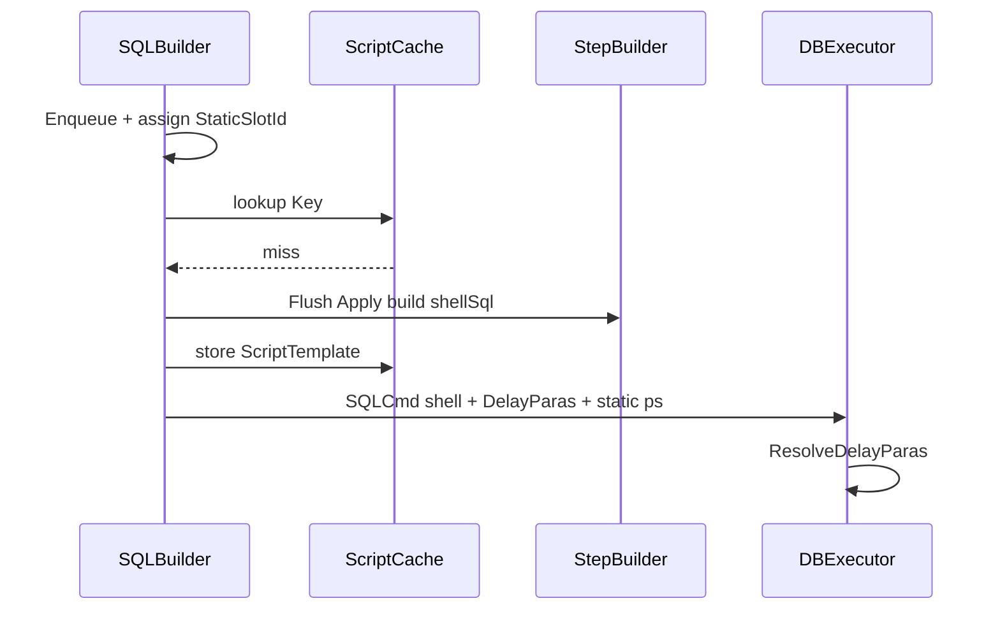

# SQLBuilder 执行模板缓存（ScriptTemplate / StaticSlot）

> 面向 **mooSQL 项目开发人员**。承接 [延迟构造重构](./SQLBuilder-延迟构造重构.md)、[Step 标记与编排 Hash](./SQLBuilder-Step标记与编排Hash.md)、[延迟参数解析](./SQLBuilder-延迟参数解析.md)。  
> 目标：在 **同编排结构** 下复用已拼装的 SQL **模板壳**，每次请求只重绑 **静态槽位值** 与 **LivePara.Run()**，跳过方言结构拼装；键以 `OrchestrationHash` 为第一分量。

---

## 1. 背景与动机

### 1.1 已具备的前置

| 能力 | 文档 / 现状 |
|------|-------------|
| 构造入队、Flush 物化 | 延迟构造 |
| `OrchestrationHash`（值不进；HasSql / 形状位进） | Hash 文档 |
| 动态片段 `@@{{moo.lp:n}}` + `IDelayPara` + `prepare` Resolve | 延迟参数解析 |

### 1.2 问题

若仅「按编排 Hash 缓存整份 `SQLCmd`」：

- **已 Resolve 的 sql** 随 In 列表长度、Format 产出而变 → 不能当模板。  
- **未拆开的 `SQLCmd`** 把壳与**本次** `DelayParas` / `ps.value` 绑在一起 → 命中会串值。  
- 普通 `where` 等静态参：壳里已有 `@ks_…wp0` 一类名，但缺少 **新请求逻辑值 → 壳内物理名** 的显式桥梁；靠「再 Flush 碰运气对齐计数」会静默错绑。

### 1.3 本期目标

| 目标 | 说明 |
|------|------|
| **锁定缓存对象** | `ScriptTemplate` = 壳 SQL + 静态槽表 + Live 形态元数据 |
| **锁定静态桥方案 C** | **编排期**分配稳定 `StaticSlotId`；拼装**只许**用该 ID 派生参数名写入壳 |
| **锁定 Key** | 复合键，不以裸 `int` OrchestrationHash 单独作生产键 |
| **锁定命中语义** | 复用壳；重填 `staticValues` + 新 `IDelayPara[]`；走既有 `prepare.Resolve` |
| **划清非目标** | 子查询 In **不做** LivePara；嵌套子壳缓存另议 |

### 1.4 非目标（本期文档 / 首期实现）

- 不实现分布式缓存、跨进程持久化。  
- 不要求一次迁完所有 API；允许「未纳入 StaticSlot 的路径」走冷路径（完整拼装）。  
- 不缓存 DbCommand / 连接。  
- 不保证 `int` Hash 绝对无碰撞（靠复合 Key + 可选校验）。

### 1.5 成功判据

1. 同编排、仅静态 where 值不同：命中后 sql 壳字节级相同，`ps` 值不同，查询语义正确。  
2. 同编排、仅 Live 载荷不同（如 In 列表）：壳相同（仍含同一批 `@@{{moo.lp:n}}`），Resolve 后文本可不同。  
3. 空 / 非空 In 等 **HasSql/形状** 不同 → Key 不同 → 不互相命中。  
4. StaticSlot 名 **仅**由编排期 ID 派生；禁止命中路径依赖 `_addCount` 碰运气对齐。  
5. 有单测：冷/热路径等价；错绑（故意打乱 ordinal）应失败或不可达。

---

## 2. 概念定义

| 术语 | 含义 |
|------|------|
| **ScriptTemplate** | 可缓存的执行模板（壳 + 槽表 + Live 元数据） |
| **shellSql** | 未 `ResolveDelayParas` 的 SQL 文本；可含静态参数名与 `@@{{moo.lp:n}}` |
| **StaticSlot** | 壳内已定名的静态参数槽；值每次请求重绑，**不改变壳文本** |
| **StaticSlotId** | 编排期分配的稳定槽位序号（方案 **C**） |
| **LivePara / IDelayPara** | 动态片段；壳内为 PlaceHolder；`prepare` 时 `Run()` |
| **staticValues** | 本次请求按 StaticSlot 序对齐的值数组（**不进缓存**） |
| **ScriptCacheKey** | 查表键：编排指纹 + 方言/出口等 |
| **冷路径** | 未命中：完整 Flush + 拼装 → 收录 Template |
| **热路径** | 命中：装壳 → 填静态值 + 登记 Live → `prepare` |

### 2.1 三层分离（已锁定）

```text
结构字面     → 进 shellSql，进 OrchestrationHash（表名/列名/op/…）
StaticSlot   → 名进 shellSql；值每次重绑；桥 = StaticSlotId
LivePara     → PlaceHolder 进 shellSql；Run 产片段+可选 KV
```

| | StaticSlot | LivePara |
|--|------------|----------|
| 壳中形态 | 最终参数名（如 `@ms_s0`） | `@@{{moo.lp:n}}` |
| 值写入 | 热路径直接 `ps[name]=val` | `Run()` |
| 文本是否随值变 | **否** | **常是**（In 列表等） |
| 桥 | `StaticSlotId` → 物理名 | `DelayParas` 下标 n |

`DelayFormatSQL` / `DelayWhereFormat` 在 **Run** 内才生成的 `@`/`#{}` **不属于** StaticSlot（仍属 Live 产出）。

---

## 3. 方案 C：编排期稳定 StaticSlotId（已锁定）

### 3.1 为何选 C

| 方案 | 做法 | 否决/采纳 |
|------|------|-----------|
| A 首次物化收录名表 | 冷路径学会 `@ks_…wpN`，热路径按 ordinal 填 | 名仍源自物化计数，与编排耦合松，易因 Flush 次序漂移 |
| B 隐式桥=再跑起名 | 命中仍 Apply 写参，只跳过 buildSelect | 省拼装但**无显式桥**；起名一变即静默错绑 |
| **C 编排期槽位 ID** | Enqueue（或等价编排点）分配 `StaticSlotId`；拼装**只许**用其派生名 | **采纳**：干净、可审、不能靠运气 |

### 3.2 分配规则（已锁定）

1. **何时分配**  
   门面 `Enqueue` 静态写参步时（或该 Step 构造时由门面注入），按 **本 builder 磁带内** 已分配槽位数递增：`0,1,2,…`。  
   - `ifs` 跳过未入队 → **不占**槽。  
   - `paraRule` 导致 Apply 不落参 → 编排期若判定 HasSql=0 / 不写参，则 **不分配**（与 Hash/Apply 对齐；见 §6）。  

2. **谁持有**  
   对应 `IStep` 持有 `StaticSlotId`（或 `IStaticSlotStep`）；子 builder 磁带 **独立** 编号（父/子不相混）。  

3. **物理名派生（建议格式，可微调用版号进 Key）**  

```text
{paraPrefix}ms_s{StaticSlotId}
```

示例：`@ms_s0`、`@ms_s1`（`paraPrefix` 来自方言）。  
**禁止**热路径/冷路径再使用「`wp` + `_addCount`」为**已纳入槽位制**的步起名。

4. **多值一步**  
   一步多个静态值（少见）→ 分配连续多个 Id，或一步内 `slotId + subIndex`；须在 Step 内写清，并进入 Template.staticSlots。  

5. **与 Live 并存**  
   同一步若既有静态又有 Live：静态走 SlotId，动态走 DelayPara；不得混用一种机制表达两种语义。

### 3.3 错误模型（不能出错）

| 违规 | 处理 |
|------|------|
| 已纳入槽位制的 Step Apply 时未带 SlotId | DEBUG 断言失败；RELEASE 可抛 `InvalidOperationException` |
| 拼装写出未登记于 `staticSlots` 的参数名 | 冷路径收录校验失败，不入缓存 |
| 热路径 `staticValues.Length != staticSlots.Length` | 拒绝命中，回退冷路径或抛错（实现选一，文档默认 **抛错**） |
| Live 个数与 Template.liveCount 不一致 | 同上 |
| 壳内出现 `@@{{moo.lp:k}}` 且 `k >= liveCount` | 校验失败 |

---

## 4. 缓存对象与键（已锁定）

### 4.1 `ScriptTemplate`（缓存 Value）

```csharp
sealed class ScriptTemplate
{
    public string ShellSql;                 // 未 Resolve
    public StaticSlot[] StaticSlots;      // 有序；桥
    public int LiveCount;                   // PlaceHolder 个数（= 冷路径登记的 DelayParas.Count）
    public string ParaSeed;                 // 或规范化后的 seed 模式标记
    // 可选：OrchestrationHash 存证、BuildKind、校验用指纹
}

struct StaticSlot
{
    public int SlotId;                      // = 编排期 StaticSlotId
    public string NameInTemplate;           // 写入壳的物理名（可含方言前缀策略约定）
    // 可选：int StepTapeIndex; 便于诊断
}
```

**不进缓存：** `staticValues`、`IDelayPara` 实例、`ps.value`、已 Resolve 的 sql。

### 4.2 `ScriptCacheKey`（缓存 Key）

```text
ScriptCacheKey = Hash(
  OrchestrationHash,           // 含 paraRule、HasSql、形状位
  (int)DataBaseType,
  ExpressionVersion,           // 方言/表达式版本
  (int)SqlBuildKind,           // toSelect / toUpdate / toDelete / …
  StaticSlotNameSchemaVersion, // ms_s{N} 等命名模式版本
  LivePlaceHolderSchemaVersion // @@{{moo.lp:n}} 格式版本（已有则固定）
)
```

说明：

- 裸 `OrchestrationHash`（`int`）**不得**单独作生产键。  
- `setSeed` / 默认 seed 若影响 Slot 名或旧路径，须纳入 Key 或规定缓存路径下 seed 规范化。

### 4.3 一次请求的运行时袋（不缓存）

```text
RequestBind {
  staticValues: object[]     // 与 StaticSlots 等长、同序
  liveParas: IDelayPara[]    // 与 LiveCount 等长、同序；PlaceHolder 按 n 绑定
}
```

---

## 5. 数据流

### 5.1 冷路径（未命中）

```text
Enqueue…（静态步分配 StaticSlotId）
  → Flush / Apply（用 SlotId 派生名写壳 + 写 ps；Live → AddDelayPara + PlaceHolder）
  → build* → shellSql（不 Resolve）
  → 收录 ScriptTemplate { shellSql, staticSlots, liveCount, … }
  → 本次继续：Resolve → 执行
```



### 5.2 热路径（命中）

```text
Enqueue…（同样分配 StaticSlotId；用于收值与校验）
  → lookup ScriptTemplate
  → 按 StaticSlots 序从步骤/收值器填充 staticValues
  → 构造 liveParas（Apply 仅 harvest Live，或专用 CollectBind）
  → SQLCmd.sql = template.ShellSql
  → ps 按 StaticSlots 填值；DelayParas = liveParas
  → 跳过 buildSelect（及同类结构拼装）
  → prepare → ResolveDelayParas → DbCommand
```

**禁止：** 热路径把上一请求的 `ps.value` / `DelayParas` 实例直接复用。

### 5.3 与 `prepare` 的关系

- 热/冷最终都进入既有 `DBExecutor.prepare` → `ResolveDelayParas`。  
- 缓存层 **不**替代 Resolve；只替代「结构拼装 + 静态起名」。

---

## 6. 与编排 Hash / 延迟参数的边界

| 层 | 稳定时机 | 职责 |
|----|----------|------|
| OrchestrationHash | 编排期 | 同结构识别（含有无 SQL / In 空非空形状） |
| StaticSlotId | 编排期 | 静态参物理名稳定、可重绑 |
| PlaceHolder / Live | 物化登记 | 动态片段；prepare Run |
| ScriptTemplate | 首次冷路径后 | 可复用壳 |

**子查询 `whereIn(key, Action)`：**  
不做 LivePara、不占父级 StaticSlot（子磁带自有槽位制，若子路径启用缓存）。嵌入子 SQL 属于结构/嵌套问题，**不在本文强制范围**。

**HasSql=0 与槽位：**  
不落参的步不得占用 SlotId，否则热路径收值序与壳不一致。分配规则必须与 `ContributeHash` / Apply 跳过条件一致。

---

## 7. 目录与类型落点

**存储：不另建 ScriptCache 产品。** 与 StepBuilder 结果缓存同一条路：

```text
builder.cache / setCacheHolder(ISooCache)
  → 否则 Client.Cache（MooClient.useCache）
  → 否则 CacheFacory.getHashCache()
```

键为字符串 `moo.st:…`（`ScriptCacheKey`），值为 `ScriptTemplate`，与 `setCache(key)` 的 DataTable 结果缓存共存于同一 `ISooCache`。

```
pure/src/ado/builder/
  cache/
    ScriptCacheKey.cs            # moo.st: 复合键
    ScriptTemplate.cs
    StaticSlot.cs
    StaticSlotMarks.cs           # ms_s{N}；NameSchemaVersion
  steps/
    IStaticSlotStep.cs           # 热路径静态收值契约
    ILiveBindStep.cs             # 热路径 CollectBind Live
    where/WhereKeyCompareStep.cs # >/</>=/<=/<> 公共槽位实现
  SQLBuilder.cache.cs            # useScriptTemplateCache；toSelect 冷热分流
pure/src/ado/builder/StepBuilderDymatic.cs
  cacheHolder                    # 已有；模板与 query 共用
```

门面：`useScriptTemplateCache` 控制开关。**TEMP（业务大测）当前默认开启**，命中时 `Console.WriteLine("[moo.st HIT] …")`；测完应改回默认关并去掉控制台日志。纳入槽位制的 Step 在入队前 `TryAssignStaticSlot`（与 Hash/`paraRule` 对齐）。

---

## 8. 实施阶段

| 阶段 | 内容 | 完成标志 |
|------|------|----------|
| **C0** | 本文入库；锁定对象 / 方案 C / Key / 冷热语义 | 评审通过 |
| **C1** | `StaticSlotId` 分配 + **`where(key,val)` / `WhereKeyValStep`** 起名改用 `ms_s{N}`（`whereWithSlot`；`addFrag` 尊重已有 paramKey） | 单测：同结构两值壳相同（已落地） |
| **C2** | `toSelect` 冷热分流；Template 写入 **cacheHolder / Client.Cache**；命中跳过 `runBuild`/`buildSelect` | 单测：共享 `setCacheHolder` 第二次命中、壳同值异（已落地） |
| **C3a** | `IStaticSlotStep` + 收值/收录泛化（不再写死 `WhereKeyValStep`） | 已落地 |
| **C3b** | 扩大静态 API：`where(key,val,op[,paramed])`、`whereGreaterThan` / `LessThan` / `OrEqual` / `NotEqual` → `ms_s{N}`；`whereWithSlot(..., op)` | 单测 + SqlSnapshot 基线已更新（已落地） |
| **C3c** | Live 混合：`ILiveBindStep` + CollectBind；冷路径允许 `LiveCount>0`；热路径重绑 static + 新 `IDelayPara[]` | 单测：where+whereIn / whereFormat 命中、空非空 In 不互命中（已落地） |
| **C3d** | `query` / `queryAsync` / `query<T>` 启用模板缓存时走门面 `toSelect` + `queryPrepared`（跳过内核再拼装）；`count`/`exist` 仍须结构物化，另议 | 单测：query 第二次命中（已落地） |
| **C3e** | 常规增删改：`set`/`setI`/`setU` → `ms_s{N}`；`toInsert`/`toUpdate`/`toDelete` 冷热分流；`doInsert`/`doUpdate`/`doDelete` 走 prepared | 单测：update/insert/delete 命中重绑（已落地；insertFrom/multirow/merge 另议） |
| **C4** | 容量、失效（ExpressionVersion）、指标、碰撞加固 | 可运维 |

---

## 9. 风险与缓解

| 风险 | 缓解 |
|------|------|
| SlotId 与 Apply 跳过不一致 | 分配条件 ≡ HasSql/写参条件；单测对照 |
| 旧起名与 `ms_s{N}` 混用 | 缓存路径全量槽位制；未改造 API 不入缓存 |
| Live Run 依赖 `ps.Count` 导致名漂移 | Live 产出名允许变；不进 StaticSlot；壳只含 PlaceHolder |
| `int` Key 碰撞 | 复合 Key；可选存证 OrchestrationHash 再比壳指纹 |
| 热路径收值漏字段 | `staticValues.Length` 强校验；DEBUG 对比冷路径 |

---

## 10. 待确认议题

| ID | 议题 | 建议默认 | 状态 |
|----|------|----------|------|
| T1 | 缓存对象 | `ScriptTemplate`（壳+StaticSlots+LiveCount） | **已锁定** |
| T2 | 静态桥 | **方案 C**：编排期 `StaticSlotId` | **已锁定** |
| T3 | 物理名格式 | `{paraPrefix}ms_s{SlotId}` | **已锁定**（NameSchemaVersion=1） |
| T4 | 命中入口 | `toSelect`/`toInsert`/`toUpdate`/`toDelete` + `useScriptTemplateCache`；`query*`/`doInsert|Update|Delete` 复用；存储 = 既有 `cacheHolder` | **已锁定**（C2/C3d/C3e） |
| T5 | 未改造 API | 不参与缓存（冷路径不收录） | **已锁定** |
| T6 | 子查询 In | 不做 Live/父 StaticSlot | **已锁定** |
| T7 | 热路径失败 | C2：收值对不齐则 **回退冷路径**（不抛） | **C2 默认**；可再收紧 |
| T8 | 缓存载体 | **复用** `ISooCache` / `Client.useCache` / `setCacheHolder`，不另建 MemoryScriptCache | **已锁定** |

---

## 11. 与父文档衔接

- [延迟构造重构](./SQLBuilder-延迟构造重构.md)：D14 指向本文。  
- [Step 标记与编排 Hash](./SQLBuilder-Step标记与编排Hash.md)：H4 展开为本文。  
- [延迟参数解析](./SQLBuilder-延迟参数解析.md)：L4 / PlaceHolder + Run 为 Live 半边；本文补 StaticSlot 与整模板。

---

## 附录 A — 错误对照（直觉）

```text
错误：缓存整份 SQLCmd（含本次 ps / DelayParas）
正确：缓存 ScriptTemplate；每次 RequestBind

错误：热路径靠 _addCount 再生 @ks_g…wpN 对齐旧壳
正确：壳内只有 ms_s{SlotId}；SlotId 编排期已定

错误：把 DelayWhereFormat Run 出来的 @wf_… 收进 StaticSlots
正确：壳留 @@{{moo.lp:n}}；Run 结果每次可变
```

## 附录 B — 一句话结论

> **缓存 `ScriptTemplate`（未 Resolve 的壳 + 编排期 `StaticSlotId` 派生的静态名表 + Live 个数）；每次请求只提供 `staticValues` 与新 `IDelayPara[]`，经既有 `prepare.Resolve` 执行。方案 C：槽位在 Enqueue 时分配，拼装不得另起名，以保证干净、明确、不能靠运气对齐。**
