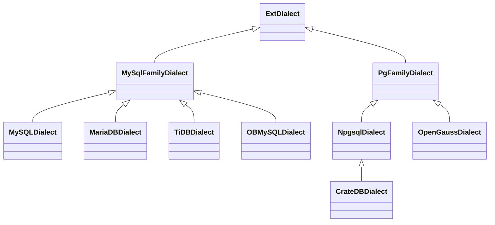
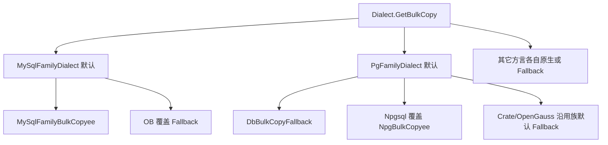

# 实施计划：方言 Family 抽象与 MariaDB 支持

> **状态**：**已落地**（2026-09-22）  
> **依据**：[方言族抽象与MariaDB支持.md](../features/方言/方言族抽象与MariaDB支持.md)  
> **英文术语**：统一 **Family**（`MySqlFamilyDialect` / `PgFamilyDialect`）。  
> **修订**：2026-09-22

---

## 0. 目标与非目标

### 目标

1. 抽出 `MySqlFamilyDialect` / `PgFamilyDialect`，现有 MySQL/TiDB/OB、Npgsql/Crate/OpenGauss **行为零回归**。  
2. 在 `SQLProviderFlags` 增补族差分旗标，产品方言只改旗标与少量 override。  
3. 交付 `DataBaseType.MariaDB` + `MariaDBDialect` + 工厂/`setDBtype` + 冒烟 + 用户文档。

### 非目标

- Doris / StarRocks / Cockroach / Yugabyte / Snowflake  
- 强制 PolarDB 独立枚举  
- 复活 Access/DB2/Informix  
- 首期不为 Express/Sentence 再抽一层「族基类文件」（Dialect 层先收复用；MariaDB 需要时再 `MariaDBExpress : MySQLExpress`）
- 不为 Fallback 再造第二套实现（沿用 [DbBulkCopyFallback](pure/src/ado/data/dialect/provider/DbBulkCopyFallback.cs)）；不把 MSSQL/Oracle/DM/ClickHouse 等跨族原生 Bulk 塞进 Family

---

## 1. 目标结构



**对外稳定**：`MySQLDialect`、`NpgsqlDialect`、`TiDBDialect`、`OBMySQLDialect`、`CrateDBDialect`、`OpenGaussDialect` 类型名与 `DialectFactory` 注册键不变。

---

## 1.1 BulkCopy 分析（内容 2）与 Family 策略

### 现状分层（已有能力）

| 层 | 类型 | 角色 |
|----|------|------|
| 抽象 API | [`DbBulkCopy`](pure/src/ado/data/dialect/provider/DbBulkCopy.cs) | 统一 Bulk 外观；`Dialect.GetBulkCopy()` 抽象工厂 |
| 通用退化 | [`DbBulkCopyFallback`](pure/src/ado/data/dialect/provider/DbBulkCopyFallback.cs) | **无原生 Bulk 时**用 SQLBuilder 多行 `INSERT`；与族无关，全库共用 |
| 驱动原生封装 | `MySqlFamilyBulkCopyee` / `NpgBulkCopyee` / `MSSQBulkCopyee` / … | 包一层驱动 API（`MySqlBulkCopy`、`COPY BINARY` 等） |

### 同族现状（与方言拼装同类问题）

| 产品 | 当前 `GetBulkCopy` | 说明 |
|------|-------------------|------|
| MySQL / TiDB | `MySqlFamilyBulkCopyee` | MySqlConnector 原生；TiDB 与 MySQL **各写一遍** |
| OceanBase MySQL | `DbBulkCopyFallback` | 同协议，但不用 MySqlBulkCopy |
| MariaDB（规划） | 应跟族默认 | 驱动同为 MySqlConnector |
| PostgreSQL | `NpgBulkCopyee` | Npgsql BinaryImporter / COPY |
| CrateDB | `DbBulkCopyFallback` | **显式**不能 COPY BINARY |
| OpenGauss / GaussDB | `DbBulkCopyFallback` | 驱动可换，不宜绑 `NpgsqlBinaryImporter` |
| KingBase 等 | Fallback | 不在本计划迁入，但与 PG 族「默认 Fallback」一致 |

**结论：存在类似问题。** 重复的不是 Fallback 实现本身（已抽象），而是各方言 **反复决定「原生还是 Fallback」**、MySQL 族内 **重复 `return new MySqlFamilyBulkCopyee`**。适合在 Family 的 `GetBulkCopy()` 上定默认策略，产品只 override 例外。

### Family 层抽象什么 / 不抽象什么



| 决策 | 内容 |
|------|------|
| D-Bulk-1 | **Family 抽象的是策略默认值**（`GetBulkCopy` virtual），不是再写一套 Fallback |
| D-Bulk-2 | **MySqlFamilyDialect** 默认 `return new MySqlFamilyBulkCopyee(dbInstance)`；`OBMySQLDialect` 覆盖为 Fallback；MariaDB/TiDB/MySQL **不写** Bulk override |
| D-Bulk-3 | **PgFamilyDialect** 默认 `return new DbBulkCopyFallback(dbInstance)`；**仅** `NpgsqlDialect` 覆盖为 `NpgBulkCopyee`；Crate/OpenGauss 不覆盖（行为与现网一致） |
| D-Bulk-4 | 不强制把 `MySqlFamilyBulkCopyee` 改名为 Family 类；首期保持类型名，避免冒烟与反射断言破裂；文档注明其为「MySQL 族默认 Bulk」 |
| D-Bulk-5 | 不做「PG 族通用 COPY」抽象：COPY BINARY 绑定 Npgsql 连接类型，OpenGauss/Crate 不适用；若未来 Gauss 有稳定 importer，在 **产品方言** 单独封装后再考虑上提 |

### 与「原生未支持」的对应关系

- **未支持原生 Bulk** → 已有共同点：`DbBulkCopyFallback`（pure，跨族）。Family 只需 **默认指向它**（PG 族）或 **在例外上指向它**（OB）。  
- **支持同源驱动 Bulk** → 共同点在 Family 默认指向同一 `*BulkCopyee`（MySQL 族 → `MySqlFamilyBulkCopyee`）。  
- **伪同族但协议/驱动不同** → 禁止在 Family 默认绑死（故 PG 族默认 Fallback，而非默认 `NpgBulkCopyee`）。

---

## 2. 阶段划分

### 阶段 A — 计划落盘与旗标契约（文档 + 小改 pure）

| 项 | 动作 |
|----|------|
| 计划文件 | 写入 `doc/design/plan/方言族抽象与MariaDB支持-实施计划.md` |
| 设计文档 | [方言族抽象与MariaDB支持.md](doc/design/features/方言/方言族抽象与MariaDB支持.md) 状态改为「实施中」，术语统一 Family |
| 旗标 | 在 [SqlProviderFlags.cs](pure/src/ado/data/dialect/SqlProviderFlags.cs) 新增并纳入 `Equals`/`GetHashCode`： |

| 旗标 | MySQL 默认 | MariaDB 默认 | 含义 |
|------|------------|--------------|------|
| `IsJsonArrowSupported` | `true` | `false`（保守，覆盖 10.11/11.x LTS） | 是否生成 `->`/`->>` |
| `IsInsertReturningSupported` | `false` | `true`（对齐 10.5+） | INSERT/UPDATE/DELETE RETURNING |
| `IsJsonNativeBinary` | `true` | `false` | JSON 是否按原生二进制语义预期 |

首期旗标以**构造时写死默认**为主，不做连接后版本探测（降低范围）；需要时再加配置覆盖。

---

### 阶段 B — MySQL Family（重构，零行为变更）

**新增** [`ext/src/provides/dialect/MySQL/MySqlFamilyDialect.cs`](ext/src/provides/dialect/MySQL/MySqlFamilyDialect.cs)（`abstract`）：

从 [MySQLDialect.cs](ext/src/provides/dialect/MySQL/MySQLDialect.cs) / [TiDBDialect.cs](ext/src/provides/dialect/TiDB/TiDBDialect.cs) 上提共性：

- 默认装配：`MySQLExpress` / `MySQLSentence` / `MySQLClauseTranslator` / `MySQLMappingPanel` / `MySQLFunction`
- ADO：`MySqlConnection/Command/DataAdapter/CommandBuilder`、`AddCmdPara*`
- **Bulk（D-Bulk-2）**：`virtual GetBulkCopy()` 默认 `MySqlFamilyBulkCopyee`；子类无原生能力时再 override
- `CreateMemberTranslator` → `MySqlMemberTranslator`
- `SupportsMerge() => false`
- `ProviderFlags.IsInsertOrUpdateSupported = true`，以及上表 MySQL 族默认旗标

**迁入（只改基类 + 删重复）：**

| 类 | 改后 | 子类保留 |
|----|------|----------|
| `MySQLDialect` | `: MySqlFamilyDialect` | `initDBVersion` 及 MySQL 特有逻辑；**删除**重复的 `GetBulkCopy`（吃族默认） |
| `TiDBDialect` | `: MySqlFamilyDialect` | `TiDBExpress`、Option；**删除**重复 `GetBulkCopy` |
| `OBMySQLDialect` | `: MySqlFamilyDialect` | `OBMySQLExpress`、`initVersions`；**保留** `GetBulkCopy → DbBulkCopyFallback` |

**验收：**

```text
dotnet test Tests/TestBug/mooSQL.Tests.csproj -f net8.0 --filter "FullyQualifiedName~TiDB|FullyQualifiedName~MySQL|FullyQualifiedName~OceanBase|FullyQualifiedName~DBTestProvider"
```

工厂返回类型、LIMIT/`?`、Bulk 类型名与现冒烟一致。

---

### 阶段 C — PostgreSQL Family（重构，零行为变更）

**新增** [`ext/src/provides/dialect/Npgsql/PgFamilyDialect.cs`](ext/src/provides/dialect/Npgsql/PgFamilyDialect.cs)（`abstract`）：

- 默认装配 PG 轮子：`NpgsqlExpress` / `NpgSentence` / `NpgClauseTranslator` / `NpgMappingPanel` / `NpgSQLFunction`（子类可在 ctor 末尾覆盖）
- **不**绑定 `NpgsqlConnection`：ADO 方法保持 `abstract` 或由具体子类实现（满足 OpenGauss 换驱动）
- **Bulk（D-Bulk-3）**：`virtual GetBulkCopy()` 默认 `DbBulkCopyFallback`；**禁止**在 PgFamily 默认返回 `NpgBulkCopyee`
- `CreateMemberTranslator` 默认 `NpgsqlMemberTranslator`（OpenGauss 若已有覆盖则保留）
- `SupportsMerge` 默认 `true`（与现 Npgsql 一致；Crate 若需否再 override）

**迁入：**

| 类 | 改后 | 说明 |
|----|------|------|
| `NpgsqlDialect` | `: PgFamilyDialect` | stock Npgsql ADO；**覆盖** `GetBulkCopy → NpgBulkCopyee` |
| `CrateDBDialect` | 仍 `: NpgsqlDialect` | **必须继续覆盖** Bulk → Fallback（否则会继承到 Npgsql 的 COPY）；保留现有 override |
| `OpenGaussDialect` | `: PgFamilyDialect` | 吃族默认 Fallback；可删与族默认相同的 `GetBulkCopy` 样板；保留 GaussDB/Npgsql `#if` ADO 与 OpenGauss* 轮子 |

**验收：** Crate / OpenGauss 冒烟仍断言 `DbBulkCopyFallback`；PG 仍为 `NpgBulkCopyee`；`DBTestProvider` 相关全绿。

> **注意（Crate）**：`CrateDBDialect : NpgsqlDialect` 时，Bulk 不能「只靠 PgFamily 默认」——因为中间层 Npgsql 已覆盖为原生 COPY。Crate **必须保留** `GetBulkCopy → Fallback` override（现状已如此）。这是继承链上的已知代价；不为此把 Crate 改为直挂 PgFamily（避免扩大行为面）。

---

### 阶段 D — MariaDB 产品（纯增量）

| 项 | 内容 |
|----|------|
| 枚举 | [DataBase.cs](pure/src/ado/data/database/DataBase.cs)：`MariaDB = 25` |
| `setDBtype` | `MARIADB` / `MariaDB` / `玛丽亚` → `MariaDB` |
| 方言 | `ext/src/provides/dialect/MariaDB/MariaDBDialect.cs`：`: MySqlFamilyDialect`；ctor 设 MariaDB 旗标；**Bulk 不 override**（吃族默认 `MySqlFamilyBulkCopyee`）；Express/Sentence 首期复用 MySQL（若 RETURNING 拼 SQL 必须差分再加 `MariaDBExpress`） |
| 工厂 | [DialectFactory.cs](ext/src/provides/DialectFactory.cs) 注册 |
| 测试辅助 | [DBTest.Providers.cs](Tests/TestBug/src/TestExt/DBTest.Providers.cs)：`useMariaDBDialectOnly()` / `useMariaDB(conn?)`（`MARIADB_CONN`） |
| 冒烟 | `MariaDBDialectSmokeTests.cs`：对标 TiDB（工厂类型、LIMIT/`?`、Bulk、旗标断言、可选 Live `SELECT 1`） |
| 用户文档 | 新增 `doc/design/features/方言/MariaDB-方言适配.md`；更新 `.cursor/skills/moo-sql/SKILL.md` 支持列表一行 |

**MariaDB 首期不做：** 复制/GTID、存储过程差异、连接后版本探测开启 Arrow、强制旧项目改枚举。

---

### 阶段 E — 明确不在本计划

Doris / StarRocks / Cockroach / Yugabyte：另开设计/实施文，本 PR 序列不包含。

---

## 3. PR / 提交建议顺序

1. **PR1**：阶段 A 旗标 + 计划/设计文档状态（可合并进 PR2）  
2. **PR2**：阶段 B MySQL Family 重构  
3. **PR3**：阶段 C PG Family 重构  
4. **PR4**：阶段 D MariaDB 增量 + 用户文档 + skill  

禁止在 PR2/PR3 夹带 MariaDB 行为变更。

---

## 4. 风险控制

| 风险 | 控制 |
|------|------|
| 上提 ADO 时漏掉 `initDBVersion` / OB 特有路径 | 子类保留原私有方法；diff 以「删重复、改基类」为主 |
| OpenGauss 继承 PgFamily 后轮子被基类 ctor 冲掉 | PgFamily ctor 只设「可被覆盖的默认」；OpenGauss 在自身 ctor **后写** OpenGauss* 组件（与现 Crate 模式一致） |
| `SQLProviderFlags` Equals/Hash 漏字段 | 增旗标时同步改两处（现文件已有完整手写实现） |
| 旗标尚未被生成器消费 | 阶段 D 至少在冒烟断言旗标；JSON Arrow / RETURNING 的生成路径若暂无分支，在 MariaDB 文档写明「旗标已就绪，生成接入随 LINQ/Express 迭代」——若阶段 D 发现 Insert 路径已读类似标志，则接到 `IsInsertReturningSupported` |
| Crate 继承 Npgsql 后 Bulk 误用 COPY | 阶段 C 保留 Crate 的 Fallback override；冒烟锁定 `DbBulkCopyFallback` |
| 误在 PgFamily 默认挂 NpgBulkCopyee | 代码评审对照 D-Bulk-3；OpenGauss 无 NpgsqlConnection 时会运行期失败 |

---

## 5. 完成定义（DoD）

- [ ] `MySqlFamilyDialect` / `PgFamilyDialect` 存在；TiDB/OB/Crate/OpenGauss 继承关系符合上图  
- [ ] Bulk 策略符合 §1.1：MySQL 族默认 `MySqlFamilyBulkCopyee`；OB/Crate/OpenGauss 为 Fallback；PG 为 `NpgBulkCopyee`；MariaDB 吃族默认  
- [ ] MySQL/TiDB/OB/PG/Crate/OpenGauss 既有测试无回归  
- [ ] `DataBaseType.MariaDB` + 工厂 + `setDBtype` + 冒烟（含三旗标与 Bulk 类型期望值）  
- [ ] `MariaDB-方言适配.md` + skill 列表更新；设计/计划文档写明 Bulk 族策略  
- [ ] 设计文档状态改为「已支持 / 已落地」（阶段 D 完成后）
