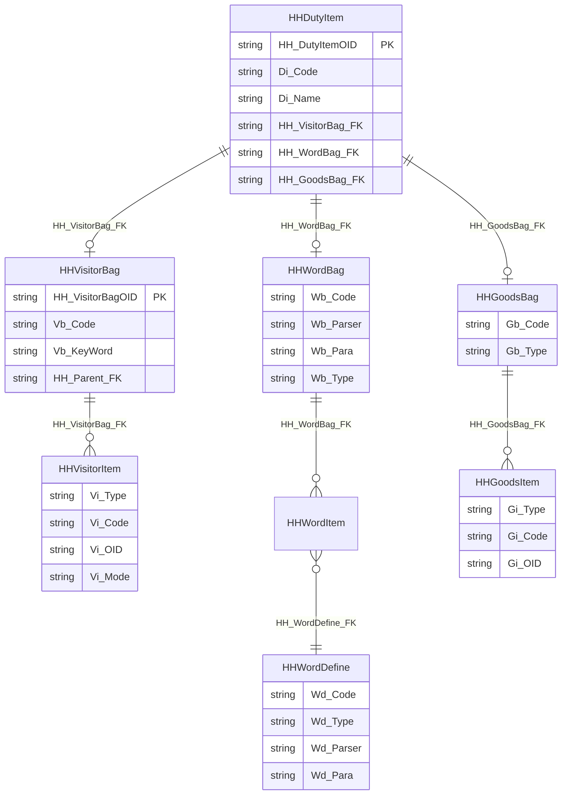
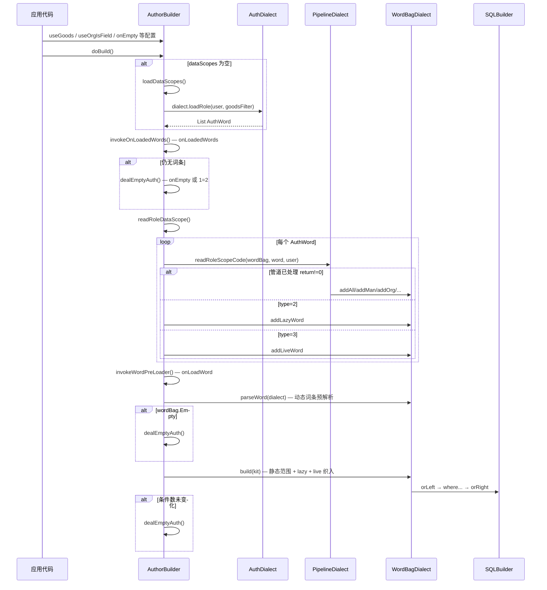

# mooSQL 数据权限体系

## 1. 概述

mooSQL 数据权限模块（`mooSQL.auth`）解决 **数据库查询带数据权限** 的问题。设计理念延续自 SQLBuilder：与 SQLBuilder 深度绑定，可输出纯 SQL 或参数化 SQL；核心库只封装权限加载、解析、应用的过程与优化判定，**具体的表结构、角色定义、词条语义由业务系统实现**。

因此每个业务系统都会有一套或多套伴生子类（方言 + 管道 + 构建器），而数据库侧通常采用 **AuthBag（权限包）** 模型来配置「资源 + 访客 + 词条」三元组。

| 文档 | 说明 |
|------|------|
| 本文 | 权限体系总览（概念、架构、AuthBag 模型、实现指南、API） |
| [authlife.md](./authlife.md) | 执行生命周期各阶段详解 |
| [authbase.md](./authbase.md) | 早期 API 与案例备忘 |

### 源码位置

| 层级 | 路径 |
|------|------|
| 核心抽象 | `pure/src/zoom/auth/` |
| 业务实体（AuthBag） | `Tests/src/DBLayer/AuthBag/` |
| 业务实现示例 | `Tests/src/Auth/SysRole/` |

---

## 2. 核心概念

### 2.1 权限公式

```
用户数据权限 = 资源（Goods）+ 访客（Visitor）+ 词条（Word）
```

- **资源（Goods）**：权限生效所针对的功能入口，如菜单、按钮、门户、VC 等。必须在系统加载时预先可知晓，用于缩小「哪些责任/角色参与计算」。
- **访客（Visitor）**：权限作用的对象范围，可以是某个人、某个部门、某个群组。同样需在加载前确定（登录人、指定人员、指定单位等）。
- **词条（Word）**：数据范围的具体语义，如「本人数据」「本单位及下级」「作为班主任的数据」等。

### 2.2 预定义权限实体（核心库）

| 类 | 含义 | 关键字段 |
|----|------|----------|
| `AuthUser` | 权限主体（用户） | `UserOID`、`Acount`、`orgOID`、`divisionOID`、`postNo` |
| `AuthOrg` | 组织/部门 | `HROID`、`HRCode`（层次码）、`OrgNo` |
| `AuthPost` | 岗位 | `postOID`、`postCode`、`postNo` |
| `AuthWord` | 词条/数据范围 | `scopeCode`、`type`、`parser`、`para`、`groupId` |
| `AuthGoods` | 资源项 | `id`、`code`、`type`、`group` |
| `AuthGoodsBag` | 资源集合 | `Goods` 列表 |

### 2.3 词条类型（`AuthWord.type`）

| type | 名称 | 处理方式 |
|------|------|----------|
| `1`（默认） | 静态词条 | 由 `PipelineDialect.readRoleScopeCode` 直接翻译为组织/人员/岗位范围 |
| `2` | 延迟词条（Lazy） | 进入 `lazyWords`，在 `onLoadWord` / `onParseWord` 阶段由业务解析 |
| `3` | 动态词条（Live） | 进入 `WordTranslator`，按 JSON 条件树 + `onBuildLiveWord` 织入 SQL |

`readRole` 的返回值决定是否已由管道处理：`readRoleScopeCode` 返回非 0 表示已处理；返回 0 时按 `type` 分流到 lazy/live。

---

## 3. 架构分层

```mermaid
flowchart TB
    subgraph app [应用层]
        SQL["SQLBuilder.useAuthor / useDuty"]
        Ext["AuthExtension 二次封装"]
    end

    subgraph biz [业务层 — 每个系统实现]
        AB["AuthBuilder : AuthorBuilder&lt;T&gt;"]
        AD["AuthLoader : AuthDialect"]
        AP["AuthPipeline : PipelineDialect"]
        AF["MyAuthFactory : AuthFactory&lt;T&gt;"]
        DB["AuthBag 表：Duty / Visitor / Word / Goods"]
    end

    subgraph core [核心层 pure/src/zoom/auth]
        AuthorBuilder
        AuthDialect
        PipelineDialect
        WordBagDialect
        WordGroupBag
        WordTranslator
        CodeRange / ItemRange
    end

    SQL --> Ext --> AB
    AB --> AF --> AD
    AB --> AuthorBuilder
    AD --> AuthDialect
    AP --> PipelineDialect
    AD --> AP
    AD --> WordBagDialect
    DB -.->|"loadDataScopes 读取"| AD
```

### 3.1 核心类职责

| 类 | 职责 | 业务侧是否重写 |
|----|------|----------------|
| `AuthorBuilder<RealDialect>` | 权限构建器：配置参数、驱动加载→解析→织 SQL | **是**（如 `AuthBuilder`） |
| `AuthDialect` | 方言：用户/组织/岗位/词条的数据库加载 | **是**（如 `AuthLoader`） |
| `AuthFactory<RealDialect>` | 工厂：创建方言及实体实例 | **是**（如 `MyAuthFactory`） |
| `PipelineDialect` | 管道：将 `scopeCode` 翻译为 `WordBagDialect` 中的范围 | **是**（如 `AuthPipeline`） |
| `WordBagDialect` | 词条集合：多分组 OR 组合，组内 AND/OR | 可选重写 |
| `WordGroupBag` | 单组权限：人/组织/岗位范围 + lazy/live 词条 | 可选重写 |
| `WordTranslator` | 动态语义 JSON → `ConditionGroup` → SQL | 可选重写 |
| `CodeRange<T>` | 层次码范围（组织、岗位树） | 一般不重写 |
| `ItemRange<T>` | 个体范围（用户列表） | 一般不重写 |

### 3.2 继承关系（业务示例）

```
核心库                              业务库（Tests/src/Auth/SysRole）
─────────────────────────────────────────────────────────────────
AuthorBuilder<RealDialect>    →    AuthBuilder : AuthorBuilder<AuthLoader>
AuthDialect                   →    AuthLoader
PipelineDialect               →    AuthPipeline
AuthFactory<RealDialect>      →    MyAuthFactory
```

---

## 4. AuthBag 业务数据模型

AuthBag 是业务侧对「资源 + 访客 + 词条」的持久化配置模型，实体位于 `Tests/src/DBLayer/AuthBag/`。

### 4.1 表结构总览



### 4.2 各表说明

#### 责任项 `hh_dutyitem`（`HHDutyItem`）

权限配置的 **聚合根**：一条责任 = 一个访客集合 + 一个词条集合 + 一个资源集合。

| 字段 | 说明 |
|------|------|
| `Di_Code` / `Di_Name` | 责任编号、名称 |
| `HH_VisitorBag_FK` | 关联访客集合 |
| `HH_WordBag_FK` | 关联词条集合 |
| `HH_GoodsBag_FK` | 关联资源集合 |

#### 访客集合 `hh_visitorbag` + 访客项 `hh_visitoritem`

界定「对谁生效」。

| 层级 | 关键字段 | 说明 |
|------|----------|------|
| 集合 | `Vb_Code`、`Vb_KeyWord` | 集合标识、关键成员描述 |
| 集合 | `HH_Parent_FK` | 支持访客集合嵌套 |
| 项 | `Vi_Type` | 访客类型（人/组织/岗位/角色等，由业务定义） |
| 项 | `Vi_Code` / `Vi_OID` | 访客标识 |
| 项 | `Vi_Mode` | 匹配方式（等值、包含下级等） |
| 项 | `Vi_IsOn` | 是否启用 |

对应核心库：通过 `AuthDialect.getUser/getOrg` 加载 `AuthUser`、`AuthOrg` 等，再填入 `WordBagDialect`。

#### 词条集合 `hh_wordbag` + 词条项 `hh_worditem` + 词条定义 `hh_worddefine`

界定「能看到什么数据范围」。

| 层级 | 关键字段 | 说明 |
|------|----------|------|
| 集合 | `Wb_Parser` / `Wb_Para` | 集合级解析器与参数 |
| 集合 | `Wb_Type` / `Wb_Tache` | 类型、解析时机 |
| 项 | `HH_WordDefine_FK` | 引用词条定义 |
| 定义 | `Wd_Code` | 范围码，对应 `AuthWord.scopeCode` |
| 定义 | `Wd_Type` | 对应 `AuthWord.type`（静态/延迟/动态） |
| 定义 | `Wd_Parser` | 动态词条 JSON 条件树 |
| 定义 | `Wd_Para` | 默认参数 |

加载时映射为 `AuthWord`：

```csharp
new AuthWord {
    id = row["Id"].ToString(),
    scopeCode = row["DataScope"].ToString(),  // 或 Wd_Code
    code = row["Code"].ToString(),
    name = row["Name"].ToString(),
    type = wd_Type,
    parser = wd_Parser,
    para = wd_Para,
    groupId = groupId
};
```

#### 资源集合 `hh_goodsbag` + 资源项 `hh_goodsitem`

界定「在哪个功能入口下生效」。

| 层级 | 关键字段 | 说明 |
|------|----------|------|
| 集合 | `Gb_Code` / `Gb_Type` | 资源包标识 |
| 项 | `Gi_Type` | 资源类型（如 `1`=菜单） |
| 项 | `Gi_Code` / `Gi_OID` | 菜单权限码或 OID |

运行时通过 `AuthorBuilder.useGoods(...)` 或 `goodsBag.addGoods(...)` 注入，在 `loadDataScopes` 中过滤角色/责任。

### 4.3 AuthBag 与核心库的映射

| AuthBag 概念 | 核心库类/成员 |
|--------------|---------------|
| 责任项 | 一次权限计算单元；`loadDataScopes` 的查询主体 |
| 访客项 | `AuthUser` / `AuthOrg` / `AuthPost` → `wordBag.addMan/addOrg/...` |
| 词条定义.scopeCode | `PipelineDialect.readRoleScopeCode` 的分支键 |
| 词条定义.parser | `AuthWord.parser` → `WordTranslator` / `ConditionGroup` |
| 资源项 | `AuthGoods` → `goodsBag.Goods` → 角色加载 WHERE 条件 |

### 4.4 两种业务权限模式

项目中存在两种典型落地方式，可并存：

| 模式 | 数据来源 | 示例 |
|------|----------|------|
| **角色 + DataScope** | 用户角色表 + 角色上的 `DataScope` 字段 | `AuthLoader.loadRole` 查 `hh_sysrole` |
| **AuthBag 责任包** | `hh_dutyitem` 关联的三类 Bag | 按菜单/门户查责任项，再展开 Visitor + Word |

核心库的 `AuthorBuilder` 对两种模式透明：业务只需实现 `loadDataScopes()` 返回 `List<AuthWord>`，并在 `readRoleDataScope()` 中决定是否 `addAll()`（超管）及如何遍历词条。

---

## 5. 执行生命周期

`doBuild()` 是权限生效的唯一入口。完整流程如下：



### 5.1 阶段说明

| 阶段 | 触发点 | 用途 |
|------|--------|------|
| 前置配置 | `useGoods`、`useManVisit`、`useOrgVisit`、`useWordPara` 等 | 限定资源、访客、动态参数 |
| 加载词条 | `loadDataScopes()` | 从 DB 读取 `AuthWord` 列表 |
| 加载后 | `onLoadedWords` | 词条刚读完，尚未解析 |
| 空权限 | `onEmpty` | 无词条或织入失败时的兜底（默认 `1=2`） |
| 解析静态 | `readRoleDataScope` + `readRoleScopeCode` | scopeCode → 人/组织/岗位范围 |
| 延迟预处理 | `onLoadWord` | 为 lazy 词条准备上下文 |
| 动态预解析 | `parseWord` | JSON parser → `ConditionGroup` |
| 静态织入 | `wordBag.build` | `whereOrgIs` 等委托生成 SQL |
| 延迟/动态织入 | `onParseWord`、`onBuildLiveWord` | 业务自定义 SQL |
| 全部数据 | `addAll` + `onIsAll` | 超管或 scopeCode=全部 |

### 5.2 分组与逻辑组合

- **组间**：`WordBagDialect.groups` 的多个 `WordGroupBag` 用 **OR** 连接（`kit.orLeft/orRight`）。
- **组内**：默认组（`groupId = _empty`）内人/组织/岗位条件用 **OR**；非默认组（`AuthWord.groupId` 指定）用 **AND**（`isAdd = true`）。
- **范围优化**：`CodeRange` 在 `addContainValue` 时自动去除已被父级覆盖的子级编码，避免冗余条件。

---

## 6. 范围处理机制

### 6.1 CodeRange（组织/岗位树）

| 方法 | 含义 |
|------|------|
| `addBindValue` | 仅当前节点（等值 / IN） |
| `addContainValue` | 当前节点及下级（层次码前缀 LIKE） |
| `useIsBuilder` / `useInBuilder` / `useLikeBuilder` | 注册 SQL 编织委托 |
| `useAllBuilder` | 对整个 `CodeRange` 一次性生成 SQL（`whereOrgBag`） |

组织层次关系通过 `AuthOrg.isChildOf`（`HRCode.StartsWith`）判定。

### 6.2 ItemRange（人员）

| 方法 | 含义 |
|------|------|
| `add` | 添加用户（去重） |
| `useOneBuilder` / `useInBuilder` | 单人 / IN 列表 SQL |

### 6.3 动态条件（Condition / ConditionGroup）

动态词条的 `parser` 字段存 JSON 条件树，结构示例：

```json
{
  "Operation": "or",
  "Filters": [
    { "Key": "{loginRole}", "Value": "uuid1,uuid2", "Contrast": "contains" }
  ],
  "Children": [
    {
      "Operation": "and",
      "Filters": [
        { "Key": "CreateUserId", "Value": "{loginUser}", "Contrast": "==" }
      ]
    }
  ]
}
```

支持的 `Contrast`：`==`、`!=`、`<`、`>`、`<=`、`>=`、`contains`、`in`、`not in`、`between`。

占位符（如 `{loginUser}`）通过 `useWordPara` 注入，由 `readAuthWordPara` 在织入前替换。

---

## 7. 业务侧实现指南

实现一套完整权限需 **4 个必写类** + 1 个扩展方法。

### 7.1 AuthFactory

```csharp
public class MyAuthFactory : AuthFactory<AuthLoader>
{
    public override AuthLoader GetDialect() => new AuthLoader();
}
```

### 7.2 AuthDialect（AuthLoader）

必须实现：

- `getPipeLine()` / `getWordBag()`
- `getOrgByOID`、`getOrgByOIDs`、`getOrg`、`getUser`、`getPost`
- `loadManOrg`、`loadManDiv`、`loadManPost`
- `getDefaultRole`

业务特有方法示例：`loadRole(UserManager user, Action<SQLBuilder> onloading)` — 查用户角色并映射为 `AuthWord`，同时接受 `goodsBag` 过滤。

### 7.3 PipelineDialect（AuthPipeline）

实现 `readRoleScopeCode`，将 `scopeCode` 映射到 `WordBagDialect` 操作：

```csharp
public override int readRoleScopeCode(WordBagDialect range, AuthWord role, AuthUser user)
{
    switch (role.scopeCode)
    {
        case "1": range.addAll(); return 1;
        case "2": range.addContainOrg(user.HisDivision); return 1;
        case "3": range.addBindOrg(user.HisDivision); return 1;
        case "4": range.addMan(user); return 1;
        case "10": range.addBindPost(user.HisPost); return 1;
        case "11": range.addContainPost(user.HisPost); return 1;
        default: return 0;  // 交给 lazy/live 或 onParseWord
    }
}
```

可选：重写 `parseAuthWord(AuthWord role)` 将 `role.parser` JSON 反序列化为 `ConditionGroup`。

### 7.4 AuthorBuilder（AuthBuilder）

必须实现：

```csharp
public override List<AuthWord> loadDataScopes() { /* 查库 + goodsBag 过滤 */ }

public override void readRoleDataScope()
{
    if (user.SuperAdmin) { wordBag.addAll(); return; }
    foreach (var word in dataScopes)
        readRole(word, authUser);
}
```

### 7.5 SQLBuilder 扩展

```csharp
public static SQLBuilder useAuthor(this SQLBuilder kit, UserManager user, Action<AuthBuilder> buildAuth)
{
    var auth = new AuthBuilder { user = user };
    auth.useSQLBuilder(kit);
    buildAuth(auth);
    return kit;
}
```

---

## 8. API 参考

### 8.1 配置期（doBuild 之前）

#### 资源过滤

```csharp
useGoods(long id = 0, string code = "", string type = "", string group = "2", string name = "")
```

#### 字段快捷绑定

| 方法 | 作用 |
|------|------|
| `useUseIsField(field)` | 用户 OID 等值 + IN |
| `useUseOIDFK(fk)` | 用户外键列 |
| `useOrgIsField(field)` | 组织 OID 等值 + IN |
| `useOrgOIDFK(fk)` | 组织外键列 |
| `useOrgLikeField(classCodeField)` | 组织层次码左匹配 |
| `useOrgCode(classCodeField)` | 同 `useOrgLikeField` |

#### 动态参数

```csharp
useWordPara(string key, object val)
```

#### 自定义角色加载

```csharp
onloadRole(Action<SQLBuilder> onload)
```

### 8.2 条件编织注册

| 方法 | 范围类型 |
|------|----------|
| `whereUserIs` / `whereUserIn` | 用户 |
| `whereOrgIs` / `whereOrgIn` / `whereOrgLike` / `whereOrgOne` / `whereOrgBag` | 组织 |
| `wherePostIs` / `wherePostIn` / `wherePostLike` / `wherePost` | 岗位 |
| `whereOrgLikeByPK` / `whereOrgLikesByPK` | 非层次码的组织下级 |

### 8.3 事件钩子

| 方法 | 时机 |
|------|------|
| `onEmpty(Func<AuthorBuilder<T>, string>)` | 无权限或织入失败 |
| `onLoadedWords(Action<RealDialect>)` | 词条加载完毕，未解析 |
| `onLoadWord(Action<AuthWord, RealDialect>)` | 延迟词条解析前 |
| `onParseWord(Func<AuthWord, RealDialect, string>)` | 延迟词条织入 SQL |
| `onBuildLiveWord(Action<ConditionGroup, SQLBuilder>)` | 动态词条织入 SQL |
| `onIsAll(Func<WordBagDialect, string>)` | 全部数据时替换默认 `1=1` |

### 8.4 执行

```csharp
string doBuild()   // 执行完整流程，返回条件摘要或 "1=2"
reset()            // 清空已注册编织器（不含角色加载条件）
```

### 8.5 AuthorBuilder 成员

| 成员 | 说明 |
|------|------|
| `factory` | 抽象工厂 |
| `kit` | 绑定的 SQLBuilder |
| `dialect` | 方言实例 |
| `authUser` | 当前权限用户 |
| `goodsBag` | 资源集合 |
| `dataScopes` | 未解析的原始词条 |
| `roleIds` | 参与计算的角色 ID |

---

## 9. 使用示例

### 9.1 最简：按菜单 + 角色 DataScope

```csharp
var data = kit.clear()
    .select("u.*")
    .from("Orders o")
    .useAuthor(_userManager, auth =>
    {
        auth.useGoods(code: "order:list", type: "1")
            .useUseIsField("o.CreatedBy")
            .useOrgIsField("o.OrgId")
            .useOrgLikeField("o.OrgCode")
            .onEmpty(a => {
                kit.where("1=2");
                return "";
            })
            .doBuild();
    })
    .query();
```

### 9.2 完整：资源过滤 + 自定义词条 + 动态语义

```csharp
kit.select("a.*")
   .from("KB_Task a")
   .useAuthor(_userManager, auth =>
   {
       auth.useGoods(id: menuId, type: "1")
           .useWordPara("{manCode}", manCode)
           .onloadRole(k => {
               k.whereIn("d.HH_GoodsBag_FK", g => {
                   g.select("gi.HH_GoodsBag_FK")
                    .from("hh_goodsitem gi")
                    .where("gi.Gi_OID", portalOID)
                    .where("Gi_Type", "3");
               });
           })
           .useOrgIsField("a.KB_OrgOID")
           .useOrgLikeField("a.KB_OrgCode")
           .useUseIsField("a.SYS_Created")
           .onParseWord((word, range) => {
               if (word.scopeCode == "t01")
               {
                   kit.whereIn("a.KB_OrgOID", mc => {
                       mc.select("dw.HH_Org_FK")
                         .from("kb_deptworkor dw")
                         .where("dw.Dw_Code", _userManager.Account);
                   });
               }
               return null;
           })
           .onBuildLiveWord((child, k) => {
               if (child.key == "{taskBase}")
                   child.ApplyToSQL(k);
           })
           .onEmpty(a => {
               kit.whereLikeLeft("a.KB_OrgCode", myCode);
               return "";
           })
           .doBuild();
   })
   .query();
```

### 9.3 AuthBag 责任包加载（伪代码）

从 `hh_dutyitem` 展开三 Bag 的典型查询思路：

```csharp
// 1. 按资源项定位责任
kit.select("d.HH_DutyItemOID, d.HH_WordBag_FK, d.HH_VisitorBag_FK")
   .from("hh_dutyitem d")
   .join("join hh_goodsbag gb on d.HH_GoodsBag_FK = gb.HH_GoodsBagOID")
   .join("join hh_goodsitem gi on gi.HH_GoodsBag_FK = gb.HH_GoodsBagOID")
   .where("gi.Gi_Code", menuPermission);

// 2. 展开词条项 → AuthWord
kit.select("wd.Wd_Code as scopeCode, wd.Wd_Type as type, wd.Wd_Parser as parser")
   .from("hh_worditem wi")
   .join("join hh_worddefine wd on wi.HH_WordDefine_FK = wd.HH_WordDefineOID")
   .where("wi.HH_WordBag_FK", wordBagFk);

// 3. 访客项 → 过滤 loginUser 是否命中 VisitorBag（业务自定义）
```

具体 SQL 因 `Vi_Type` / `Vi_Mode` 约定而异，核心库不绑定 AuthBag 表名，由 `AuthLoader.loadDataScopes` 实现。

---

## 10. 与 SQLBuilder 的集成

权限条件通过 `WordBagDialect.build` 写入 SQLBuilder：

```
kit.orLeft()
  ( 组1条件 OR 组2条件 OR ... )   // 或 isAll → 1=1
kit.orRight()
```

若 `doBuild` 前后 `kit.ConditionCount` 未变化，视为未织入有效条件，走 `dealEmptyAuth()`。

二次封装可隐藏 `AuthorBuilder` 细节，例如历史项目中的 `useDuty` / `useResp`；底层仍调用同一套 `doBuild` 流程。

---

## 11. 扩展点 checklist

| 需求 | 扩展方式 |
|------|----------|
| 新 scopeCode 语义 | 改 `PipelineDialect.readRoleScopeCode` |
| 复杂 scopeCode（需查库） | `type=2` + `onParseWord` |
| JSON 可配置条件 | `type=3` + `parseAuthWord` + `onBuildLiveWord` |
| 自定义组织 SQL（无直接字段） | `whereOrgIn` / `whereOrgLike` 内写子查询 |
| 换词条分组策略 | 重写 `AuthFactory.getWordGroupBag` 或 `WordBagDialect` |
| 扩展 AuthUser 属性 | 继承 `AuthUser`，在 `AuthFactory.getAuthUser` 返回 |
| AuthBag 新访客类型 | 在 `loadDataScopes` 或 Visitor 解析处增加 `Vi_Type` 分支 |
| 超管看全部 | `readRoleDataScope` 中 `wordBag.addAll()` |
| 无权限时业务兜底 | `onEmpty` |
| 全部数据自定义 | `onIsAll` |

---

## 12. 设计要点

1. **核心稳定、业务可变**：加载谁的角色、scopeCode 含义、表结构均在业务方言中实现，核心只负责人/组织/岗位范围的合并优化与 SQL 织入协议。
2. **与 SQLBuilder 一体**：权限是 WHERE 子句的一段 OR 分组，而非独立中间件；方便调试（可直接 `print()` SQL）。
3. **静态 + 延迟 + 动态三级词条**：覆盖从枚举 DataScope 到运行时 JSON 条件的全谱系。
4. **AuthBag 可配置**：责任项聚合三类 Bag，适合后台配置化权限；与角色 DataScope 模式可共存。
5. **失败 closed**：默认无权限时 `1=2`，除非 `onEmpty` 显式兜底。

---

## 13. 相关测试

`Tests/src/Auth/AuthOptimizationsTests.cs` 覆盖：

- `onLoadWord` / `invokeWordPreLoader` 调用链
- `Condition` 的 `not in` / `between` 织入
- `CodeRange` 父子层次码去重

业务集成示例见 `Tests/src/Auth/SysRole/`。
