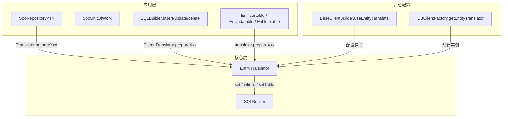

# 仓储与 EntityTranslator 持久化切面

## 1. 背景与升级目标

`EntityTranslator`（实体转译器）负责将实体对象映射为 SQLBuilder 的 INSERT / UPDATE / DELETE / SELECT 语句片段。它原本主要服务于 SQLClip 查询与 SQLBuilder 实体扩展；近期对其持久化路径进行了大幅升级，**核心动机是增强仓储（Repository）在增删改时的可扩展能力**。

升级目标：

- 在实体 **插入、更新、删除** 的 SQL 生成过程中，允许业务侧注册个性化逻辑。
- 在 **执行前、字段赋值中、执行后** 三个阶段插入钩子（切面）。
- 典型场景：保存实体时自动填充系统字段（创建时间、创建人、租户 ID、版本号、逻辑删除标记等），将原先分散在仓储或 Service 中的重复赋值逻辑收敛到一处。

版本记录见 [更新迭代记录](../configs/updatelog.md) v8.0.0.2：`EntityTranslator 实体转义器增加切面，允许对实体的插入、更新、删除的 SQL 生成前后插入自定义逻辑`。

---

## 2. 架构关系



| 组件 | 路径 | 与 EntityTranslator 的关系 |
|------|------|---------------------------|
| `SooRepository<T>` | `pure/src/adoext/repository/SooRepository.cs` | 持有 `Translator`，Insert/Update/Save 经 `prepareInsert` / `prepareUpdate` |
| `SooUnitOfWork` | `pure/src/adoext/repository/SooUnitOfWork.cs` | 通过 `useRepo<T>()` 间接使用仓储，继承同一 Translator 行为 |
| `SQLBuilder` 扩展 | `pure/src/utils/door/SQLBuilderExtensions.cs` | `insert/update/delete` 使用 `Client.Translator` |
| `EntitySaveBase` | `pure/src/adoext/savable/EntitySaveBase.cs` | `insertable()` / `updatable()` / `deleteable()` 链式 API 的基类 |
| `BaseClientBuilder` | `pure/src/aop/BaseClientBuilder.cs` | `useEntityTranslate` 在构建时配置全局 Translator |
| `MooClient.Translator` | `pure/src/aop/MooClient.cs` | 客户端级单例 Translator，SQLBuilder 扩展默认使用 |

---

## 3. 持久化执行链路

以仓储插入为例，完整调用链如下：

```
repo.Insert(entity)
  → insertInner(entity, kit)
      → OnBeforeSave(entity)                    // 仓储层虚方法（子类可重写）
      → Translator.prepareInsert(...)
          → fireBeforeInsert                    // 切面：插入前
          → setSaveTable                        // 解析表名
          → 遍历列 → setInsertFieldValue
              → fireInsertField                 // 切面：逐字段赋值
              → kit.set(col, val)               // 默认赋值
          → fireReadyInsert                     // 切面：插入 SQL 片段就绪
      → kit.doInsert()                          // 执行 SQL
      → OnAfterSave(entity, rows)               // 仓储层虚方法
```

更新（`prepareUpdate`）、删除（带 Type 参数的 `prepareDelete`）结构对称，见下文钩子表。

### 3.1 仓储 Save 的 Insert/Update 分支

`Save` / `SaveRange` 在 `SaveInner` 中根据主键是否为空、以及数据库是否已存在记录，自动选择插入或更新，**两种路径均会触发对应 Insert/Update 切面**。

### 3.2 与仓储虚方法的分工

| 层次 | 机制 | 时机 | 粒度 |
|------|------|------|------|
| `SooRepository<T>` | `OnBeforeSave` / `OnAfterSave` | SQL 执行前后 | 按实体类型子类重写，仅仓储路径 |
| `EntityTranslator` | `OnBeforeXxxEntity` / `OnXxxField` / `OnReadyXxxEntity` | SQL **构建**过程中 | 全局注册，按实体类型/字段过滤 |

推荐：**系统字段默认值、审计字段** 放在 `EntityTranslator` 切面；**单表特殊业务校验** 可放在仓储子类 `OnBeforeSave`。

---

## 4. 切面 API 一览

注册入口均在 `EntityTranslator.config.cs`，链式返回 `this`，可多次注册（事件累加）。

### 4.1 插入

| 方法 | 签名 | 触发时机 | 典型用途 |
|------|------|----------|----------|
| `OnBeforeInsertEntity` | `Action<SQLBuilder, object, Type, EntityInfo>` | 解析表名之前 | 修改实体属性、注入上下文值 |
| `OnInsertField` | `Func<SQLBuilder, string, object, EntityInfo, bool>` | 每个非忽略列写入 SET 前 | 按列名自定义 SQL 片段；**返回 true 表示已处理，跳过默认 `kit.set`** |
| `OnReadyInsertEntity` | `Action<SQLBuilder, object, Type, EntityInfo>` | 所有列处理完毕、执行 INSERT 前 | 补充额外列、修正 SQLBuilder 状态 |

### 4.2 更新

| 方法 | 签名 | 触发时机 | 典型用途 |
|------|------|----------|----------|
| `OnBeforeUpdateEntity` | `Action<SQLBuilder, object, Type, EntityInfo>` | 解析表名之前 | 自动设置 `UpdateTime`、`UpdateUserId` |
| `OnUpdateField` | `Func<SQLBuilder, string, object, EntityInfo, bool>` | 每个非主键列写入 SET 前 | 忽略 null、写入 `GETDATE()` 等表达式 |
| `OnReadyUpdateEntity` | `Action<SQLBuilder, object, Type, EntityInfo>` | WHERE 与 SET 构建完毕 | 追加乐观锁条件等 |

### 4.3 删除

| 方法 | 签名 | 触发时机 | 典型用途 |
|------|------|----------|----------|
| `OnBeforeDeleteEntity` | `Action<SQLBuilder, object, Type, EntityInfo>` | 构建 WHERE 前 | 逻辑删除改为 UPDATE（在 Before 中改走 update 需自行处理） |
| `OnReadyDeleteEntity` | `Action<SQLBuilder, object, Type, EntityInfo>` | WHERE 构建完毕 | 追加租户隔离条件 |

删除路径 **无字段级钩子**（DELETE 不产生 SET 列）。

### 4.4 字段级钩子返回值约定

`OnInsertField` / `OnUpdateField` 委托返回 `bool`：

- `true`：当前处理器已写入 SQLBuilder，**不再**调用默认 `kit.set(列名, 值)`。
- `false`：继续下一个注册处理器；全部返回 false 时走默认赋值。

多个处理器按注册顺序执行，**任一返回 true 即停止**（见 `EntityTranslator.trigger.cs` 中 `fireInsertField` / `fireUpdateField`）。

### 4.5 辅助配置（字段白名单/黑名单）

与切面配合使用，在 `EntityTranslator.config.cs`：

| 方法 | 作用 |
|------|------|
| `ignoreInsert` / `includeInsert` | 控制 INSERT 参与列 |
| `ignoreUpdate` / `includeUpdate` | 控制 UPDATE 的 SET 列 |
| `setTable` / `whenParseTableName` | 自定义表名（分表、动态表） |
| `OnLoadPKValue` | 主键为空时自动生成（如 GUID、雪花 ID） |
| `clear()` | 清空全部切面与字段配置 |

---

## 5. 全局注册：useEntityTranslate

在应用启动构建 `DBInsCash` 时注册：

```csharp
var cash = new BaseClientBuilder()
    .useEntityTranslate(et =>
    {
        // 插入前：统一写创建时间
        et.OnBeforeInsertEntity((kit, entity, type, en) =>
        {
            if (entity is IAudit aud && aud.CreateTime == default)
                aud.CreateTime = DateTime.Now;
        });

        // 插入字段：CreateUserId 为空时用当前用户
        et.OnInsertField((kit, col, val, en) =>
        {
            if (col == "CreateUserId" && val == null)
            {
                kit.set(col, CurrentUser.Id);
                return true;
            }
            return false;
        });

        // 更新前：审计字段
        et.OnBeforeUpdateEntity((kit, entity, type, en) =>
        {
            if (entity is IAudit aud)
            {
                aud.UpdateTime = DateTime.Now;
                aud.UpdateUserId = CurrentUser.Id;
            }
        });

        // 更新字段：UpdateTime 强制用数据库时间
        et.OnUpdateField((kit, col, val, en) =>
        {
            if (col == "UpdateTime")
            {
                kit.set(col, "GETDATE()", false); // 按 SQLBuilder set 重载写入表达式
                return true;
            }
            return false;
        });
    })
    .doBuild();
```

可按 `type` 或 `en.DbTableName` 分支，只对特定实体生效。

---

## 6. Translator 实例与生效范围（重要）

当前默认实现中，**存在多个 EntityTranslator 实例来源**：

| 调用路径 | Translator 来源 |
|----------|-----------------|
| `db.useSQL().insert(entity)` | `MooClient.Translator`（单例，`useEntityTranslate` 直接配置的对象） |
| `db.useRepo<T>().Insert(entity)` | `ClientFactory.getEntityTranslator()` → **每次 `new EntityTranslator()`** |
| `db.insertable<T>()` 等 | 同上，新建实例 |

因此：

- **`useEntityTranslate` 注册的钩子对 SQLBuilder 扩展路径（`kit.insert/update`）生效。**
- **对默认 `SooRepository` 路径，钩子不会自动生效**，除非扩展 `DBClientFactory`：

```csharp
public class MyClientFactory : DBClientFactory
{
  private readonly MooClient _client;
  public MyClientFactory(MooClient client) => _client = client;

  public override EntityTranslator getEntityTranslator()
      => _client.Translator;  // 返回已配置的共享实例
}
```

并在 `BaseClientBuilder` 中 `useClientFactory(new MyClientFactory(client))`（需在 `doBuild` 前绑定 client 引用，或在 `buildingCash` 钩子中替换工厂）。

**推荐做法**：业务系统统一扩展 `DBClientFactory`，使仓储、SQLBuilder、Savable 共用同一已配置的 `EntityTranslator`。

---

## 7. 删除钩子的覆盖范围

修正后，以下实体/主键删除路径均会触发 `OnBeforeDeleteEntity` 与 `OnReadyDeleteEntity`：

| 入口 | 实现方式 | 钩子触发 |
|------|----------|----------|
| `prepareDelete<T>(builder, entity)` | 委托至 `prepareDelete(object, Type)` | 是 |
| `prepareDelete(builder, entity, type)` | 带 `Type` 重载 | 是 |
| `prepareDeleteById` / `prepareDelete(builder, en, ids)` | 按 ID / ID 集合 | 是 |
| `kit.delete(entity)` / `kit.toDelete(entity)` | 经泛型 `prepareDelete<T>` | 是 |
| `kit.delete(IEnumerable<T>)` 单主键 | `prepareDelete(en, ids)`，钩子 1 次 | 是 |
| `kit.delete(IEnumerable<T>)` 联合主键 | 逐行 `prepareDelete(object, Type)` | 每行 1 次 |
| `removeById` / `removeByIds` / `deleteByType` | 经对应 prepare 方法 | 是 |
| `SooRepository.Delete` / `Delete(IEnumerable)` | 经 SQLBuilder 扩展 | 是 |
| `SooRepository.DeleteById` / `DeleteByIds` | `prepareDeleteById` / `prepareDelete(en, ids)` | 是 |
| `SooUnitOfWork.Delete` / `DeleteRange` / `DeleteById(s)` | 同上 | 是 |
| `EnDeletable.doDelete` | 经 `prepareDelete<T>` | 是 |

**仍不在覆盖范围（设计差异）：**

| 入口 | 原因 |
|------|------|
| `SooRepository.Delete(Expression<Func<T,bool>>)` | LINQ/DbBus 条件删除，不经 EntityTranslator |
| `SQLClip.doDelete` / `removeBy` | 自由 WHERE，无实体上下文 |
| `MergeInto.whenMatchThenDelete` 等 | 特殊 DML 路径 |

**批量删除钩子参数说明：** 单主键批量删除时，钩子收到的 `entity` 参数为 **id 集合**（`IEnumerable`），与 `removeByIds` 行为一致；按单 ID 删除时为标量 id 值。

---

## 8. 典型场景示例

### 8.1 插入时系统字段默认值

```csharp
et.OnBeforeInsertEntity((kit, entity, type, en) =>
{
    if (type != typeof(Order)) return;
    var order = (Order)entity;
    if (string.IsNullOrEmpty(order.OrderNo))
        order.OrderNo = IdGenerator.NextOrderNo();
    if (order.Status == 0)
        order.Status = OrderStatus.Draft;
});
```

在 Before 阶段修改 **实体属性**，后续默认字段遍历会读到新值；若需 SQL 表达式（非属性值），在 `OnInsertField` 中 `kit.set` 并返回 true。

### 8.2 更新时忽略 null 字段

```csharp
et.OnUpdateField((kit, col, val, en) =>
{
    if (val == null) return true; // 已处理 = 不写入 SET
    return false;
});
```

### 8.3 按实体类型注册（在 useEntityTranslate 内）

```csharp
void RegisterAudit<T>() where T : class, IAudit, new()
{
    et.OnBeforeInsertEntity((kit, e, t, en) => { if (t == typeof(T)) FillCreate((IAudit)e); });
    et.OnBeforeUpdateEntity((kit, e, t, en) => { if (t == typeof(T)) FillUpdate((IAudit)e); });
}
RegisterAudit<User>();
RegisterAudit<Order>();
```

### 8.4 仓储子类补充（仅仓储路径）

```csharp
public class OrderRepository : SooRepository<Order>
{
    protected override void OnBeforeSave(Order entity)
    {
        // 仅 Insert/Update/Save 经仓储时执行
        entity.TotalAmount ??= CalcAmount(entity);
    }
}
```

---

## 9. 自动分表（Shard）

分表为 **opt-in**：未配置 `ShardMode`、未调用 `useShard`、未使用分表查询 API 的实体，表名解析与改造前一致（`DbTableName`）。

### 9.1 实体声明

```csharp
[SooTable("Order_{year}{month}", ShardMode = TableShardMode.Month, ShardAnchor = "2024-1-1")]
public class OrderLog
{
    [SooShardField]
    public DateTime CreateTime { get; set; }
}
```

| 属性 | 说明 |
|------|------|
| `ShardMode` | `None`（默认，不分表）、`Year` / `Month` / `Day` / `Interval` 等 |
| `NameTemplate` | 物理表名模板（可与 `SooTable.Name` 合并） |
| `ShardAnchor` | 周期分表锚点日期 |
| `[SooShardField]` | 分片键字段（对标 SqlSugar `[SplitField]`） |

`ShardMode != None` 时解析器自动设置 `LiveName = true` 并注册 `NameParses`。

### 9.2 启动注册

```csharp
// Lambda 自定义表名（仅影响类型 T）
client.useShard<OrderLog>(o => $"Order_{o.CreateTime:yyyyMM}");

// 或策略 / 配置对象
client.useShardStrategy<Audit>(new TenantShardStrategy());
client.configureShard<OrderLog>(cfg => cfg.AutoCreateOnInsert = true);
```

`BaseClientBuilder` 提供同名转发：`useShard` / `useShardStrategy` / `configureShard`。

### 9.3 表名解析优先级

`loadName` / `tbname` 参数 → `EntityTranslator.setTable` 全局 → `ShardScope` 单点 → `LiveName` + `NameParses` / 策略 → `DbTableName`。

`EntityTranslator.GetResolvedTableName` 在 INSERT/UPDATE/DELETE 与 `SooRepository.SaveInner` 中统一使用；**默认 `GetList` / `GetById` 不自动 UNION**，跨表查询需显式 API。

### 9.4 写入与批量

- 单条 `Insert` / `Update`：按实体分片键 `ResolvePoint` 路由物理表。
- `InsertRange`：对分表实体按 `ShardTableHelper.GroupByTable` 分组后逐表插入。
- `AutoCreateOnInsert`：首次写入前可调用 `ShardDdlHelper.EnsureTableForInsert` 建表（需配置）。

### 9.5 查询

| API | 说明 |
|-----|------|
| `ShardScope.For<T>(point)` | 单次查询锁定物理表 |
| `repo.ForShard(point)` / `repo.UseTable(name)` | 仓储单表 |
| `repo.QueryRange(from, to, kit => ...)` | 时间范围 UNION（WHERE 内推各子查询） |
| `db.useSQL().splitTable<T>(from, to)` | SQLBuilder 分表链 |
| `clip.fromShardRange<T>(from, to, out T)` | SQLClip 范围查询 |
| `ShardQueryOptions.Recent(n)` | 最近 n 张表（默认 3） |

Phase D：`ShardJoinHelper.BuildShardSubquerySql` 供分表与普通表手动 JOIN 时使用；完整双分表 JOIN 待后续扩展。

### 9.6 零干扰约束

1. 禁止在默认 CRUD 中无条件调用 `splitTable` / `ResolveRange`。
2. `ShardScope` 仅在 `en.Shard != null` 或 `LiveName == true` 时读取。
3. `TableShardMode.None` 必须为枚举值 `0`。
4. 全局 `setTable` 仍覆盖分表路由（与改造前一致）。

核心类型目录：`pure/src/ado/SQL/DBmodel/shard/`。

---

## 10. 源码索引

| 文件 | 职责 |
|------|------|
| `EntityTranslator.cs` | `prepareInsert/Update/Delete`，字段遍历与 `setXxxFieldValue` |
| `EntityTranslator.config.cs` | 切面注册 API、`include/ignore`、表名与主键加载 |
| `EntityTranslator.trigger.cs` | `fireBefore/Ready/Field` 事件派发 |
| `EntityTranslator.fast.cs` | 查询辅助（`BuildPKFromWhere` 等） |
| `SooRepository.core.cs` | `insertInner` / `updateInner` / `SaveInner` |
| `SooRepository.cs` | `OnBeforeSave` / `OnAfterSave`、对外 CRUD API |
| `SQLBuilderExtensions.cs` | `insert/update/delete/save` 扩展 |
| `BaseClientBuilder.cs` | `useEntityTranslate` |
| `DBClientFactory.cs` | `getEntityTranslator()` 默认工厂 |

---

## 11. 设计要点小结

1. **切面挂在 SQL 构建阶段**，不替代 ADO 执行层；`OnReady*` 之后才是 `doInsert/doUpdate/doDelete`。
2. **字段级钩子**适合「列级」策略（默认值、表达式、跳过 null）；**实体级 Before** 适合改实体对象属性。
3. **目标场景**是将系统字段、审计字段、租户字段等横切逻辑从各仓储实现中抽出，集中到 `EntityTranslator` 一次注册。
4. 使用仓储时务必 **统一 Translator 实例**（扩展 `DBClientFactory`），否则 `useEntityTranslate` 与 `useRepo` 行为不一致。
5. 删除钩子已覆盖仓储、SQLBuilder、Savable 的实体/主键删除路径；表达式删除与 Clip 条件删除仍不经 Translator。
6. 仓储另有 `OnBeforeSave` / `OnAfterSave` 虚方法，与 Translator 切面互补，可按需组合。

---

## 12. 相关文档

- [仓储使用说明](./repository.md)
- [工作单元 UnitOfWork](./unitofwork.md)
- [BaseClientBuilder 配置](../configs/dbclientbuilder.md)
- [更新迭代记录](../configs/updatelog.md)
