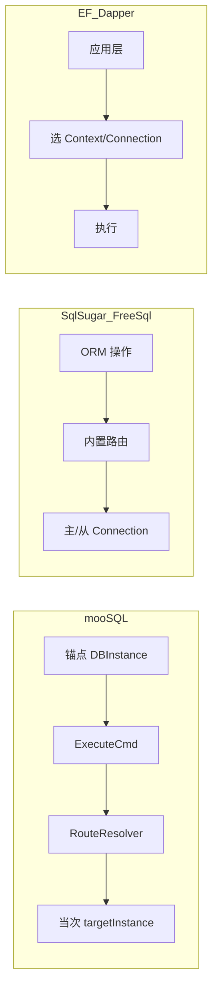

# 主从与多库：与主流 C# ORM 功能对比

> 项目内部文档，与 [主从与多库功能设计.md](./主从与多库功能设计.md) 配套。  
> 对比基于 mooSQL 当前实现与各框架公开能力，聚焦**主从 / 读写分离 / 多库 / 高可用**，不涉及 CodeFirst、导航属性等通用 ORM 能力。

---

## 1. 定位差异

| 方案 | 定位 | 主从能力来源 |
|------|------|-------------|
| **mooSQL** | 自研 ADO 访问层 + SQLBuilder | **内置** cluster 模块 |
| **EF Core** | 标准 ORM | **无内置**，需双 DbContext / Interceptor / 驱动层 `ApplicationIntent` |
| **SqlSugar** | 国产 ORM，偏业务快速开发 | **内置** `SlaveConnectionConfigs` |
| **FreeSql** | 国产 ORM，功能全面 | **内置** `UseSlave` + FreeSql.Cloud 多库 |
| **Dapper** | 微 ORM | **无内置**，应用层自行选择 Connection |
| **NHibernate** | 经典 ORM | **无内置**，需 DataSource 路由层 |

mooSQL 与 SqlSugar、FreeSql 同属「**客户端路由**」路线；EF Core / Dapper / NHibernate 更偏「**应用架构层自行接入**」。

---

## 2. 功能对照总表

| 能力 | mooSQL | EF Core | SqlSugar | FreeSql | Dapper | NHibernate |
|------|:------:|:-------:|:--------:|:-------:|:------:|:----------:|
| **读写自动分离** | ✅ 注册组后 SELECT 自动路由 | ⚠️ 需自实现 | ✅ 默认 Query→从库 | ✅ 默认 Select→从库 | ❌ | ⚠️ 需自实现 |
| **显式强制主库读** | ✅ `.useMaster()` | ⚠️ 双 Context / Interceptor | ✅ `MasterQueryable` | ✅ `.Master()` | 手动选连接 | 手动选 DataSource |
| **显式强制从库读** | ✅ `.useReadReplica()` | ⚠️ 自实现 | ✅ `SlaveQueryable`（反向模式） | ⚠️ 需扩展 / Cloud | 手动 | 手动 |
| **读负载策略** | ✅ 轮询 / 加权 / 首个可用 / 自定义 | ❌ | ✅ HitRate 概率 | ✅ 随机 + 权重 | 自实现 | 自实现 |
| **事务内锁主库** | ✅ 活动事务忽略读从库 | ✅ 社区共识 | ✅ 事务内全走主库 | ✅ 写/事务走主库 | 手动 | 只读事务路由 |
| **实例健康感知** | ✅ `DBHealth` + 探活 | ❌ | ⚠️ 文档建议自写 | ✅ 从库故障隔离+恢复探测 | ❌ | ❌ |
| **从库不可用 fallback** | ✅ 可配置回退主库 | 自实现 | 依赖配置/自写 | ✅ 全挂则主库 | 自实现 | 自实现 |
| **Failover（主挂切热备）** | ✅ 4 种模式 + 选举 | ❌ | ❌ | ❌ | ❌ | ❌ |
| **同步双写 fan-out** | ✅ 组级 + `.useDualWrite()` | ❌ | ❌（写只走主，双写靠业务） | ❌ | ❌ | ❌ |
| **写后异步复制** | ✅ `useSlave` 插件 | ❌ | ❌（靠 DB 复制） | ❌ | ❌ | ❌ |
| **多库 / 分库** | ✅ 连接位 + 组 | ⚠️ 多 Connection | ✅ `[Tenant]` / 多 ConfigId | ✅ FreeSql.Cloud | ⚠️ 多连接 | ⚠️ 多 SessionFactory |
| **路由粒度** | **ExecuteCmd 单次 SQL** | Command / Context | ORM 操作级 | SQL 前缀判定 | Connection 级 | Session/Transaction 级 |
| **临时单次路由** | ✅ Builder 链式，不改锚点 | ⚠️ 较难 | ⚠️ 全局/Ado 开关为主 | ⚠️ 偏全局 | ✅ 最灵活 | ⚠️ 需换 Session |
| **可观测事件** | ✅ Health / Failover 事件 | Interceptor 日志 | AOP 日志 | Monitor/AOP | 无 | 无 |

图例：✅ 内置支持 · ⚠️ 可做到但需额外工程 · ❌ 框架不提供

---

## 3. 分框架简评

### 3.1 Entity Framework Core

**常见做法：**

- 双 `DbContext`（读库连 `ApplicationIntent=ReadOnly`，写库连主库）
- 或 `DbCommandInterceptor`，在 `ReaderExecuting` / `NonQueryExecuting` 切换连接

**与 mooSQL 对比：**

| EF Core | mooSQL |
|---------|--------|
| 无统一「主从组」模型 | `MasterSlaveGroup` + 从库能力 bool 组合 |
| 无内置健康 / Failover | 内置探活、选举、`OnFailover` |
| 读写路由需自行设计 | `configureGroup` + `ExecuteCmd` 自动解析 |
| 强类型 LINQ、Change Tracking | 贴近 SQL，路由与 SQLCmd 类型绑定 |

EF Core 生态与 ASP.NET DI 集成好，但**高可用主从是应用架构题**，不是 ORM 开箱能力。

### 3.2 SqlSugar

**做法：** 配置 `SlaveConnectionConfigs` + `HitRate`，无事务时 Query→从库、写→主库。

```csharp
SlaveConnectionConfigs = new List<SlaveConnectionConfig> {
    new() { HitRate = 10, ConnectionString = "..." }
};
db.Queryable<User>().ToList();                    // 从库
db.MasterQueryable<User>().ToList();              // 强制主库
db.Ado.IsDisableMasterSlaveSeparation = true;     // 写后强制读主库
```

**与 mooSQL 对比：**

| 维度 | SqlSugar | mooSQL |
|------|----------|--------|
| 上手成本 | **更低**（配连接串即可） | 需理解组 / 锚点 / Executor |
| 读策略 | HitRate 概率 | RoundRobin / WeightedRandom / FirstAvailable / Custom |
| 健康 / Failover | 文档建议自写失败隔离 | **内置** |
| 双写 | 业务侧双写 | **框架 fan-out** + 失败策略 |
| 异步复制 | 靠 DB 层复制 | **ModifyMediator 插件** |
| 单次临时路由 | 较弱（全局开关为主） | **`.useReadReplica()` 等链式 API** |

SqlSugar 在**常规读写分离**上与 mooSQL 最接近，但 mooSQL 额外提供 Failover、同步双写、写后异步复制一体化能力。

### 3.3 FreeSql

**做法：** `UseSlave(...)`，默认 Select→从库；`.Master()` 强制主库；从库故障会隔离并周期探测。

**与 mooSQL 对比：**

| 维度 | FreeSql | mooSQL |
|------|---------|--------|
| 读写分离 | ✅ 成熟，默认读从库 | ✅ 注册组后 SELECT 自动路由 |
| 从库健康 | ✅ 故障切换 + 恢复探测 | ✅ `DBHealth` + Scheduler |
| Failover 升主 | ❌ | ✅ `HotStandby` + 选举 |
| 多库 | ✅ **FreeSql.Cloud**（Change/Use、TCC/SAGA） | ✅ 连接位 + 组，无分布式事务云 |
| 默认读从库 | 是（社区有「希望默认读主」讨论） | 注册组后 SELECT 才路由；未注册则全走锚点 |

FreeSql 的**读写分离 + 从库健康**与 mooSQL 重叠度高；mooSQL 在 Failover / 双写 / 异步复制上更完整，FreeSql.Cloud 在**跨库分布式事务**上更强。

### 3.4 Dapper

**做法：** 无内置；通常 `IConnectionFactory` 按 Query/Command 返回不同连接，或 CQRS 读写不同路径。

**与 mooSQL 对比：**

| Dapper | mooSQL |
|--------|--------|
| 完全自控，依赖最少 | 框架封装路由、健康、Failover |
| 需自写全部主从逻辑 | 配置 + 链式 API |
| 性能 / 控制面最优 | 在 ADO 层之上增加路由层 |

Dapper 适合团队愿意自研路由；mooSQL 适合要 SQL 控制力、又不想重复造主从基础设施的场景。

### 3.5 NHibernate

**做法：** 框架层无读写分离；常见是在 ADO `DataSource` 层按只读 / 读写事务路由（类似 Spring `AbstractRoutingDataSource`）。

**与 mooSQL 对比：** NHibernate 的 Session 与连接绑定，跨库 / 跨主从切换较 awkward；mooSQL 在 **ExecuteCmd 边界**做当次路由，对「同一 Builder 锚点、不同 SQL 走不同库」更自然。

---

## 4. mooSQL 相对优势与短板

### 4.1 相对优势（市面较少一体提供）

1. **Failover 闭环**：`OnNextConnect` / `ImmediateOnFailure` + `HotStandby` 选举 + `promoteMaster` 手动回切
2. **读写路由 + 异步复制 + 同步双写** 三层正交：`ReadReplica` / `AsyncReplica` / `DualWrite` 可组合
3. **ExecuteCmd 边界路由**：不改 `getInstance` 锚点，`.useReadReplica()` 只影响当次 SQL
4. **从库能力模型**：同一从库可同时「可读 + 可升主」
5. **可观测**：`OnHealthStatusChanged`、`OnFailover`

### 4.2 相对短板

1. **生态与资料**：EF / SqlSugar / FreeSql 社区文档更多
2. **ORM 通用能力**：无 EF 级 Change Tracking、官方迁移工具链
3. **读写分离默认策略**：SqlSugar/FreeSql 配好即全局生效；mooSQL 需 `configureGroup`，概念更多
4. **分布式一致性**：双写不保证全局一致（与 SqlSugar/FreeSql 相同，需业务幂等）
5. **Cloud 级多库事务**：不如 FreeSql.Cloud 的 TCC/SAGA

---

## 5. 场景选型

| 场景 | 更常见选择 | 说明 |
|------|-----------|------|
| 标准 Web CRUD + EF 全家桶 | EF Core + 双 Context | 除非整体切到 mooSQL |
| 读写分离，快速上线 | SqlSugar / FreeSql | mooSQL 可行，需理解组模型 |
| 主库故障自动切热备 | **mooSQL** 或基础设施（Proxy/K8s） | mooSQL **差异化能力** |
| 写后异步同步到从库 | **mooSQL** `useSlave` | 较少 ORM 自带 |
| 脑裂 / 多活同步双写 | **mooSQL** `.useDualWrite()` | ORM 层少见 |
| 跨库 + 分布式事务 | FreeSql.Cloud | mooSQL 偏连接位，非强项 |
| 报表读从、交易读主 | 均可 | mooSQL `.useMaster()` / `.useReadReplica()` 语义清晰 |

---

## 6. API 风格对比（同一需求：报表走从库）

```csharp
// mooSQL — 单次 SQL 临时路由
db.useSQL().useReadReplica()
    .select("*").from("Order").query();

// SqlSugar — 反向模式或 SlaveQueryable
db.SlaveQueryable<Order>().ToList();

// FreeSql — 默认已从库；强制主库才需要 .Master()
fsql.Select<Order>().Master().ToList();

// EF Core — 通常注入 ReadDbContext
readDb.Orders.Where(...).ToList();

// Dapper — 自己选连接
using var conn = factory.GetReadConnection();
conn.Query<Order>("SELECT * FROM Order");
```

---

## 7. 路由模型对比（架构视角）



| 模型 | 路由决策点 | 临时覆盖难度 | 与事务关系 |
|------|-----------|-------------|-----------|
| mooSQL | `DBExecutor.ExecuteCmd` | 低（链式 API） | 事务锁定 Session 实例 |
| SqlSugar / FreeSql | ORM API / SQL 前缀 | 中（全局开关 / Master API） | 事务内锁主库 |
| EF Core | DbContext / Interceptor | 高（需架构设计） | 同事务不切换连接 |
| Dapper | 应用选 Connection | 低（最灵活） | 完全手动 |

---

## 8. 结论

- **SqlSugar / FreeSql**：主从能力集中在「**读写分离 + 从库负载**」，与 mooSQL 重叠最多，但一般**不含 Failover 升主、同步双写、写后异步复制**的一体化方案。
- **EF Core / Dapper / NHibernate**：主从是**架构模式**，不是框架内置产品功能。
- **mooSQL**：定位接近「**带 SQL 构建器的客户端路由 ORM + 高可用扩展包**」——在读写分离之上，额外提供健康探测、灾备切换、双写 fan-out、异步复制插件，适合对**数据库拓扑变化**敏感的业务系统。

---

## 9. 相关文档

- [主从与多库功能设计.md](./主从与多库功能设计.md) — 内部设计与实现规划
- [doc/docs/SQL/high/masterslave.md](../docs/SQL/high/masterslave.md) — 面向用户的使用说明（VitePress 站点）
