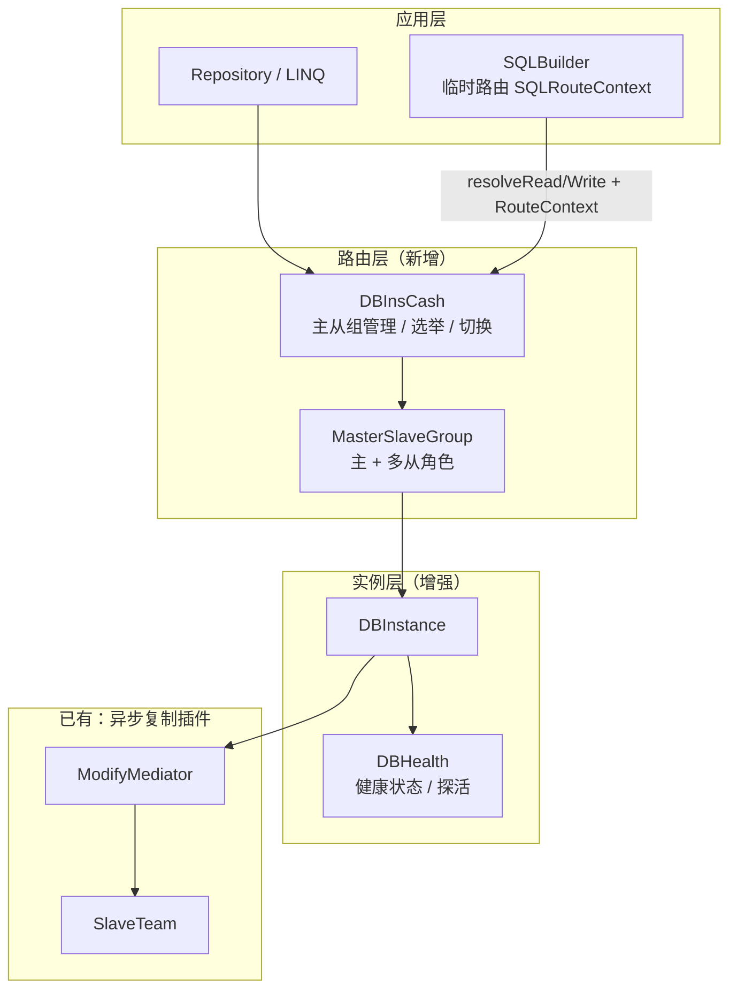
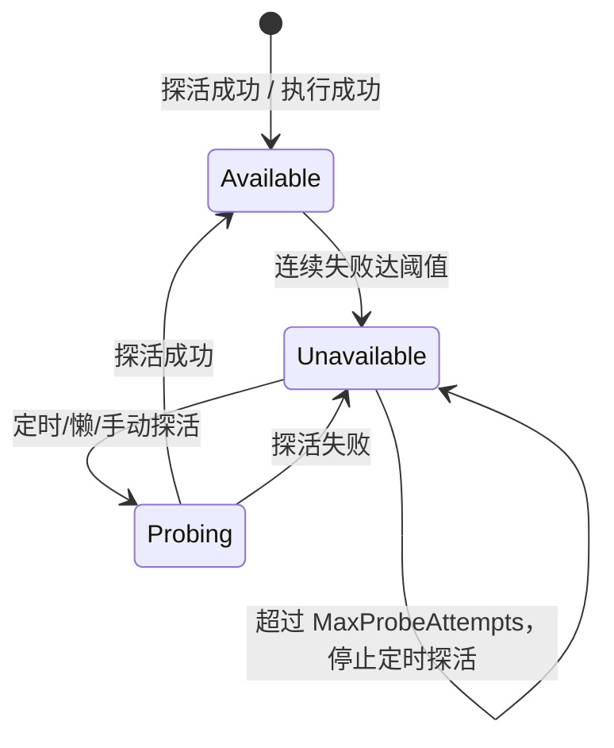
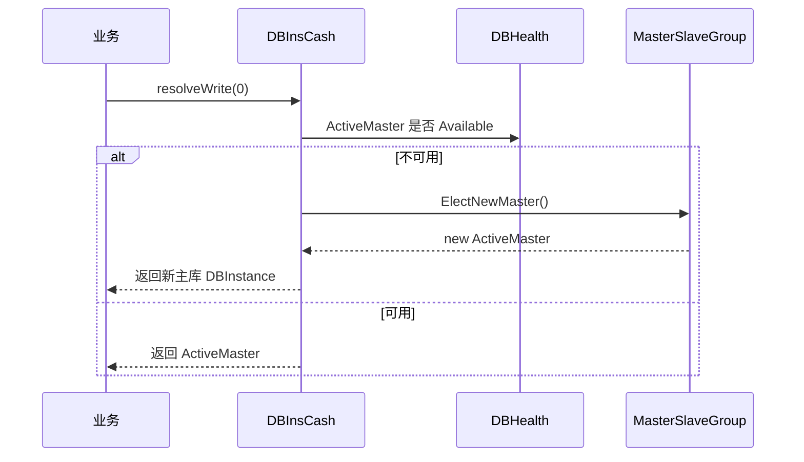
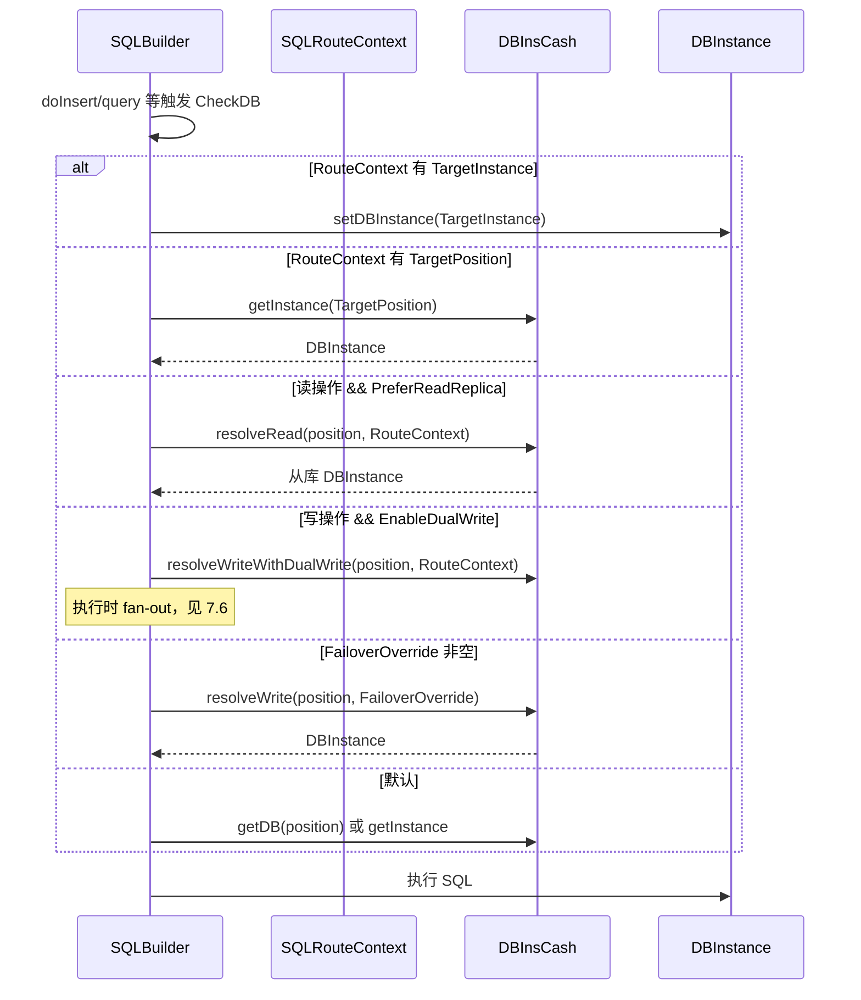

# 主从与多库功能设计

## 1. 背景与现状

### 1.1 已有能力

mooSQL 当前已具备**主库写后异步复制到从库**的插件能力（`pure/src/ado/data/slave/`）：


| 组件                             | 职责                        |
| ------------------------------ | ------------------------- |
| `ModifyMediator`               | 主执行器，监听主库 DML/DDL 成功后推送语句 |
| `SlaveTeam`                    | 从库团队，按连接位（position）管理从库队列 |
| `TeamHeader`                   | 某连接位的从库小队                 |
| `SlaveCmdWorker`               | 单个从库的异步执行队列与消费者           |
| `BaseClientBuilder.useSlave()` | 业务侧注册主从复制关系               |


该插件解决的是：**主库成功后，如何把相同 SQL 投递到从库执行**，支持 `always` / `signal` 两种行动模式。

### 1.2 配置层现状

- `DataBase.slaves`：已有从库列表字段，但无角色、权重、健康状态等语义。
- `DBInsCash`：按连接位缓存 `DBInstance`，无集群/主从组概念。
- `DBInstance`：单库实例，无健康状态子属性。

### 1.3 设计缺口（本文要补齐的）


| 缺口      | 说明                            |
| ------- | ----------------------------- |
| 实例健康感知  | 无法标记失联、记录异常、自动恢复探测            |
| 从库能力模型  | 从库仅有"可读/可写"配置，缺少查询从库、热备、双写等多能力组合 |
| Builder 级切换 | 切换策略仅在 DBInsCash 层，SQLBuilder 无法按语句临时指定路由 |
| 灾时路由    | 主库病态后无法自动选举/切换连接目标            |
| 业务级切换策略 | 读写路由、脑裂双写、灾备切换缺乏统一配置入口        |


### 1.4 设计原则

1. **分层解耦**：健康探测（实例级）→ 主从组管理（连接位级）→ 路由切换（全局/业务级），各层职责单一。
2. **与现有插件共存**：异步复制插件（`ModifyMediator`）继续负责"写后同步"；本设计负责"连哪个库、何时切"。
3. **默认保守**：灾切默认"标记 + 下次取连接时选举"，激进重试作为可选模式。
4. **可观测**：状态变更、探活结果、切换决策均通过 `MooClient.events` / 日志输出，便于排查。
5. **Builder 优先**：SQLBuilder 作为主推入口，主从切换能力以**实例级临时挂载**方式暴露，不污染全局 `DBInsCash` 状态。

---

## 2. 总体架构




**调用链（读操作）**

```
业务 Get(position) → DBInsCash.resolveRead(position)
  → MasterSlaveGroup 按角色筛选可用从库 → 负载策略选出 DBInstance
  → 若从库均不可用且允许降级 → 回退主库（可配置）
```

**调用链（写操作 / 灾切）**

```
业务 Get(position) → DBInsCash.resolveWrite(position)
  → 当前 ActiveMaster 健康？→ 是：返回主库
  → 否：触发 FailoverPolicy → 选举新主（HotStandby）→ 更新 ActiveMaster
```

**调用链（SQLBuilder 临时切换，任务 5）**

```
db.useSQL().useReadReplica().query()
  → CheckDB() 读取 RouteContext
  → DBInsCash.resolveRead(position, RouteContext)
  → setDBInstance(选中的从库) → 执行 query
  → 不修改组级 ActiveMaster / FailoverMode
```

---

## 3. 任务 1：数据库连接实例健康状态管理

### 3.1 目标

实时标记实例 **可用 / 失联**，记录异常时间与原因；自动检测恢复；在执行 SQL 前规避失效连接，提升框架容错性。

### 3.2 核心模型

#### 3.2.1 健康状态枚举，（0未知，一般0默认false，这里从1计数）

```csharp
public enum DBHealthStatus
{
    None=0,
    /// <summary>探活成功，可正常使用</summary>
    Available = 1,
    /// <summary>连续探活或执行失败，暂不可用</summary>
    Unavailable = 2,
    /// <summary>正在恢复探测中（介于两者之间，可选对外仍视为不可用）</summary>
    Probing = 3
}
```

#### 3.2.2 健康状态实体

挂载于 `DBInstance`，作为子属性：

```csharp
public class DBHealth
{
  public DBInstance Owner { get; }
  public DBHealthStatus Status { get; }
  public DateTime? LastSuccessAt { get; }      // 最后一次探活/执行成功
  public DateTime? LastFailureAt { get; }      // 最后一次失败
  public string LastError { get; }             // 最近一次异常摘要
  public int ConsecutiveFailures { get; }      // 连续失败次数
  public int ProbeAttempts { get; }             // 累计探活次数（恢复策略用）
}
```

**存续位置**：`DBInstance.Health`（懒初始化，未启用探活时为 null 或 NoOp 实现）。

#### 3.2.3 探活 SQL


| 优先级   | 来源                                      | 示例                                                                    |
| ----- | --------------------------------------- | --------------------------------------------------------------------- |
| 1（最高） | 业务在`DBPosition` 中自定义                    | `SELECT 1`                                                            |
| 2     | 方言 `Dialect.`SQLSentence`.getPingSQL()` | MySQL: `SELECT 1`；Oracle: `SELECT 1 FROM DUAL`；SQL Server: `SELECT 1` |


方言扩展：

```csharp
// Dialect 新增虚方法，各数据库方言 override
public virtual string getPingSQL() => "SELECT 1";
public virtual int PingTimeoutMs => 3000;
```

### 3.3 探活时机与策略


| 机制       | 触发点                                    | 行为                                                    |
| -------- | -------------------------------------- | ----------------------------------------------------- |
| **预先探活** | `DBInsCash.getInstance()` / 连接池取连接前    | 若状态为 `None,`且未到"放弃探活"阈值，先执行 ping；成功则置 `Available`     |
| **懒探活**  | 首次 `getInstance` 或首次执行 SQL 前           | 仅当状态未知或超过 `StaleThreshold` 时探测                        |
| **异常探活** | `DBExecutor` 捕获连接/超时类异常                | `MarkFailure()`，状态 → `Unavailable`，记录 `LastFailureAt` |
| **定时探活** | 后台 `HealthProbeScheduler`（可选）          | 对 `Unavailable` 实例按 `RecoveryInterval` 周期探测           |
| **手动恢复** | `health.markManualRecovery()` / 管理 API | 重置连续失败计数，立即触发一次探活                                     |


#### 病态恢复监测

```csharp
public class DBHealthOptions
{
  public bool Enabled = true;
  public int MaxFailures = 3;       // 达到后标记 Unavailable
  public int ReTrySize = 10; // 超过后停止定时探活，仅手动/懒探活
  public TimeSpan RecoveryInterval = TimeSpan.FromSeconds(30);
  public TimeSpan StaleThreshold = TimeSpan.FromMinutes(5); // 懒探活：成功态过期再探
  public string CustomPingSQL;                  // 覆盖方言默认值
}
```

**状态流转**




### 3.4 与 SQL 执行的集成

增加异常判定逻辑，在 `DBExecutor.ExecuteCmd` 入口（或 `ExeSession.Open`）中进行是否数据库失联还是SQL报错的分析：

1. 若 `DBInstance.Health.Status == Unavailable` 且非"强制使用"标志 → 抛出 `DBUnavailableException` 或交由上层路由切换（任务 3）。
2. 执行失败且异常类型属于连接类（超时、broken connection、login failed 等）→ 调用 `Health.MarkFailure(ex)`。
3. 执行成功 → `Health.MarkSuccess()`。

### 3.5 可观测性

- 事件：`OnHealthStatusChanged(DBInstance, oldStatus, newStatus)`
- 日志：探活 SQL、耗时、失败原因（复用 `IExeLog`）

---

## 4. 任务 2：主从库管理功能

### 4.1 目标

在 `DBInsCash` 中增加**主从组（MasterSlaveGroup）**管理：一个连接位对应一组「1 主 + N 从」。**一个从库可同时具备多种能力**，通过 bool 属性组合表达，不再使用单一角色枚举。

#### 4.2.1 从库能力 bool 属性

| 属性 | 含义 | 典型组合 |
|------|------|----------|
| `ReadReplica` | 参与读路由、读写分离读侧 | 单独 true，或与 HotStandby 叠加 |
| `HotStandby` | 灾备热库，主挂时可被选举为新主 | 常与 ReadReplica 同时为 true |
| `DualWrite` | 脑裂双写目标，写操作 fan-out | 可与 AsyncReplica 叠加 |
| `AsyncReplica` | 仅异步复制目标（兼容 ModifyMediator） | 单独 true，不参与读/主选举 |

**约定**

- 各 bool 默认 `false`；`null` 表示"继承组级/全局默认"。
- 同一从库可 `ReadReplica=true && HotStandby=true`，表示"可读且可升主"。
- 路由筛选用语义：`where ReadReplica && ReadEnabled`，而非枚举比较。

### 4.3 从库成员描述

```csharp
public class SlaveMember
{
  public int Position;              // 从库连接位
  public DBInstance Instance;       // 运行时实例（懒加载）
  public int Weight = 1;            // 读负载权重
  public bool ReadEnabled = true;   // 总开关：是否允许读
  public bool WriteEnabled = false; // 总开关：是否允许写（DualWrite / HotStandby 写路径）

  /// <summary>只读查询从库，读写分离读侧</summary>
  public bool ReadReplica;
  /// <summary>灾备热库，主挂掉时可提升为新主</summary>
  public bool HotStandby;
  /// <summary>脑裂双写库，与主库同时接受写入</summary>
  public bool DualWrite;
  /// <summary>异步复制目标，不参与读路由与主选举</summary>
  public bool AsyncReplica;

  public DBHealth Health => Instance?.Health;

  // 辅助：判断是否具备某能力（bool 组合）
  public bool CanRead => ReadEnabled && (ReadReplica || HotStandby);
  public bool CanFailover => HotStandby && WriteEnabled && Health?.Status == DBHealthStatus.Available;
  public bool CanDualWrite => DualWrite && WriteEnabled;
}
```

### 4.4 主从组

```csharp
public class MasterSlaveGroup
{
  public int GroupId;               // 通常等于主库 position
  public DBInstance Master;         // 逻辑主库（ActiveMaster）
  public DBInstance ActiveMaster;   // 当前实际写入目标（灾切后可能 != Master）
  public List<SlaveMember> Slaves;
  public FailoverMode FailoverMode; // 见任务 3
  public ReadRoutePolicy ReadPolicy;
}
```

**存续位置**：`DBInsCash` 内 `ConcurrentDictionary<int, MasterSlaveGroup> groups`（key = 主连接位）。

### 4.5 与现有 `DataBase.slaves` 的关系

扩展 `DataBase` 配置（向后兼容：无新字段时从库默认 `AsyncReplica=true`，其余 false）：

```xml
<!-- 配置示例（概念）：bool 属性可组合 -->
<database index="0" name="main">
  <master failover="OnNextConnect" readFallback="master">
    <slave index="1" readReplica="true" weight="2"/>
  <!-- 可读 + 可升主 -->
    <slave index="2" readReplica="true" hotStandby="true" writeEnabled="true"/>
    <slave index="3" dualWrite="true" writeEnabled="true"/>
    <slave index="4" asyncReplica="true"/>
  </master>
</database>
```

代码注册（与 `useSlave` 并存）：

```csharp
cash.configureGroup(0, g => g
  .master(0)
  .addSlave(1, s => { s.ReadReplica = true; s.Weight = 2; })
  .addSlave(2, s => { s.ReadReplica = true; s.HotStandby = true; s.WriteEnabled = true; })
  .addSlave(3, s => { s.DualWrite = true; s.WriteEnabled = true; }));
```

### 4.6 读路由策略

```csharp
public enum ReadRoutePolicy
{
  MasterOnly,           // 不分离，全部走主
  RoundRobin,           // 可用 ReadReplica 轮询
  WeightedRandom,       // 按 Weight 随机
  FirstAvailable,       // 第一个可用从库
  Custom                // 业务注入 Func<MasterSlaveGroup, DBInstance>
}
```

`resolveRead(groupId)` 伪代码：

```
candidates = Slaves where CanRead && Health.Available
if candidates empty:
  if ReadFallbackToMaster → return ActiveMaster
  else throw NoReadableReplicaException
return ReadPolicy.Select(candidates)
```

### 4.7 写路径与 DualWrite

- 默认写：`ActiveMaster`。
- `DualWrite=true` 的从库：写操作经 `WriteFanoutExecutor` 同步写主 + 所有 `CanDualWrite` 从库（失败策略可配置：全失败才失败 / 主成功即从成功）。

与 **ModifyMediator 异步复制** 的边界：


| 场景          | 使用                                |
| ----------- | --------------------------------- |
| 延迟可接受、从库仅跟随 | `ModifyMediator` + `AsyncReplica=true` |
| 强一致双写、脑裂场景  | `DualWrite=true` + 同步 Fanout        |
| 灾备提升        | `HotStandby=true` + Failover（任务 3）     |


---

## 5. 任务 3：全局级别灾时自动切换

### 5.1 目标

配置并激活后，当主库健康状态变为 **Unavailable**，按策略切换到热备库，保证业务可继续获取可写连接。

### 5.2 切换模式

```csharp
public enum FailoverMode
{
  Disabled,              // 不自动切换
  MarkOnly,              // 仅标记，不换连接（运维手动处理）
  OnNextConnect,         // 常规：标记病态，下次 resolveWrite 时选举
  ImmediateOnFailure     // 激进：当前 SQL 失败后立即切换并重试一次
}
```

### 5.3 选举规则

`FailoverPolicy.ElectNewMaster(group)`：

超优先级：选举支持业务侧注册选举Func以自定义行为，业务侧选举返回false表示失败，继续后续选举逻辑。

1. 候选：`Slaves` 中 `HotStandby == true` 且 `CanFailover`。
2. 排序：优先级配置 > 复制延迟（若可获取）> 连接位顺序。
3. 选中后：`group.ActiveMaster = elected`，触发 `OnFailover(group, oldMaster, newMaster)`。
4. 若无可用热备：保持 `Unavailable`，抛错或进入只读模式（可配置）。

### 5.4 两种时机详解

#### 常规模式（`OnNextConnect`）




- **不在 SQL 执行中途切换**，避免事务语义混乱。
- 已开启的事务：仍绑定原连接，失败由业务回滚；**新事务**走新主。

#### 激进模式（`ImmediateOnFailure`）

在 `DBExecutor` 捕获主库连接失败且 `FailoverMode == ImmediateOnFailure`：

1. `Health.MarkFailure`
2. `DBInsCash.tryFailover(groupId)` 选举新主
3. **同一 SQL 重试一次**（仅当无活动事务、且为 idempotent 或配置允许）
4. 重试仍失败 → 向上抛出，不再无限重试

**约束**：默认仅对**非事务**或**自动提交**语句启用；事务内切换需业务显式配置。

### 5.5 脑裂与回切

- **升主后旧主恢复**：不自动回切（避免双主）；通过 `OnFailover` 事件通知，运维确认后 `group.promoteMaster(manual: true)`。
- **元数据**：`ActiveMaster` 与配置主 `Master` 分离，持久化可选（内存默认，集群场景可接外部 store）。

---

## 6. 任务 4：业务侧自定义多维度主从切换

### 6.1 目标

统一配置入口，支持：**脑裂多写**、**灾时切换**、**读取切换**等多种模式，并可按连接位/组/全局叠加策略。

### 6.2 策略配置模型

```csharp
public class MasterSlaveOptions
{
  // 全局默认
  public FailoverMode DefaultFailover = FailoverMode.OnNextConnect;
  public ReadRoutePolicy DefaultReadPolicy = ReadRoutePolicy.WeightedRandom;
  public bool ReadFallbackToMaster = true;

  // 按组覆盖
  public Dictionary<int, GroupOverride> Groups;

  // 业务钩子
  public Func<MasterSlaveGroup, DBInstance> CustomReadSelector;
  public Func<FailoverContext, DBInstance> CustomFailoverElector;
  public Action<FailoverContext> OnFailover;
}

public class GroupOverride
{
  public FailoverMode? Failover;
  public ReadRoutePolicy? ReadPolicy;
  public bool? DualWriteSync;           // DualWrite 是否同步等待所有库
  public bool? RequireReadReplica;      // 读路由是否限定 ReadReplica=true 的从库
  public bool? AllowHotStandbyRead;     // 读路由是否允许 HotStandby 参与
}
```

### 6.3 多维度切换矩阵


| 维度       | 配置项                                           | 行为                                |
| -------- | --------------------------------------------- | --------------------------------- |
| **读取切换** | `ReadRoutePolicy` + `CustomReadSelector`      | 动态选择读库；可从库全挂时 fallback 主库         |
| **灾时切换** | `FailoverMode` + `CustomFailoverElector`      | 主库不可用时选举热备                        |
| **脑裂多写** | `DualWrite=true` + `DualWriteSync`       | 写操作 fan-out 到多库；可配部分成功策略          |
| **信令复制** | 现有 `SlaveTeam.Signal` / `SQLBuilder.useSignal()` | 仅特定 signal 的 SQL 异步复制到从库（与读写路由正交） |
| **强制主库** | `DBExecutor.useMaster()` / `SQLCmd.routeHint` | 单次请求绕过读从库                         |
| **强制从库** | `useReplica()` / `SQLBuilder.useReadReplica()` | 单次读走从库                          |
| **Builder 临时切换** | `SQLBuilder.useRoute(...)` 等 | 见任务 5，仅当前 Builder 实例生效 |


### 6.4 业务 API  sketch

```csharp
// 连接位 0：读写分离 + 灾切
var db = cash.Get(0);                    // 默认：写 → ActiveMaster
var readDb = cash.GetRead(0);            // 读 → ReadReplica 选举
var writeDb = cash.GetWrite(0);          // 显式写库

// 临时指定（DBInsCash / DBExecutor 层）
db.useRoute(RouteHint.PreferReplica);

// 注册双写组
cash.configureGroup(0, o => o
  .enableDualWrite(slavePositions: new[] { 3, 4 })
  .onDualWriteError(DualWriteErrorPolicy.MasterWins));

// SQLBuilder 临时切换（任务 5，推荐）
var kit = db.useSQL()
  .useReadReplica()                              // 本次链式查询走读从库
  .useFailover(FailoverMode.ImmediateOnFailure)  // 本次写操作启用激进灾切
  .useTarget(position: 2)                        // 指定映射到连接位 2
  .select("*").from("User").query();

// 与异步复制插件联合（信令与路由正交）
client.initModifyMediator(team => team
  .sign(0, replicaInstances)
  .Signal = "order-sync");
```

### 6.5 `DBInsCash` 新增方法汇总


| 方法                                                               | 说明                           |
| ---------------------------------------------------------------- | ---------------------------- |
| `GetWrite(int position)`                                         | 解析写库（含 Failover）             |
| `GetRead(int position)`                                          | 解析读库                         |
| `Get(int position)`                                              | 兼容旧行为，默认等同 `GetWrite` 或按全局配置 |
| `configureGroup(int masterPosition, Action<GroupBuilder> setup)` | 注册/更新主从组                     |
| `tryFailover(int groupId)`                                       | 手动/内部触发选举                    |
| `getGroup(int position)`                                         | 获取组状态（监控/管理）                 |


---

## 7. 任务 5：SQLBuilder 实例级临时切换

### 7.1 目标

SQLBuilder 是 mooSQL **主推**的数据访问入口（`db.useSQL()`）。任务 5 在其上挂载**临时路由上下文**，允许单次链式构建中：

- 临时激活灾时切换（覆盖组级 `FailoverMode`）
- 临时指定连接映射（固定到某 position / 某 `DBInstance`）
- 临时启用读从库、双写 fan-out 等能力

**作用域**：仅当前 `SQLBuilder` 实例及其 `copy()` 派生实例；不修改 `DBInsCash` / `MasterSlaveGroup` 的全局状态。

### 7.2 设计动机

| 对比项 | DBInsCash 全局层（任务 2–4） | SQLBuilder 临时层（任务 5） |
|--------|------------------------------|-----------------------------|
| 配置持久性 | 组级配置，长期生效 | 随 Builder 生命周期，执行完即失效 |
| 典型场景 | 应用默认读写分离、灾备策略 | 某条报表走从库、某次写入强制双写、灾时单笔重试 |
| 与现有 API 关系 | `GetRead` / `GetWrite` | 链式 `.useXxx()`，风格与 `useSignal()` 一致 |

### 7.3 核心模型：`SQLRouteContext`

挂载于 `SQLBuilder`，类似已有的 `Signal`、`_AutoClearWay`：

```csharp
/// <summary>
/// SQLBuilder 实例级路由上下文，null 表示完全继承 DBInsCash 组策略。
/// </summary>
public class SQLRouteContext
{
  public int? TargetPosition;           // 指定连接位
  public DBInstance TargetInstance;     // 直接指定实例（优先级高于 TargetPosition）

  public bool? PreferReadReplica;       // true：读操作 resolveRead
  public bool? ForceMaster;             // true：读写均走 ActiveMaster
  public bool? EnableDualWrite;         // true：写操作 fan-out
  public FailoverMode? FailoverOverride; // 覆盖组级 FailoverMode
  public ReadRoutePolicy? ReadPolicyOverride;

  public int[] DualWritePositions;      // 限定双写目标连接位；null 表示按组配置
  public Func<MasterSlaveGroup, DBInstance> ReadSelector;  // 单次自定义读选举
  public Func<FailoverContext, DBInstance> FailoverElector; // 单次自定义灾切选举

  public SQLRouteContext Clone();       // copy() 时深拷贝
}
```

**存续位置**：`SQLBuilder.RouteContext`（internal 或 public readonly 访问）。

### 7.4 链式 API（与 SQLBuilder 风格一致）

所有方法返回 `this`，可任意顺序链式调用（后调覆盖先调的同名字段）：

```csharp
public partial class SQLBuilder
{
  internal SQLRouteContext RouteContext;

  /// <summary>本次读操作走读从库路由（等价 PreferReadReplica=true）</summary>
  public SQLBuilder useReadReplica() => useRoute(r => r.PreferReadReplica = true);

  /// <summary>本次读写均强制主库</summary>
  public SQLBuilder useMaster() => useRoute(r => r.ForceMaster = true);

  /// <summary>临时启用双写 fan-out</summary>
  public SQLBuilder useDualWrite(params int[] slavePositions);

  /// <summary>临时覆盖灾切模式（如单笔 SQL 启用 ImmediateOnFailure）</summary>
  public SQLBuilder useFailover(FailoverMode mode);

  /// <summary>临时指定连接位映射</summary>
  public SQLBuilder useTarget(int position);

  /// <summary>临时指定 DBInstance（优先级最高）</summary>
  public SQLBuilder useTarget(DBInstance instance);

  /// <summary>临时覆盖读路由策略</summary>
  public SQLBuilder useReadPolicy(ReadRoutePolicy policy);

  /// <summary>通用路由配置</summary>
  public SQLBuilder useRoute(Action<SQLRouteContext> configure);

  /// <summary>清除临时路由，恢复继承组策略</summary>
  public SQLBuilder resetRoute();
}
```

### 7.5 解析时机与执行集成

SQLBuilder 在 `CheckDB()`（`exeNonQuery` / `query` 等执行前）及 `setDBInstance` 路径中，增加 **resolve 阶段**：



**规则**

1. `RouteContext` 优先级 **高于** 组级 `MasterSlaveOptions`，**低于** 已显式 `setDBInstance()`（业务已绑死实例时不覆盖）。
2. `copy()` / `selectWith()` 等派生 Builder 时 **克隆** `RouteContext`，子 Builder 可再覆盖。
3. `clear()` 默认 **不清除** `RouteContext`（与 `Signal` 行为一致）；需显式 `resetRoute()`。
4. 执行完成后是否自动 `resetRoute()` 由 `configClear` 扩展项控制（可选 `CleanWay.AfterRoute`）。

### 7.6 各能力与临时挂载方式

| 能力 | 全局配置（任务 2–4） | SQLBuilder 临时挂载 |
|------|----------------------|---------------------|
| 读从库 | `GetRead` + `ReadRoutePolicy` | `.useReadReplica()` / `.useReadPolicy(...)` |
| 强制主库 | `RouteHint` / `useMaster()` | `.useMaster()` |
| 灾时切换 | `FailoverMode` on group | `.useFailover(ImmediateOnFailure)` |
| 指定连接位 | `setPosition` / `setDBInstance` | `.useTarget(2)` / `.useTarget(db)` |
| 双写 | group `DualWrite=true` | `.useDualWrite(3, 4)` |
| 自定义选举 | `CustomReadSelector` | `.useRoute(r => r.ReadSelector = ...)` |
| 信令复制 | `useSignal`（已有） | 与路由正交，可同时 `.useSignal("x").useReadReplica()` |

**双写执行**：当 `RouteContext.EnableDualWrite == true`，`exeNonQuery` / `doInsert` 等写路径调用 `WriteFanoutExecutor`，主库 + 指定从库同步执行；`RouteContext` 仅控制**本次**是否 fan-out 及目标范围，不改变组级 `ActiveMaster`。

### 7.7 与 `DBInsCash.resolve*` 的协作

`DBInsCash` 新增带上下文的重载（内部使用，也供高级场景直接调用）：

```csharp
DBInstance resolveRead(int position, SQLRouteContext ctx = null);
DBInstance resolveWrite(int position, SQLRouteContext ctx = null);
IReadOnlyList<DBInstance> resolveDualWriteTargets(int position, SQLRouteContext ctx = null);
```

解析逻辑：

```
effectiveFailover = ctx?.FailoverOverride ?? group.FailoverMode
effectiveReadPolicy = ctx?.ReadPolicyOverride ?? group.ReadPolicy
if ctx?.ReadSelector != null → 使用自定义读选举
if ctx?.ForceMaster == true → 返回 ActiveMaster
...
```

### 7.8 使用示例

```csharp
var db = cash.Get(0);

// 1. 报表查询：临时走从库，不影响其他 SQL
db.useSQL()
  .useReadReplica()
  .select("Id,Name").from("Order").where("Status", 1)
  .query<Order>();

// 2. 灾时单笔写入：临时启用激进灾切 + 重试
db.useSQL()
  .useFailover(FailoverMode.ImmediateOnFailure)
  .set("Status", 2).from("Order").where("Id", id)
  .doUpdate();

// 3. 指定映射：本次强制走连接位 2（如已升主的热备）
db.useSQL()
  .useTarget(2)
  .select("*").from("User").query();

// 4. 临时双写：仅本 insert 同步写主 + 从库 3、4
db.useSQL()
  .useDualWrite(3, 4)
  .set("Name", "test").into("Log")
  .doInsert();

// 5. 组合：从库读 + 信令触发异步复制
db.useSQL()
  .useReadReplica()
  .useSignal("order-sync")
  .select("*").from("Order").query();

// 6. copy 继承路由上下文
var sub = kit.copy();  // 继承 RouteContext，可继续 .useMaster() 覆盖
```

### 7.9 文件规划

| 路径 | 内容 |
|------|------|
| `pure/src/ado/builder/SQLBuilder.route.cs` | `SQLRouteContext`、`.useReadReplica()` 等链式 API |
| `pure/src/ado/builder/SQLBuilderDymatic.cs` | `CheckDB()` 集成 resolve 逻辑 |
| `pure/src/ado/data/cluster/RouteResolver.cs` | `resolveRead/Write` 带 `SQLRouteContext` 的实现 |
| `pure/src/ado/data/database/DBExecutor.cs` | 接收 Builder 传入的 route hint（激进 Failover 重试） |

### 7.10 验收标准

- [ ] `.useReadReplica()` 仅影响当前 Builder 的 `query*` 路径，其他 Builder / `Get(0)` 不受影响。
- [ ] `.useFailover(ImmediateOnFailure)` 仅对当前 Builder 的写操作生效，不改变组级 `FailoverMode`。
- [ ] `.useTarget(n)` 后 `CheckDB()` 绑定连接位 n 的实例，且 `position` 字段同步更新。
- [ ] `.useDualWrite(3,4)` 仅本次 `doInsert/doUpdate/...` fan-out 到指定从库。
- [ ] `copy()` 派生 Builder 继承 `RouteContext`；`resetRoute()` 恢复组默认。
- [ ] 与已有 `useSignal()`、`setDBInstance()`、`setPosition()` 无冲突，优先级符合 7.5 规则。

---

## 8. 模块划分与文件规划


| 路径                                         | 内容                                                                                      |
| ------------------------------------------ | --------------------------------------------------------------------------------------- |
| `pure/src/ado/data/health/`                | `DBHealth`, `DBHealthStatus`, `HealthProbeScheduler`, `DBHealthOptions` |
| `pure/src/ado/data/cluster/`               | `MasterSlaveGroup`, `SlaveMember`, `FailoverPolicy`, `ReadRoutePolicy`, `RouteResolver`     |
| `pure/src/ado/data/instance/DBInsCash.cs`  | 扩展 `groups`、`GetRead`/`GetWrite`、`resolve*`                                             |
| `pure/src/ado/data/database/DBInstance.cs` | 增加 `Health` 属性                                                                          |
| `pure/src/ado/data/dialect/Dialect.cs`     | `getPingSQL()`                                                                          |
| `pure/src/ado/data/database/DBExecutor.cs` | 失败标记、激进 Failover 重试                                                                     |
| `pure/src/ado/builder/SQLBuilder.route.cs` | 任务 5：`SQLRouteContext`、链式临时切换 API                                                              |
| `pure/src/ado/data/slave/`                 | 保持现有异步复制，文档注明与 cluster 层关系                                                              |


---

## 9. 实施阶段建议


| 阶段     | 内容                                                   | 依赖     |
| ------ | ---------------------------------------------------- | ------ |
| **P0** | 任务 1：`DBHealth` + 方言 ping + 异常标记             | 无      |
| **P1** | 任务 2：`MasterSlaveGroup` + `GetRead`/`GetWrite` + 读路由（bool 能力） | P0     |
| **P2** | 任务 3：`OnNextConnect` Failover + 事件                   | P0, P1 |
| **P3** | 任务 4：`GroupOverride`、DualWrite fan-out、Custom 钩子     | P1, P2 |
| **P4** | 任务 5：`SQLRouteContext` + SQLBuilder 链式 API + `CheckDB` 集成 | P1, P2 |
| **P5** | `ImmediateOnFailure`、定时探活调度器、配置 XML 解析               | P0–P4  |


---

## 10. 风险与约束

1. **事务一致性**：灾切后旧事务不会迁移；文档与 API 需明确"新连接新主"。
2. **双写冲突**：`DualWrite` 不保证分布式一致性，需业务幂等或冲突解决策略。
3. **复制延迟**：读从库可能滞后；强一致读应走主库或 `useMaster()`。
4. **与 EF/外部 ORM 无关**：本设计仅在 mooSQL `DBInsCash` / `DBExecutor` / `SQLBuilder` 层生效。
5. **线程安全**：`ActiveMaster` 变更、`Health` 状态更新需 volatile / 锁，避免选举竞态。
6. **Builder 作用域**：`SQLRouteContext` 不得泄漏到静态缓存；`copy()` 必须克隆上下文，避免多线程共享同一 mutable 对象。

---

## 11. 验收标准（摘要）

- 主库断连后，实例状态在 N 次失败内置为 `Unavailable`，且记录时间与错误信息。
- 方言未配置时，各内置数据库均有默认 ping SQL；业务自定义 SQL 优先生效。
- `GetRead(0)` 能在多个 `ReadReplica=true` 从库间按策略分配且跳过不可用实例。
- 同一从库可同时 `ReadReplica=true && HotStandby=true`，读路由与灾备选举均生效。
- `FailoverMode.OnNextConnect`：主库不可用时，下次 `GetWrite(0)` 返回可用热备。
- `DualWrite=true` 配置后，写 SQL 到达主库与双写从库（同步策略可配置）。
- `db.useSQL().useReadReplica().query()` 仅当前 Builder 走从库，其他 Builder 不受影响。
- `db.useSQL().useFailover(ImmediateOnFailure).doUpdate()` 仅当前写操作启用激进灾切。
- 现有 `useSlave` / `ModifyMediator` / `useSignal` 行为无回归，可与新主从组并存。

