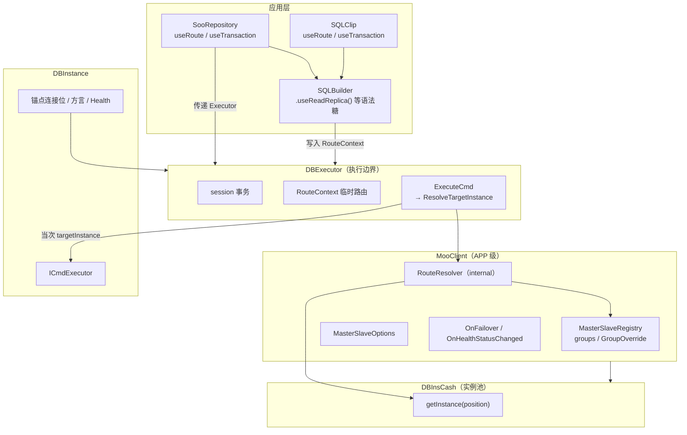
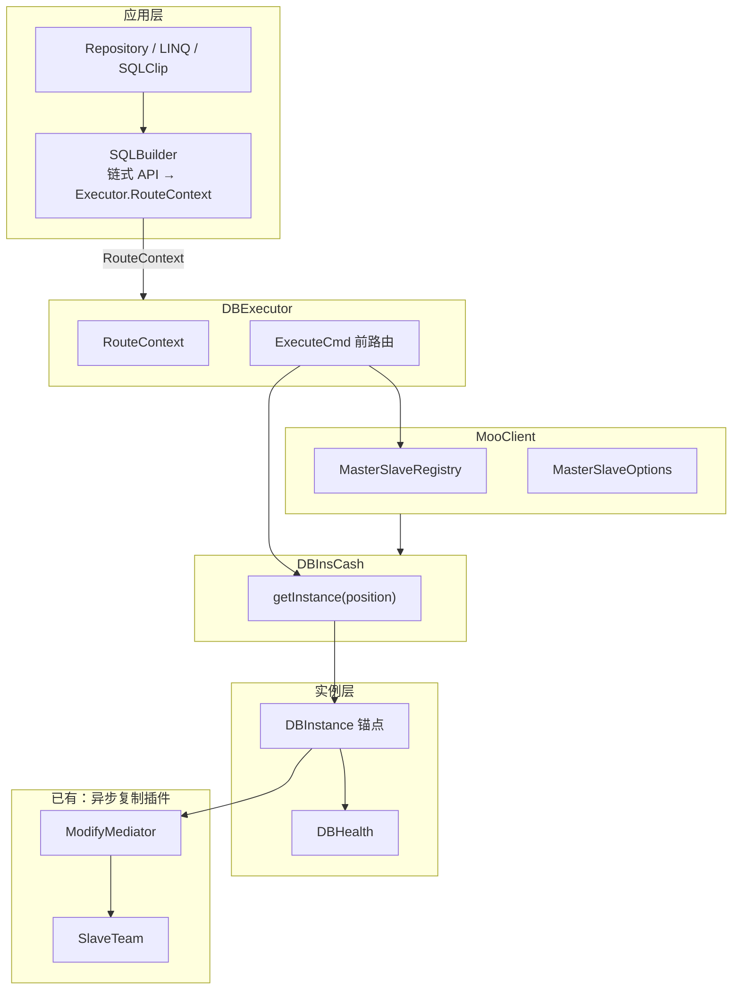
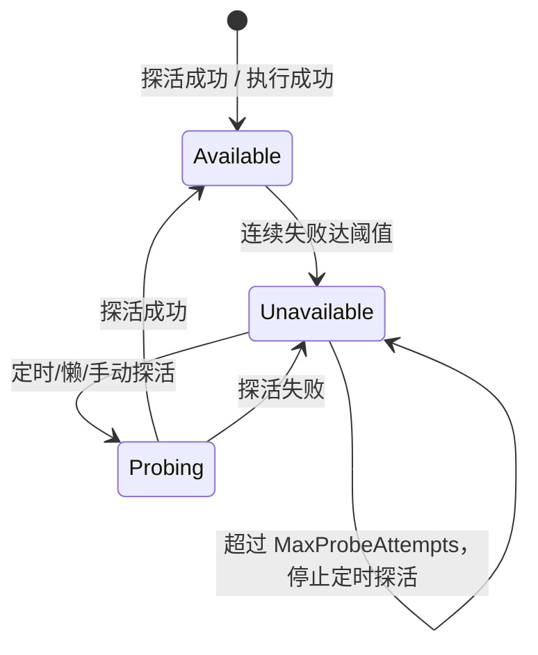
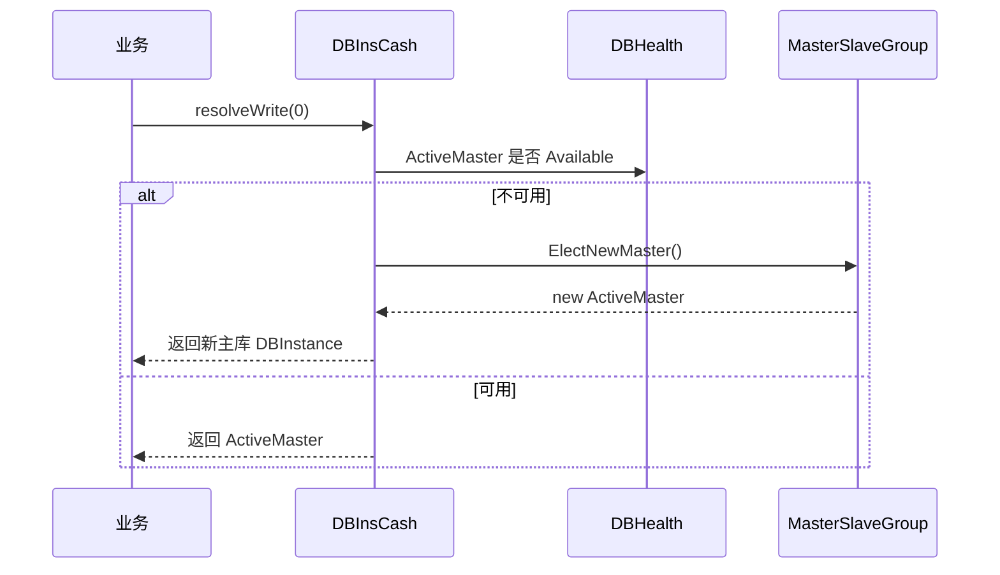
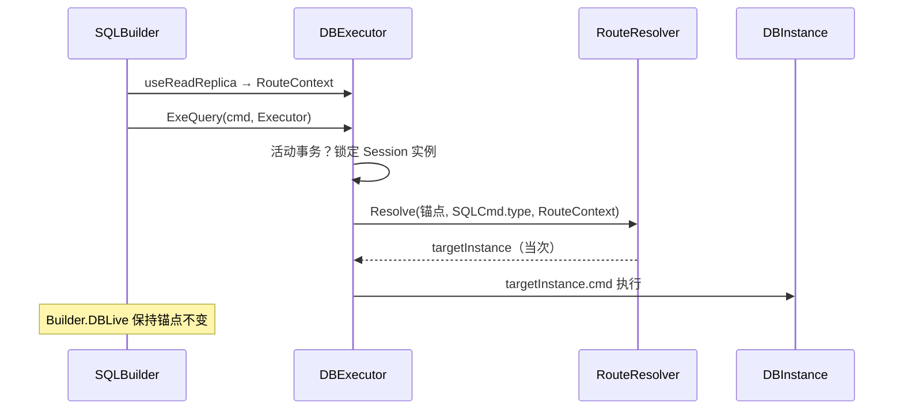

# 主从与多库功能设计

## 1. 背景与现状

### 1.1 已有能力

mooSQL 当前已具备**主库写后异步复制到从库**的插件能力（`pure/src/ado/data/slave/`）：


| 组件                             | 职责                        |
| ------------------------------ | ------------------------- |
| `ModifyMediator`               | 主执行器，监听主库 DML/DDL 成功后推送语句 |
| `SlaveTeam`                    | 从库团队，按连接位（position）管理从库队列 |
| `TeamHeader`                   | 某连接位的从库小队                 |
| `SlaveCmdWorker`               | 单个从库的异步执行队列与消费者           |
| `BaseClientBuilder.useSlave()` | 业务侧注册主从复制关系               |


该插件解决的是：**主库成功后，如何把相同 SQL 投递到从库执行**，支持 `always` / `signal` 两种行动模式。

### 1.2 配置层现状

- `DataBase.slaves`：已有从库列表字段，但无角色、权重、健康状态等语义。
- `DBInsCash`：按连接位缓存 `DBInstance`；**主从组配置已迁至 `MooClient`**。
- `MooClient`：APP 级总入口，持有 `MasterSlaveOptions`、主从组注册与 Failover 事件。
- `DBInstance`：单库实例（锚点），挂载 `Health`。

### 1.3 设计缺口（本文要补齐的）


| 缺口          | 说明                                                                 |
| ----------- | ------------------------------------------------------------------ |
| 实例健康感知      | 无法标记失联、记录异常、自动恢复探测                                                 |
| 从库能力模型      | 从库仅有"可读/可写"配置，缺少查询从库、热备、双写等多能力组合                                   |
| Builder 级切换 | ~~切换策略在 DBInsCash 层~~ → **Executor.RouteContext + Builder 链式 API** |
| 灾时路由        | 主库病态后无法自动选举/切换连接目标                                                 |
| 业务级切换策略     | 读写路由、脑裂双写、灾备切换缺乏统一配置入口                                             |


### 1.4 设计原则

1. **分层解耦**：健康探测（实例级）→ 主从组管理（连接位级）→ 路由切换（全局/业务级），各层职责单一。
2. **与现有插件共存**：异步复制插件（`ModifyMediator`）继续负责"写后同步"；本设计负责"连哪个库、何时切"。
3. **默认保守**：灾切默认"标记 + 下次取连接时选举"，激进重试作为可选模式。
4. **可观测**：状态变更、探活结果、切换决策均通过 `MooClient.events` / 日志输出，便于排查。
5. **Builder 优先**：SQLBuilder 作为主推入口，主从切换能力以**链式 API + Executor 路由上下文**暴露，不污染全局实例池状态。
6. **配置归 Client、路由归 Executor**：主从组与全局策略挂在 `MooClient`；`DBInsCash` 只管实例缓存；读写目标在 `DBExecutor.ExecuteCmd` 执行边界解析。

---

## 2. 架构修订说明（2025）

> 本节记录**已落地代码**与**目标架构**的对齐结论，避免后续推功能时偏离分工。

### 2.1 三句话分工


| 层级             | 职责                                                             |
| -------------- | -------------------------------------------------------------- |
| **MooClient**  | APP 级总入口：主从组注册、`MasterSlaveOptions`、Failover/Health 事件         |
| **DBInsCash**  | 纯实例池：`getInstance(position)`，不含读写路由                            |
| **DBExecutor** | 执行作用域：事务 Session + `RouteContext`；`ExecuteCmd` 前按 SQL 类型解析目标实例 |


**路由原则**：取实例 ≠ 选路由；`DBInstance` 是逻辑组**锚点**（通常为主库连接位），真正连哪台库由 Executor 当次决定。

### 2.2 已实现 vs 目标（修订前 → 修订后）


| 能力           | 初版实现（已废弃方向）                                   | 当前目标                                                       |
| ------------ | --------------------------------------------- | ---------------------------------------------------------- |
| 主从配置承载       | `DBInsCash._groups` + `MasterSlaveOptions`    | `**MooClient`** 持有组与全局选项                                   |
| 业务取读/写库      | `GetRead` / `GetWrite`                        | **废弃**；统一 `getInstance(position)` 或 `db.useSQL()`          |
| 路由时机         | `SQLBuilder.CheckDB` → `setDBInstance`        | `**DBExecutor.ExecuteCmd` 入口**                             |
| 临时读从/灾切      | `SQLBuilder.RouteContext` + Builder 改绑 DBLive | **API 在 Builder，状态在 Executor.RouteContext**                |
| 仓储 / Clip 集成 | 各层自行改 Builder                                 | `**useRoute(executor)`**，与 `useTransaction` 并列             |
| 路由解析器        | `RouteResolver(DBInsCash, options)`           | `RouteResolver(MooClient, DBInsCash)`，Cash 仅 `getInstance` |


### 2.3 目标架构图




### 2.4 与事务模型对齐

事务已有范本：`SQLBuilder.useTransaction(executor)` → 状态在 `DBExecutor.session`，Builder/Repo 只做传递。

主从临时路由采用同一模式：

```csharp
// 事务
kit.beginTransaction();              // 配置 Executor.session
repo.useTransaction(executor);       // 传递 Executor

// 路由（目标形态）
kit.useReadReplica();                // 配置 Executor.RouteContext
repo.useRoute(executor);             // 传递 Executor
clip.useTransaction(executor);       // 路由随 Executor 一起走
```


| 层级                      | 事务                                    | 路由                                                |
| ----------------------- | ------------------------------------- | ------------------------------------------------- |
| DBExecutor              | `session`                             | `RouteContext`                                    |
| SQLBuilder              | `useTransaction` / `beginTransaction` | `.useReadReplica()` 等 → 写 `Executor.RouteContext` |
| SooRepository / SQLClip | `useTransaction(executor)`            | `useRoute(executor)`                              |


### 2.5 读/写判定（ExecuteCmd 内）

优先级（高 → 低）：

1. **活动事务**：Session 已绑定物理连接 → 锁定为 Session 所在实例，忽略 `PreferReadReplica`（与「事务内不 Failover」同原则）。
2. **RouteContext 显式覆盖**：`TargetInstance` / `TargetPosition` / `ForceMaster` / `PreferReadReplica`。
3. `**SQLCmd.type`**：`Select` → 读路径；`Insert`/`Update`/`Delete`/`Merge`/DDL → 写路径；`Unknown` 保守走写（主库）。
4. **组级默认**：`MasterSlaveOptions` + `GroupOverride` + `MasterSlaveGroup.ReadPolicy`。

解析结果**仅用于当次 ExecuteCmd**，不回写 Builder 的 `DBLive` 锚点。

### 2.6 API


| API         | 状态                          |
| ----------- | --------------------------- |
| `DBInsCash` | **仅下发DBInstance实例，池化实例库**   |
| 解析主从跳转      | **MooClient/RouteResolver** |
| `解析时机`      | Executor 内解析                |


### 2.7 文件归属


| 路径                                               | 内容                                                      |
| ------------------------------------------------ | ------------------------------------------------------- |
| `pure/src/aop/MooClient.cluster.cs`              | 主从组、`MasterSlaveOptions`、`configureGroup`、`tryFailover` |
| `pure/src/ado/data/instance/DBInsCash.cs`        | 实例池；XML 加载时委托 Client 注册组                                |
| `pure/src/ado/data/cluster/RouteResolver.cs`     | 读/写/双写目标解析（Client + Cash）                               |
| `pure/src/ado/data/database/DBExecutor.route.cs` | `ExecuteCmd` 前 `ResolveTargetInstance`                  |
| `pure/src/ado/builder/SQLBuilder.route.cs`       | 链式 API → `Executor.RouteContext`                        |
| `pure/src/adoext/repository/SooRepository.cs`    | `useRoute(executor)`                                    |
| `pure/src/adoext/clip/SQLClip.cs`                | `useRoute(executor)`                                    |


---

## 3. 总体架构（能力视图）




**调用链（读操作，修订后）**

```
db.useSQL().useReadReplica().query()
  → useReadReplica 写入 Executor.RouteContext.PreferReadReplica
  → DBLive.ExeQuery(cmd, Executor)
  → DBExecutor.ExecuteCmd
      1. 无活动事务 → RouteResolver.ResolveRead(锚点 position, RouteContext)
      2. 当次使用 targetInstance.cmd 执行
      3. 不修改 Builder.DBLive 锚点
```

**调用链（写操作 / 灾切，修订后）**

```
db.useSQL().doUpdate() / db.useSQL().useFailover(...).doUpdate()
  → SQLCmd.type = Update → 写路径
  → DBExecutor.ExecuteCmd → ResolveWrite（含 Failover）
  → ImmediateOnFailure：连接失败时在 Executor 内选举并重试一次
```

**调用链（取连接，不含路由）**

```
cash.getInstance(0) 或 db.useSQL()  // DBLive = 锚点（主库连接位）
// 不在取库时区分读写；路由延迟到 ExecuteCmd
```

---

## 4. 任务 1：数据库连接实例健康状态管理

### 3.1 目标

实时标记实例 **可用 / 失联**，记录异常时间与原因；自动检测恢复；在执行 SQL 前规避失效连接，提升框架容错性。

### 3.2 核心模型

#### 3.2.1 健康状态枚举，（0未知，一般0默认false，这里从1计数）

```csharp
public enum DBHealthStatus
{
    None=0,
    /// <summary>探活成功，可正常使用</summary>
    Available = 1,
    /// <summary>连续探活或执行失败，暂不可用</summary>
    Unavailable = 2,
    /// <summary>正在恢复探测中（介于两者之间，可选对外仍视为不可用）</summary>
    Probing = 3
}
```

#### 3.2.2 健康状态实体

挂载于 `DBInstance`，作为子属性：

```csharp
public class DBHealth
{
  public DBInstance Owner { get; }
  public DBHealthStatus Status { get; }
  public DateTime? LastSuccessAt { get; }      // 最后一次探活/执行成功
  public DateTime? LastFailureAt { get; }      // 最后一次失败
  public string LastError { get; }             // 最近一次异常摘要
  public int ConsecutiveFailures { get; }      // 连续失败次数
  public int ProbeAttempts { get; }             // 累计探活次数（恢复策略用）
}
```

**存续位置**：`DBInstance.Health`（懒初始化，未启用探活时为 null 或 NoOp 实现）。

#### 3.2.3 探活 SQL


| 优先级   | 来源                                      | 示例                                                                    |
| ----- | --------------------------------------- | --------------------------------------------------------------------- |
| 1（最高） | 业务在`DBPosition` 中自定义                    | `SELECT 1`                                                            |
| 2     | 方言 `Dialect.`SQLSentence`.getPingSQL()` | MySQL: `SELECT 1`；Oracle: `SELECT 1 FROM DUAL`；SQL Server: `SELECT 1` |


方言扩展：

```csharp
// Dialect 新增虚方法，各数据库方言 override
public virtual string getPingSQL() => "SELECT 1";
public virtual int PingTimeoutMs => 3000;
```

### 3.3 探活时机与策略


| 机制       | 触发点                                    | 行为                                                    |
| -------- | -------------------------------------- | ----------------------------------------------------- |
| **预先探活** | `DBInsCash.getInstance()` / 连接池取连接前    | 若状态为 `None,`且未到"放弃探活"阈值，先执行 ping；成功则置 `Available`     |
| **懒探活**  | 首次 `getInstance` 或首次执行 SQL 前           | 仅当状态未知或超过 `StaleThreshold` 时探测                        |
| **异常探活** | `DBExecutor` 捕获连接/超时类异常                | `MarkFailure()`，状态 → `Unavailable`，记录 `LastFailureAt` |
| **定时探活** | 后台 `HealthProbeScheduler`（可选）          | 对 `Unavailable` 实例按 `RecoveryInterval` 周期探测           |
| **手动恢复** | `health.markManualRecovery()` / 管理 API | 重置连续失败计数，立即触发一次探活                                     |


#### 病态恢复监测

```csharp
public class DBHealthOptions
{
  public bool Enabled = true;
  public int MaxFailures = 3;       // 达到后标记 Unavailable
  public int ReTrySize = 10; // 超过后停止定时探活，仅手动/懒探活
  public TimeSpan RecoveryInterval = TimeSpan.FromSeconds(30);
  public TimeSpan StaleThreshold = TimeSpan.FromMinutes(5); // 懒探活：成功态过期再探
  public string CustomPingSQL;                  // 覆盖方言默认值
}
```

**状态流转**




### 3.4 与 SQL 执行的集成

增加异常判定逻辑，在 `DBExecutor.ExecuteCmd` 入口（或 `ExeSession.Open`）中进行是否数据库失联还是SQL报错的分析：

1. 若 `DBInstance.Health.Status == Unavailable` 且非"强制使用"标志 → 抛出 `DBUnavailableException` 或交由上层路由切换（任务 3）。
2. 执行失败且异常类型属于连接类（超时、broken connection、login failed 等）→ 调用 `Health.MarkFailure(ex)`。
3. 执行成功 → `Health.MarkSuccess()`。

### 3.5 可观测性

- 事件：`OnHealthStatusChanged(DBInstance, oldStatus, newStatus)`
- 日志：探活 SQL、耗时、失败原因（复用 `IExeLog`）

---

## 4. 任务 2：主从库管理功能

### 4.1 目标

在 `**MooClient**` 中增加**主从组（MasterSlaveGroup）**管理：一个连接位对应一组「1 主 + N 从」。**一个从库可同时具备多种能力**，通过 bool 属性组合表达，不再使用单一角色枚举。

#### 4.2.1 从库能力 bool 属性


| 属性             | 含义                         | 典型组合                     |
| -------------- | -------------------------- | ------------------------ |
| `ReadReplica`  | 参与读路由、读写分离读侧               | 单独 true，或与 HotStandby 叠加 |
| `HotStandby`   | 灾备热库，主挂时可被选举为新主            | 常与 ReadReplica 同时为 true  |
| `DualWrite`    | 脑裂双写目标，写操作 fan-out         | 可与 AsyncReplica 叠加       |
| `AsyncReplica` | 仅异步复制目标（兼容 ModifyMediator） | 单独 true，不参与读/主选举         |


**约定**

- 各 bool 默认 `false`；`null` 表示"继承组级/全局默认"。
- 同一从库可 `ReadReplica=true && HotStandby=true`，表示"可读且可升主"。
- 路由筛选用语义：`where ReadReplica && ReadEnabled`，而非枚举比较。

### 4.3 从库成员描述

```csharp
public class SlaveMember
{
  public int Position;              // 从库连接位
  public DBInstance Instance;       // 运行时实例（懒加载）
  public int Weight = 1;            // 读负载权重
  public bool ReadEnabled = true;   // 总开关：是否允许读
  public bool WriteEnabled = false; // 总开关：是否允许写（DualWrite / HotStandby 写路径）

  /// <summary>只读查询从库，读写分离读侧</summary>
  public bool ReadReplica;
  /// <summary>灾备热库，主挂掉时可提升为新主</summary>
  public bool HotStandby;
  /// <summary>脑裂双写库，与主库同时接受写入</summary>
  public bool DualWrite;
  /// <summary>异步复制目标，不参与读路由与主选举</summary>
  public bool AsyncReplica;

  public DBHealth Health => Instance?.Health;

  // 辅助：判断是否具备某能力（bool 组合）
  public bool CanRead => ReadEnabled && (ReadReplica || HotStandby);
  public bool CanFailover => HotStandby && WriteEnabled && Health?.Status == DBHealthStatus.Available;
  public bool CanDualWrite => DualWrite && WriteEnabled;
}
```

### 4.4 主从组

```csharp
public class MasterSlaveGroup
{
  public int GroupId;               // 通常等于主库 position
  public DBInstance Master;         // 逻辑主库（ActiveMaster）
  public DBInstance ActiveMaster;   // 当前实际写入目标（灾切后可能 != Master）
  public List<SlaveMember> Slaves;
  public FailoverMode FailoverMode; // 见任务 3
  public ReadRoutePolicy ReadPolicy;
}
```

**存续位置**：`MooClient` 内 `ConcurrentDictionary<int, MasterSlaveGroup> groups`（key = 主连接位）；`DBInsCash` 不再持有组。

### 4.5 与现有 `DataBase.slaves` 的关系

扩展 `DataBase` 配置（向后兼容：无新字段时从库默认 `AsyncReplica=true`，其余 false）：

```xml
<!-- 配置示例（概念）：bool 属性可组合 -->
<database index="0" name="main">
  <master failover="OnNextConnect" readFallback="master">
    <slave index="1" readReplica="true" weight="2"/>
  <!-- 可读 + 可升主 -->
    <slave index="2" readReplica="true" hotStandby="true" writeEnabled="true"/>
    <slave index="3" dualWrite="true" writeEnabled="true"/>
    <slave index="4" asyncReplica="true"/>
  </master>
</database>
```

代码注册（与 `useSlave` 并存）：

```csharp
cash.configureGroup(0, g => g
  .master(0)
  .addSlave(1, s => { s.ReadReplica = true; s.Weight = 2; })
  .addSlave(2, s => { s.ReadReplica = true; s.HotStandby = true; s.WriteEnabled = true; })
  .addSlave(3, s => { s.DualWrite = true; s.WriteEnabled = true; }));
```

### 4.6 读路由策略

```csharp
public enum ReadRoutePolicy
{
  MasterOnly,           // 不分离，全部走主
  RoundRobin,           // 可用 ReadReplica 轮询
  WeightedRandom,       // 按 Weight 随机
  FirstAvailable,       // 第一个可用从库
  Custom                // 业务注入 Func<MasterSlaveGroup, DBInstance>
}
```

`resolveRead(groupId)` 伪代码：

```
candidates = Slaves where CanRead && Health.Available
if candidates empty:
  if ReadFallbackToMaster → return ActiveMaster
  else throw NoReadableReplicaException
return ReadPolicy.Select(candidates)
```

### 4.7 写路径与 DualWrite

- 默认写：`ActiveMaster`。
- `DualWrite=true` 的从库：写操作经 `WriteFanoutExecutor` 同步写主 + 所有 `CanDualWrite` 从库（失败策略可配置：全失败才失败 / 主成功即从成功）。

与 **ModifyMediator 异步复制** 的边界：


| 场景          | 使用                                     |
| ----------- | -------------------------------------- |
| 延迟可接受、从库仅跟随 | `ModifyMediator` + `AsyncReplica=true` |
| 强一致双写、脑裂场景  | `DualWrite=true` + 同步 Fanout           |
| 灾备提升        | `HotStandby=true` + Failover（任务 3）     |


---

## 5. 任务 3：全局级别灾时自动切换

### 5.1 目标

配置并激活后，当主库健康状态变为 **Unavailable**，按策略切换到热备库，保证业务可继续获取可写连接。

### 5.2 切换模式

```csharp
public enum FailoverMode
{
  Disabled,              // 不自动切换
  MarkOnly,              // 仅标记，不换连接（运维手动处理）
  OnNextConnect,         // 常规：标记病态，下次 resolveWrite 时选举
  ImmediateOnFailure     // 激进：当前 SQL 失败后立即切换并重试一次
}
```

### 5.3 选举规则

`FailoverPolicy.ElectNewMaster(group)`：

超优先级：选举支持业务侧注册选举Func以自定义行为，业务侧选举返回false表示失败，继续后续选举逻辑。

1. 候选：`Slaves` 中 `HotStandby == true` 且 `CanFailover`。
2. 排序：优先级配置 > 复制延迟（若可获取）> 连接位顺序。
3. 选中后：`group.ActiveMaster = elected`，触发 `OnFailover(group, oldMaster, newMaster)`。
4. 若无可用热备：保持 `Unavailable`，抛错或进入只读模式（可配置）。

### 5.4 两种时机详解

#### 常规模式（`OnNextConnect`）




- **不在 SQL 执行中途切换**，避免事务语义混乱。
- 已开启的事务：仍绑定原连接，失败由业务回滚；**新事务**走新主。

#### 激进模式（`ImmediateOnFailure`）

在 `DBExecutor` 捕获主库连接失败且 `FailoverMode == ImmediateOnFailure`：

1. `Health.MarkFailure`
2. `DBInsCash.tryFailover(groupId)` 选举新主
3. **同一 SQL 重试一次**（仅当无活动事务、且为 idempotent 或配置允许）
4. 重试仍失败 → 向上抛出，不再无限重试

**约束**：默认仅对**非事务**或**自动提交**语句启用；事务内切换需业务显式配置。

### 5.5 脑裂与回切

- **升主后旧主恢复**：不自动回切（避免双主）；通过 `OnFailover` 事件通知，运维确认后 `group.promoteMaster(manual: true)`。
- **元数据**：`ActiveMaster` 与配置主 `Master` 分离，持久化可选（内存默认，集群场景可接外部 store）。

---

## 6. 任务 4：业务侧自定义多维度主从切换

### 6.1 目标

统一配置入口，支持：**脑裂多写**、**灾时切换**、**读取切换**等多种模式，并可按连接位/组/全局叠加策略。

### 6.2 策略配置模型

```csharp
public class MasterSlaveOptions
{
  // 全局默认
  public FailoverMode DefaultFailover = FailoverMode.OnNextConnect;
  public ReadRoutePolicy DefaultReadPolicy = ReadRoutePolicy.WeightedRandom;
  public bool ReadFallbackToMaster = true;

  // 按组覆盖
  public Dictionary<int, GroupOverride> Groups;

  // 业务钩子
  public Func<MasterSlaveGroup, DBInstance> CustomReadSelector;
  public Func<FailoverContext, DBInstance> CustomFailoverElector;
  public Action<FailoverContext> OnFailover;
}

public class GroupOverride
{
  public FailoverMode? Failover;
  public ReadRoutePolicy? ReadPolicy;
  public bool? DualWriteSync;           // DualWrite 是否同步等待所有库
  public bool? RequireReadReplica;      // 读路由是否限定 ReadReplica=true 的从库
  public bool? AllowHotStandbyRead;     // 读路由是否允许 HotStandby 参与
}
```

### 6.3 多维度切换矩阵


| 维度               | 配置项                                              | 行为                                |
| ---------------- | ------------------------------------------------ | --------------------------------- |
| **读取切换**         | `ReadRoutePolicy` + `CustomReadSelector`         | 动态选择读库；可从库全挂时 fallback 主库         |
| **灾时切换**         | `FailoverMode` + `CustomFailoverElector`         | 主库不可用时选举热备                        |
| **脑裂多写**         | `DualWrite=true` + `DualWriteSync`               | 写操作 fan-out 到多库；可配部分成功策略          |
| **信令复制**         | 现有 `SlaveTeam.Signal` / `SQLBuilder.useSignal()` | 仅特定 signal 的 SQL 异步复制到从库（与读写路由正交） |
| **强制主库**         | `DBExecutor.useMaster()` / `SQLCmd.routeHint`    | 单次请求绕过读从库                         |
| **强制从库**         | `useReplica()` / `SQLBuilder.useReadReplica()`   | 单次读走从库                            |
| **Builder 临时切换** | `SQLBuilder.useRoute(...)` 等                     | 见任务 5，仅当前 Builder 实例生效            |


### 6.4 业务 API  sketch

```csharp
// 连接位 0：读写分离 + 灾切（修订后）
var db = cash.getInstance(0);            // 锚点，不在取库时路由
var kit = db.useSQL()
  .useReadReplica()                      // → Executor.RouteContext
  .select("*").from("User").query();     // ExecuteCmd 内解析读从库

client.configureGroup(0, o => o
  .enableDualWrite(slavePositions: new[] { 3, 4 })
  .onDualWriteError(DualWriteErrorPolicy.MasterWins));

// 仓储 / Clip：与事务并列传递 Executor
repo.useRoute(executor).useTransaction(executor);
clip.useRoute(executor);

// 与异步复制插件联合（信令与路由正交）
client.initModifyMediator(team => team
  .sign(0, replicaInstances)
  .Signal = "order-sync");
```

### 6.5 `MooClient` / `DBInsCash` 方法汇总（修订后）


| 方法                          | 所在        | 说明                  |
| --------------------------- | --------- | ------------------- |
| `getInstance(int position)` | DBInsCash | 取锚点实例，**不含读写路由**    |
| `configureGroup(...)`       | MooClient | 注册/更新主从组            |
| `getGroup(int position)`    | MooClient | 获取组状态（监控/管理）        |
| `tryFailover(int groupId)`  | MooClient | 手动/内部触发选举           |
| `MasterSlaveOptions`        | MooClient | 全局默认与 GroupOverride |
| ~~`GetRead` / `GetWrite~~`  | —         | **已废弃删除**           |


---

## 7. 任务 5：SQLBuilder 链式 API + Executor 路由上下文

### 7.1 目标

SQLBuilder 是 mooSQL **主推**的数据访问入口（`db.useSQL()`）。链式 `.useReadReplica()` 等 API **写入 `DBExecutor.RouteContext`**，由 `ExecuteCmd` 在执行边界解析目标实例。

**作用域**：随 `DBExecutor` 生命周期；不修改 `MooClient` 组级 `ActiveMaster` / `FailoverMode`；**不**通过 `setDBInstance` 永久改绑 Builder 锚点。

### 7.2 设计动机


| 对比项     | MooClient 组级（任务 2–4）                    | Builder API + Executor 状态（任务 5）            |
| ------- | --------------------------------------- | ------------------------------------------ |
| 配置持久性   | 组级配置，长期生效                               | 随 Executor/Builder 传递，执行期生效                |
| 典型场景    | 应用默认读写分离、灾备策略                           | 报表走从库、单笔激进灾切、临时双写                          |
| 与现有 API | `configureGroup` / `MasterSlaveOptions` | `.useXxx()` → `Executor.RouteContext`      |
| 解析位置    | RouteResolver                           | **DBExecutor.ExecuteCmd** 调用 RouteResolver |


### 7.3 核心模型：`SQLRouteContext`

**存续位置**：`DBExecutor.RouteContext`（主）；SQLBuilder 链式 API 写入 Executor，必要时在 `beginTransaction` 时克隆继承。

```csharp
/// <summary>
/// 执行作用域路由上下文；null 表示完全继承 MooClient 组策略 + SQLCmd.type 默认。
/// </summary>
public class SQLRouteContext
{
  public int? TargetPosition;
  public DBInstance TargetInstance;
  public bool? PreferReadReplica;
  public bool? ForceMaster;
  public bool? EnableDualWrite;
  public FailoverMode? FailoverOverride;
  public ReadRoutePolicy? ReadPolicyOverride;
  public int[] DualWritePositions;
  public Func<MasterSlaveGroup, DBInstance> ReadSelector;
  public Func<FailoverContext, DBInstance> FailoverElector;
  public SQLRouteContext Clone();
}
```

### 7.4 链式 API（与 SQLBuilder 风格一致）

所有方法返回 `this`，可任意顺序链式调用（后调覆盖先调的同名字段）：

```csharp
public partial class SQLBuilder
{
  /// <summary>链式 API 写入 Executor.RouteContext</summary>
  public SQLBuilder useReadReplica() => useRoute(r => r.PreferReadReplica = true);
  public SQLBuilder useMaster() => useRoute(r => r.ForceMaster = true);
  public SQLBuilder useDualWrite(params int[] slavePositions);
  public SQLBuilder useFailover(FailoverMode mode);
  public SQLBuilder useTarget(int position);
  public SQLBuilder useTarget(DBInstance instance);
  public SQLBuilder useReadPolicy(ReadRoutePolicy policy);
  public SQLBuilder useRoute(Action<SQLRouteContext> configure);
  public SQLBuilder resetRoute();
}
```

### 7.5 解析时机与执行集成（修订后）

路由在 `**DBExecutor.ExecuteCmd` 入口**完成，不在 `CheckDB` 中 `setDBInstance`：




**规则**

1. `RouteContext` 优先级 **高于** 组级 `MasterSlaveOptions`。
2. **活动事务**内忽略读从库路由，与 Failover 约束一致。
3. `copy()` 派生 Builder 时 **克隆** RouteContext。
4. `resetRoute()` 清除 `Executor.RouteContext`。

### 7.6 各能力与临时挂载方式


| 能力    | 全局配置（任务 2–4）                        | SQLBuilder 临时挂载                              |
| ----- | ----------------------------------- | -------------------------------------------- |
| 读从库   | `MasterSlaveOptions` + 组 ReadPolicy | `.useReadReplica()` + ExecuteCmd Select 路径   |
| 强制主库  | `RouteHint` / `useMaster()`         | `.useMaster()`                               |
| 灾时切换  | `FailoverMode` on group             | `.useFailover(ImmediateOnFailure)`           |
| 指定连接位 | `setPosition` / `setDBInstance`     | `.useTarget(2)` / `.useTarget(db)`           |
| 双写    | group `DualWrite=true`              | `.useDualWrite(3, 4)`                        |
| 自定义选举 | `CustomReadSelector`                | `.useRoute(r => r.ReadSelector = ...)`       |
| 信令复制  | `useSignal`（已有）                     | 与路由正交，可同时 `.useSignal("x").useReadReplica()` |


**双写执行**：当 `RouteContext.EnableDualWrite == true`，`exeNonQuery` / `doInsert` 等写路径调用 `WriteFanoutExecutor`，主库 + 指定从库同步执行；`RouteContext` 仅控制**本次**是否 fan-out 及目标范围，不改变组级 `ActiveMaster`。

### 7.7 与 `RouteResolverSupporter` / `MooClient` 的协作

`RouteResolver` 为 **internal**，仅供 `DBExecutor`（及 `MooClient` 内部）调用：

```csharp
// MooClient 内部
DBInstance ResolveRead(int position, SQLRouteContext ctx = null);
DBInstance ResolveWrite(int position, SQLRouteContext ctx = null);
IReadOnlyList<DBInstance> ResolveDualWriteTargets(int position, SQLRouteContext ctx = null);
```

解析逻辑：

```
effectiveFailover = ctx?.FailoverOverride ?? group.FailoverMode
effectiveReadPolicy = ctx?.ReadPolicyOverride ?? group.ReadPolicy
if ctx?.ReadSelector != null → 使用自定义读选举
if ctx?.ForceMaster == true → 返回 ActiveMaster
...
```

### 7.8 使用示例

```csharp
var db = cash.Get(0);

// 1. 报表查询：临时走从库，不影响其他 SQL
db.useSQL()
  .useReadReplica()
  .select("Id,Name").from("Order").where("Status", 1)
  .query<Order>();

// 2. 灾时单笔写入：临时启用激进灾切 + 重试
db.useSQL()
  .useFailover(FailoverMode.ImmediateOnFailure)
  .set("Status", 2).from("Order").where("Id", id)
  .doUpdate();

// 3. 指定映射：本次强制走连接位 2（如已升主的热备）
db.useSQL()
  .useTarget(2)
  .select("*").from("User").query();

// 4. 临时双写：仅本 insert 同步写主 + 从库 3、4
db.useSQL()
  .useDualWrite(3, 4)
  .set("Name", "test").into("Log")
  .doInsert();

// 5. 组合：从库读 + 信令触发异步复制
db.useSQL()
  .useReadReplica()
  .useSignal("order-sync")
  .select("*").from("Order").query();

// 6. copy 继承路由上下文
var sub = kit.copy();  // 继承 RouteContext，可继续 .useMaster() 覆盖
```

### 7.9 文件规划


| 路径                                               | 内容                                                      |
| ------------------------------------------------ | ------------------------------------------------------- |
| `pure/src/aop/MooClient.cluster.cs`              | 主从组、`MasterSlaveOptions`、`configureGroup`、`tryFailover` |
| `pure/src/ado/builder/SQLBuilder.route.cs`       | 链式 API → `Executor.RouteContext`                        |
| `pure/src/ado/builder/SQLBuilderDymatic.cs`      | 双写 fan-out；EnsureExecutor 传递 RouteContext               |
| `pure/src/ado/data/cluster/RouteResolver.cs`     | ResolveRead/Write（Client + Cash）                        |
| `pure/src/ado/data/database/DBExecutor.route.cs` | ExecuteCmd 前路由 + 事务锁定                                   |
| `pure/src/adoext/repository/SooRepository.cs`    | `useRoute(executor)`                                    |
| `pure/src/adoext/clip/SQLClip.cs`                | `useRoute(executor)`                                    |


### 7.10 验收标准

- `.useReadReplica()` 经 Executor 路由，仅当次 query 走从库；Builder 锚点不变。
- `.useFailover(ImmediateOnFailure)` 在 DBExecutor 内重试，不改变组级 `FailoverMode`。
- 活动事务内读操作不走从库。
- `SooRepository.useRoute` / `SQLClip.useRoute` 与 `useTransaction` 可并用。
- ~~`GetRead` / `GetWrite`~~ 不存在；测试以 Executor + QueryType 驱动。

---

## 8. 模块划分与文件规划


| 路径                                               | 内容                                                    |
| ------------------------------------------------ | ----------------------------------------------------- |
| `pure/src/aop/MooClient.cluster.cs`              | **主从组、`MasterSlaveOptions`、`configureGroup`**         |
| `pure/src/ado/data/health/`                      | `DBHealth`, 探活调度                                      |
| `pure/src/ado/data/cluster/`                     | `MasterSlaveGroup`, `RouteResolver`, `FailoverPolicy` |
| `pure/src/ado/data/instance/DBInsCash.cs`        | **纯实例池** `getInstance`                                |
| `pure/src/ado/data/database/DBExecutor.route.cs` | **ExecuteCmd 路由**、事务锁定                                |
| `pure/src/ado/builder/SQLBuilder.route.cs`       | 链式 API → Executor.RouteContext                        |
| `pure/src/ado/data/slave/`                       | 异步复制插件（与 cluster 正交）                                  |


---

## 9. 实施阶段建议


| 阶段     | 内容                                               | 依赖     |
| ------ | ------------------------------------------------ | ------ |
| **P0** | 任务 1：`DBHealth` + 方言 ping + 异常标记                 | 无      |
| **P1** | 任务 2：`MasterSlaveGroup` 挂 MooClient + 读路由        | P0     |
| **P2** | 任务 3：`OnNextConnect` Failover + 事件               | P0, P1 |
| **P3** | 任务 4：`GroupOverride`、DualWrite fan-out、Custom 钩子 | P1, P2 |
| **P4** | 任务 5：Executor.RouteContext + ExecuteCmd 路由集成     | P1, P2 |
| **P5** | `ImmediateOnFailure`、定时探活调度器、配置 XML 解析           | P0–P4  |


---

## 10. 风险与约束

1. **事务一致性**：灾切后旧事务不会迁移；文档与 API 需明确"新连接新主"。
2. **双写冲突**：`DualWrite` 不保证分布式一致性，需业务幂等或冲突解决策略。
3. **复制延迟**：读从库可能滞后；强一致读应走主库或 `useMaster()`。
4. **与 EF/外部 ORM 无关**：本设计在 `MooClient` / `DBExecutor` / `SQLBuilder` 层生效；`DBInsCash` 仅实例池。
5. **Builder 作用域**：`RouteContext` 挂在 Executor；`copy()` 必须克隆，避免多线程共享 mutable 对象。

---

## 11. 验收标准（摘要）

- 主库断连后，实例状态在 N 次失败内置为 `Unavailable`，且记录时间与错误信息。
- 方言未配置时，各内置数据库均有默认 ping SQL；业务自定义 SQL 优先生效。
- 读路由：`ExecuteCmd` + `Select` 在多个 `ReadReplica=true` 从库间按策略分配且跳过不可用实例。
- 同一从库可同时 `ReadReplica=true && HotStandby=true`，读路由与灾备选举均生效。
- `FailoverMode.OnNextConnect`：主库不可用时，下次写路径 `ExecuteCmd` 返回可用热备。
- `DualWrite=true` 配置后，写 SQL 到达主库与双写从库（同步策略可配置）。
- `db.useSQL().useReadReplica().query()` 仅当前 Builder 走从库，其他 Builder 不受影响。
- `db.useSQL().useFailover(ImmediateOnFailure).doUpdate()` 仅当前写操作启用激进灾切。
- 现有 `useSlave` / `ModifyMediator` / `useSignal` 行为无回归，可与新主从组并存。

