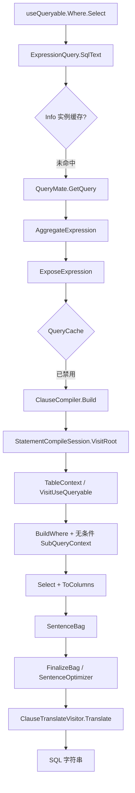

# Ext Queryable 低性能深度分析与初步优化方案

> 数据依据：[dbTest-ORM基准测试总结.md](./dbTest-ORM基准测试总结.md)  
> 对照工程：`Tests/TestFast/dbTest`（`MooSqlQueryableTest` / `useQueryable`）  
> 源码范围：`ext/src/linq`（Ext LINQ）+ `pure/src/ado/SQL/visitors`（Clause → SQL 渲染）  
> 分析日期：2026-08  
> 结论级别：**源码追溯 + 初步方案**（**本轮不实施**；未用 Profiler 精确定量拆分各阶段占比）  
> 缓存策略修订：P0 以 **SQLClip 表达式身份识别 / 频率缓存** 适配 `QueryMate` 被注释链路，而非另起完整 Lin2DB `QueryCache`

---

## 1. 问题摘要

在 dbTest 六项基准中，`useQueryable`（Ext LINQ）相对 `useSQL` / `useClip` 全面落后；**与 DB I/O 无关的 Condition / MethodCondition（只取 `SqlText`）已达毫秒级**，说明瓶颈在**编译管线本身**，而非映射或驱动。

| 场景 | Queryable | Builder | Clip | 相对 Builder | 相对 CRL/EF（表达式组） |
|------|-----------|---------|------|--------------|-------------------------|
| Result（Take100 映射） | ~1.34 ms / 777 KB | ~310 μs / 61 KB | ~339 μs | **~4.3× / ~13× 分配** | 慢于 EF（~711 μs） |
| Anonymous（投影） | ~1.40 ms / 220 KB* | ~232 μs | ~259 μs | **~6×** | 慢档（*上轮含本地投影 workaround） |
| Condition（ToSql） | **~8.95 ms / 346 KB** | ~5.5 μs | ~49 μs | **~1600×** | 慢于 EF（~137 μs）约 **65×** |
| MethodCondition（ToSql） | **~10.0 ms / 304 KB** | ~6.3 μs | ~24 μs | **~1600×** | 慢于 CRL（~8.3 μs）约 **1200×** |
| Loop（20× 按 Id） | **~41 ms / 3.8 MB** | ~1.34 ms | ~1.71 ms | **~31×** | 与 FastFramework 同最慢档 |

**关键判据**：Condition / MethodCondition **不访问数据库**，仍为 ~9–10 ms → 几乎全是「表达式 → Statement → 优化 → SQL 字符串」的固定税。Loop 是该税 ×20 再叠加执行映射。

产品定位建议不变：高吞吐 / 短查询仍应以 **SQLBuilder / SQLClip** 为主；`useQueryable` 面向标准 `IQueryable` / 对标 EF 的写法，需通过缓存与结构捷径把编译税压到「可接受」区间。

---

## 2. 调用链（以 Condition → `SqlText` 为准）

基准入口：

```text
MooSqlQueryableTest.testQueryCondition()
  → Db.useQueryable<TestEntity>()          // DBExtLinqExtension → ExtLinqEntry.CreateDbQuery → DbQuery<T>
  → .Where(GetSelectFilter())              // IQueryProvider.CreateQuery → ExpressionQueryImpl + MethodCall
  → .Select(...)                           // 再包一层 ExpressionQueryImpl（当前适配器已恢复服务端投影）
  → IExpressionQuery.SqlText
```

### 2.1 SqlText → SQL 字符串



| 步骤 | 关键位置 | 行为 |
|------|----------|------|
| 入口 | `ext/.../ExpressionQuery.cs` → `SqlText` / `GetQuery` | `Info` 仅在**同一查询对象复用**且 `IsCacheable` 时命中；基准每次新建链 → **必 miss** |
| 全局计划缓存 | `ext/.../query/Query.until.cs` → `QueryMate.GetQuery` | `_queryCache` **整段注释**；`QueryCache` 类型当前不存在；`DisableQueryCache` 不再被读取 |
| 预处理 | `ExpressionTreeOptimizationContext.AggregateExpression` | 再平衡 `AndAlso`/`OrElse` |
| Expose | `ClauseSqlTranslator.ExposeExpression` | 全树遍历、可编译判定、展开/求值 |
| 编译 | `QueryMate.CreateQuery` → `ClauseCompiler.Build` | 新建 `ClauseSqlTranslator` + `ParametersContext` + 双访问器会话 |
| Where | `ClauseMethodVisitor.VisitWhere` → `BuildWhere` | 对非 `SubQueryContext` **几乎总是** `new SubQueryContext(sequence)` |
| Select | `ClauseMethodVisitor.VisitSelect` → `ToColumns` | 投影落入 `SelectClause.Columns` |
| Finalize | `SentenceExecutor.FinalizeBag` | `EntitySelectProjector` + `SqlOptimizerFactory` → `BasicSqlOptimizer.Finalize`（重） |
| 渲染 | `QueryMate.TranslateCmds` / `ClauseTranslateVisitor` | Statement → `SQLBuilder` → 字符串 |

源码证据（计划缓存已摘掉）：

```30:30:ext/src/linq/src/linq/query/Query.until.cs
        //private static readonly QueryCache _queryCache = new();
```

```68:78:ext/src/linq/src/linq/query/Query.until.cs
                //useCache = !Opti.DisableQueryCache;
                //if (useCache)
                //{
                //    ...
                //        query = _queryCache.Find(dataContext, expr, queryFlags, false);
                //    if (query != null)
                //        return query;
                //}
```

源码证据（Where 无条件套子查询）：

```69:78:ext/src/linq/src/linq/builder/clauseSqlTranslator/ClauseSqlTranslator.SqlBuilder.cs
			if (!enforceHaving)
			{
				if (buildSequnce is not SubQueryContext subQuery || subQuery.NeedsSubqueryForComparison)
				{
					buildSequnce = new SubQueryContext(sequence);
				}

				sequence.SetAlias(condition.Parameters[0].Name);
				sequence = buildSequnce;
			}
```

---

## 3. 根因排序（按影响）

### 3.1 Condition / MethodCondition（纯编译）

| 优先级 | 根因 | 说明 |
|--------|------|------|
| **P0** | **全局 Query Plan Cache 被移除/禁用** | 每次 `SqlText`/`ToList` 全量编译；直接解释相对 EF/Chloe 的数量级差距 |
| **P0** | **基准模式永远打不中 `ExpressionQuery.Info`** | `Info` 是实例级缓存；`useQueryable().Where().Select()` 每次新建对象 → 等同无缓存 |
| **P1** | **`BuildWhere` 无条件 `SubQueryContext`** | 简单表上的 `Where` 先嵌套再被 `SentenceOptimizer` 展平 →「创建再销毁」的 AST 成本；并与 FROM 别名渲染路径耦合 |
| **P1** | **`FinalizeBag` 对简单查询仍走完整优化器** | 单表 + 简单 WHERE 仍支付 join/nesting/多遍 visitor |
| **P2** | **Expose + Aggregate + 多遍 Convert/CanBeCompiled** | 编译前大段分配与遍历；对短表达式固定税占比极高 |
| **P2** | **参数访问器每次 `CompileExpression`** | 闭包/`id` 等参数化路径的委托编译与分配 |
| **P3** | **编译会话对象图不可复用** | 每调用新建 translator / visitors / SelectQuery / placeholders → ~300 KB+/次 |

### 3.2 Loop（20× `Where(Id==i).ToList()`）

| 优先级 | 根因 | 说明 |
|--------|------|------|
| **P0** | 与上相同：无计划缓存 | ~2 ms/次编译主导；×20 ≈ 41 ms |
| **P0** | 闭包 `id` | 即便恢复缓存，若键未参数化闭包，仍会每次 miss |
| **P1** | 每轮 Finalize + Translate + `query<T>` | 次于编译，但仍可观 |
| — | ADO / 映射 | 不是主因（Builder 同场景仅 ~1.3 ms） |

### 3.3 Result / AnonymousResult

| 优先级 | 根因 | 说明 |
|--------|------|------|
| **P0/P1** | 同上编译税 | 在 Take100 场景被结果集时间部分稀释，但仍占固定 ~1 ms+ |
| **P2** | 无 Select 时 `EntitySelectProjector` 补全列 | Result 分配 ~777 KB、Gen1 高，与大语句图有关 |
| **P2** | 匿名投影 `SelectContext` + `ToColumns` | 修复 `as alias` 后应重跑；上表 Anonymous 数字含历史 workaround |

---

## 4. 与 Builder / Clip / Fast LINQ 的结构对比

| 路径 | 编译模型 | Condition 量级 | 含义 |
|------|----------|---------------|------|
| **SQLBuilder** | API 拼串，几乎无 Expression | ~5 μs | 动态条件最优 |
| **SQLClip** | 窄 Lambda → SQLBuilder | ~50 μs | 类型安全糖，税可接受 |
| **Fast（useBus）** | Fast 访问器直接写 SQLBuilder | （本轮 dbTest 未单列） | 无 SelectQuery AST / 无 SentenceOptimizer |
| **Ext（useQueryable）** | Expression → SentenceBag → Optimizer → Translate | **~9 ms（冷且无缓存）** | 对标 EF/Lin2DB 的完整编译器；**缓存关闭时不可用于高频 ToSql** |

结论：Ext 慢不是「映射写得差」，而是**完整 ORM 编译器在无计划缓存时的预期形态**被基准放大；要对齐 EF 的 Condition（~100 μs 级），必须先恢复「编译一次、参数化复用」。

---

## 5. 现有缓存盘点

| 机制 | 状态 | 对基准是否有效 |
|------|------|----------------|
| `QueryMate` / `QueryCache` | **注释禁用 / 类型缺失** | 否（**本方案主修复点**） |
| SQLClip `ClipExpSameCheckor` + `FrequencyBasedCache` | **已在 Clip 字段解析路径服役** | Ext 未接线；作 P0 身份/容器基础 |
| `ExpressionQuery.Info` | 实例级，需复用同一 query 对象 | 基准模式否 |
| `ClauseSqlTranslator._cachedSql` | 单次编译会话内 | 跨调用否 |
| `SooOption.DisableQueryCache` | 选项仍在，逻辑未接线 | 无效（接线后生效） |
| Expose / visitor 对象池 | 存在 | 微小，不解决计划复用 |
| Pure `MapperCache` | 存活 | 只助映射，不助 Ext 编译 |
| `SentenceItem.cmds` | 同一 bag 内 | bag 不复用则无效 |

**Loop 当前不会命中任何 Ext 查询计划缓存**；Clip 侧结构身份能力可迁移后改变此结论。

---

## 6. 初步优化方案

### 6.1 目标（建议验收指标）

在 `Tests/TestFast/dbTest` 同环境、Queryable 路径上：

| 场景 | 现状（约） | 暖缓存目标 | 备注 |
|------|------------|------------|------|
| Condition / MethodCondition | 9–10 ms | **&lt; 200 μs**（挑战 **&lt; 100 μs**） | 与 EF 同量级 |
| Loop ×20 | 41 ms | **&lt; 5 ms** | 仍可高于 Builder/Dapper |
| Result Take100 | 1.34 ms | **接近 EF（~0.7 ms）** | 编译摊销后 |
| Condition Allocated | ~346 KB | **显著下降（目标 &lt; 80 KB 暖路径）** | 以缓存命中路径计 |

冷启动（首次编译）允许仍为毫秒级，但文档与基准应**分列冷/暖**，避免误读。

### 6.2 P0 — 基于 SQLClip 表达式身份识别，恢复 `QueryMate` 被注释缓存链路

**策略（本轮方案核心）**：不另起一套 Lin2DB 式完整 `QueryCache` 重写；**复用 SQLClip 已验证的「Expression 结构身份 → 唯一 ID → 频率缓存」能力**，接到 `QueryMate.GetQuery` 里被注释掉的 Find / TryAdd 区域，使 Ext 编译产物（`SentenceBag`）可跨调用复用。

#### 6.2.1 SQLClip 侧已有基础（可直接对齐）

| 组件 | 路径 | 作用 |
|------|------|------|
| `ClipExpSameCheckor` | `pure/src/innerUtils/ClipExpSameCheckor.cs` | 按**表达式结构**算身份哈希；`ConstantExpression` **按类型参与哈希、不按运行时值**（闭包字段友好） |
| `ExpSameCheckor` | `pure/src/innerUtils/ExpSameCheckor.cs` | 结构相等比较器；常量默认按值（适合 Clip 另一类键） |
| `FrequencyBasedCache<TKey,TValue>` | `pure/src/adoext/clip/items/FrequencyBasedCache.cs` | LRU + 过期清理的缓存容器（Clip 字段解析已在用） |
| `ClipLinqParseCache` / `ClipProvider.TranslateField` | `pure/src/adoext/clip/` | 实践模式：`GetHashCode(expr)` → TryGet → miss 则编译并 `Add`；命中后按闭包重绑上下文 |

Clip 热路径示意（`ClipProvider.TranslateField`）：

```text
ClipExpSameCheckor.GetHashCode(expression)  →  唯一结构 ID
        ↓ hit
FrequencyBasedCache 取已解析结果，闭包表别名重绑
        ↓ miss
走访问器编译 → Cache.Add(hash, parsed)
```

**对 Ext 的关键启示**：身份键必须对「形状相同、常量/闭包值不同」的查询给出同一 ID（Loop 中 `Where(b => b.Id == id)` 的 `id` 变化不应打爆缓存）；真正取值仍走现有 `ParameterAccessor` / `SetParameters(expression, …)`。

#### 6.2.2 接到被注释链路的落点

目标文件：`ext/src/linq/src/linq/query/Query.until.cs`（`QueryMate`）

| 注释区意图 | 适配做法 |
|------------|----------|
| `_queryCache = new QueryCache()` | 新增轻量 `ExtQueryPlanCache`（或复用名 `QueryCache`）：内部用 `FrequencyBasedCache`（或 `ConcurrentDictionary` + 滑动过期），**键算法委托 `ClipExpSameCheckor`（或其 Ext 专用薄封装）** |
| `Find(..., expr, queryFlags, forExposed)` | `GetQuery` 在 Aggregate 之后、Expose 前/后各一次查找（与注释流程一致）：先未展开形状，再 `ExpandedQuery` 形状 |
| `TryAdd(..., query, expr, queryFlags, …)` | `CreateQuery` 成功且 `query.IsCacheable` 时写入 |
| `PrepareForCaching()` | **首期可降级**：不强制上 ConstantPlaceholder；依赖「结构 ID 忽略常量值 + 执行期 SetParameters 读当前表达式」。二期再补占位改写以防键持有大对象图 |
| `useCache = !Opti.DisableQueryCache` | 直接接线现有 `SooOption.DisableQueryCache` / `CacheSlidingExpiration` |

建议键维度（在 Clip 结构 ID 之上叠加，避免跨库串计划）：

```text
ExtQueryCacheKey =
    ClipExpSameCheckor 结构身份（或规范化后的 Expression）
  + ResultType (T)
  + Dialect / ProviderFlags 指纹
  + QueryFlags（含 ExpandedQuery）
  + 必要 Options（如 ParameterizeTakeSkip、InlineParameters）
```

值：`SentenceBag<T>`（或非泛型 `SentenceBag` + 结果类型校验）。命中后**不得**跳过 `SetParameters`；`FinalizeBag` 对已 `IsFinalized` 的 bag 早退，与现逻辑兼容。

#### 6.2.3 与 Clip 的差异（必须写进实施约束）

| 点 | Clip 现状 | Ext 适配要求 |
|----|-----------|--------------|
| 缓存粒 | 字段/条件片段解析结果 | 整查询 `SentenceBag`（更大、并发更敏感） |
| 键类型 | 实践中多用 **int 哈希** 直接当 key | **禁止仅用 int**：哈希碰撞会错计划。应使用「结构比较器 + 完整 Key 结构体」；`ClipExpSameCheckor.GetHashCode` 作哈希，`Equals` 需与「常量按类型」语义一致（勿直接套 `ExpressionComparer` 的按值常量比较，否则 Loop 永不命中） |
| 命中后修正 | 闭包重绑表别名 | 执行/ToSql 仍用**当前** Expression 喂给 `ParameterAccessors` |
| DB 实例 | 绑定在 Clip 上下文 | Key 含方言指纹；`SentenceBag.DBLive` 命中后应绑定到**本次** `DBInstance` 或保证方言一致才命中 |

#### 6.2.4 排除与正确性边界

不可入缓存（与现有 `IsCacheable` 对齐并加强）：

- `NavColumns` / Include / 多 `SentenceItem`
- 编译错误路径 / `ErrorExpression`
- 显式 `DisableQueryCache`
- （可选首期）含不可参数化的客户端求值、动态 SQL 注入片段

**预期**：Condition/MethodCondition 暖路径 ms → 数十～百 μs；同形状 Loop ×20 编译 1 次。  
**风险**：Equals/哈希语义不一致 → 该命中未命中或（更糟）误命中；须用「同形状不同闭包值」「不同形状同哈希压力」单测守住。

#### 6.2.5 本轮范围声明

> **本轮仅编制方案，不实施代码。** 实施时应优先改 `Query.until.cs` 注释区 + 新增/抽取与 Clip 共享的身份键组件，避免平行发明第二套表达式指纹算法。

### 6.3 P0′ — 对外 CompiledQuery / 复用 API（缓存之上的显式出口）

自动结构缓存覆盖「同形状链式 API」后，仍建议提供显式编译 API（对标 EF `CompileQuery`），用于形状稳定、调用极热的路径：

```csharp
// 示意 API（名称待定）
var q = db.CompileQuery((DBInstance d, int id) =>
    d.useQueryable<TestEntity>().Where(b => b.Id == id));

for (var i = 0; i < 20; i++)
    _ = q(db, i).ToList();
```

**预期**：不依赖启发式相等；与 6.2 共用同一套 `SentenceBag` 复用与 `SetParameters` 约定。  
**顺序**：可在 6.2 暖缓存跑通后再做；若 6.2 键语义短期难稳，可把 CompiledQuery 提前为 Loop 的过渡方案。

### 6.4 P1 — 收紧 `BuildWhere` 的 SubQuery 包装

**现状**：几乎所有非 Having 的 Where 都 `new SubQueryContext`。  
**建议**：仅在以下情况包装：

- 已有 Distinct / Take / Skip / SetOperators  
- `NeedsSubqueryForComparison`  
- 文档/指南已写明必须隔离的语义场景  

简单 `TableContext` / 可合并的 `SelectContext` 上直接挂 `SearchCondition`。

**预期**：减少「嵌套再展平」；Finalize 与别名路径更简单；Condition/Result 编译分配下降。

**风险**：Distinct/分页/集合运算语义回归——应用针对性用例守住。

### 6.5 P1 — 简单查询 Finalize 快路径

当语句满足「单表、无 Join/Apply/CTE/集合运算、无复杂投影嵌套」时：

- 跳过或降级 `SentenceOptimizer` 中与 join/nesting 相关的遍  
- 复用 `ISqlOptimizer` 实例（避免每轮 `new`）

**预期**：ToSql 尾段明显缩短；与 P1 SubQuery 收紧叠加效果更好。

### 6.6 P2 — 编译器内部减负

| 项 | 说明 |
|----|------|
| 参数访问器缓存 | 按表达式形状缓存 `CompileExpression` 结果 |
| 减少双遍 Convert | 热路径避免 Test + Real 重复转换 |
| 收紧 `CanBeCompiled` | 结果缓存，降低 Expose 成本 |
| 会话/访问器池化 | 降低 Gen0（收益小于 P0） |

### 6.7 P3 — 基准与文档治理

1. 在 `MooSqlQueryableTest` / 文档中区分：**冷编译** vs **暖缓存** vs **CompiledQuery**  
2. Anonymous / Condition 在 Select 列名修复后**重跑**并更新总结表  
3. 可选：对 `GetQuery` 各 `ActivityID`（已有 Activity 埋点）做一次采样，量化 Expose / Create / Finalize / Translate 占比，指导下一批微调

---

## 7. 建议落地顺序

```text
阶段 A（正确性优先 — 对齐 Clip 身份缓存）
  A1. 固化 ExtQueryCacheKey 语义：以 ClipExpSameCheckor 为结构指纹；
      Equals 与「常量按类型」一致（必要时抽 ClipStructuralComparer，避免 ExpressionComparer 按值比较）
  A2. 实现 ExtQueryPlanCache（FrequencyBasedCache / 等价容器）+ Clear 钩子
  A3. 打开 QueryMate.GetQuery 注释区：DisableQueryCache、Find×2、TryAdd、IsCacheable
  A4. 单测：同形状不同闭包值命中；不同谓词不命中；多方言不串；DisableQueryCache 生效
  A5. dbTest：Condition / Loop 冷暖分列复测

阶段 B（管线减负，与 A 可部分并行）
  B1. BuildWhere 条件化 SubQuery
  B2. Finalize 简单查询快路径
  B3. Result / Anonymous 复测

阶段 C
  C1. 公开 CompileQuery API（与 A 共用 SentenceBag 复用约定）
  C2. PrepareForCaching / 占位改写（降低键持有表达式图）
  C3. 参数访问器缓存、访问器池化
  C4. 更新基准总结与对外说明（冷/暖分列）
```

---

## 8. 明确不做 / 慎做

| 项 | 原因 |
|----|------|
| 为性能把 Ext 改成 Fast 式直接改 SQLBuilder | 破坏 Ext「Statement/Clause」架构与对标 EF 的定位 |
| 另起一套与 Clip 无关的表达式指纹算法 | 重复造轮、语义分叉；应适配 Clip 身份识别 |
| 仅用 int 哈希当 Ext 计划缓存 key（照搬 Clip 字段缓存简化写法） | 碰撞即错 SQL；Ext 计划缓存必须完整 Equals |
| 去掉 Distinct/Take/Skip 等场景的 SubQuery | 语义错误 |
| 对 Join/Apply/CTE 盲目跳过 Optimizer | 嵌套/空值/列提升依赖优化器 |
| 缓存键忽略方言 / 用 `ExpressionComparer` 按值比常量做结构键 | 跨库串计划，或 Loop 永不命中 |
| 用 Builder 的 Condition 数字宣传「表达式解析更快」 | 路径不同构（总结文档已声明） |

---

## 9. 与近期缺陷修复的关系

近期已修：

1. **`VisitColumnWord`**：`expression as alias`（消除 `b.IdId`）  
2. **FROM 别名**：`VisitTableWord` 输出 `Name as Alias`；子查询展平时避免 `as b as b`  

这些修复让服务端 `Select` / 执行路径正确，**不降低编译税**。Queryable 性能问题是**架构级缓存与管线重量**问题，需按第 6 节推进。

`Tests/TestFast/dbTest` 已改为 `ProjectReference` 本仓库 `ext/mooSQL.Ext.csproj`，便于边改 Ext 边用 `moosmoke` / BenchmarkDotNet 验证。

---

## 10. 一句话结论

**Ext Queryable 在 Condition/Loop 上的低性能，主因是「完整编译管线 + `QueryMate` 计划缓存被注释关掉 + Where 无条件套子查询 + 重 Finalize」；不是 ADO 映射慢。**  
最高杠杆是：**用 SQLClip 已有的 Expression 结构身份识别（`ClipExpSameCheckor` + 频率缓存模式）适配并恢复 `Query.until.cs` 被注释的缓存链路**，使同形状查询复用 `SentenceBag`、执行期再 `SetParameters`；其次才是收紧 SubQuery / Finalize，以及可选的 CompiledQuery API。在暖缓存落地前，高频短查询仍应走 **SQLBuilder / SQLClip**。

> 文档状态：方案编制（含 Clip 适配路径）；**尚未实施代码。**
