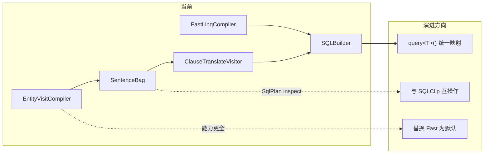

# mooSQL LINQ 全景分析与项目对比

> **更新日期：2026-06**  
> 基于 Phase 2 重构后的代码状态整理。涵盖 Fast LINQ（`pure/src/linq`）与 Ext LINQ（`ext/src/linq`）两条主线，以及与整体项目的定位对比。

---

## 一、当前 LINQ 全景：三条路径，正在收敛

项目里现在有 **三套编译器**，但执行终点已经统一：

| 路径 | 工厂 | 编译器 | 默认入口 | 状态 |
|------|------|--------|----------|------|
| **Fast LINQ** | `FastLinqFactory` | `FastLinqCompiler` | `db.useDbBus<T>()` | **生产默认** |
| **Entity LINQ** | `EntityLinqFactory` | `EntityQueryCompiler` | 手动注入工厂 | Phase 2 已落地 |
| **Entity Visit** | `EntityVisitFactory` | `EntityVisitCompiler` | 测试 `CreateBus` / `useBus` | 与上者 **实现相同** |

### 关键变化

`EntityQueryCompiler` 和 `EntityVisitCompiler` 的 `DoCompile` **已完全一致**，都走 `SentenceExecutor`：

```csharp
// ext/src/linq/core/EntityQueryCompiler.cs（EntityVisitCompiler 相同）
public override Func<QueryContext, TResult> DoCompile<TResult>(Expression expression, QueryContext context)
{
    var query = QueryMate.GetQuery<TResult>(DB, ref expression, out _);
    query.DBLive = DB;
    query.srcExp = expression;

    return ctx =>
    {
        ctx.DB ??= DB;
        return SentenceExecutor.Execute<TResult>(query, ctx, expression);
    };
}
```

**生产入口**仍用 Fast 路径（`pure/src/utils/door/DBQueryableExtension.cs`）：

```csharp
var fac = new FastLinqFactory();
```

**集成测试**已切到 Ext 新路径（`Tests/src/TestHelpers/LinqSqliteTestHelper.cs`）：

```csharp
var factory = new EntityVisitFactory();
```

**结论**：Ext LINQ 已完成 Phase 2 重构；Fast 与 Ext **执行哲学已对齐**（都落到 `SQLBuilder.query<T>()`），但 **编译中间层仍不同**，生产尚未切换。

---

## 二、Ext LINQ Phase 2 核心变化

### 旧设计（Phase 1，已废弃）

```
Expression
  → BuildSequence（Statement）
  → BuildQuery（第二编译：投影 + BuildMapper）
  → SetRunQuery（DbDataReader Mapper）
  → InitPreambles（前置查询）
  → QueryRunner.BasicResultEnumerable
```

### 新设计（Phase 2，当前）

```
Expression
  → TryBuildSequence + ClauseCompiler     // 仅编译
  → SentenceBag（Statement + NavColumns）
  → SentenceExecutor                      // 统一执行
      → ClauseTranslateVisitor → SQLBuilder
      → kit.query<T>().ToList()
      → NavColumnLoader（LoadWith）
```

### 已删除的职责

| 已删除 | 原因 |
|--------|------|
| `BuildMapper` / `DbDataReader` 行映射 | 实体映射改由 `query<T>()` 完成 |
| `Preamble` / `InitPreambles` | 执行阶段不再依赖前置查询数组 |
| `SetRunQuery` 在编译期绑定执行委托 | 执行统一由 `SentenceExecutor` 负责 |
| `SentenceBag.finalExp` | 参数解析仅用 `srcExp` |
| `ExpressionBuilder.BuildQuery<T>()` | 第二编译阶段不再需要 |

### 新增/强化的 Pure 层能力

- **`ClauseTranslateVisitor`**（`pure/src/ado/SQL/visitors/`）：把 `SelectQueryClause` 等 Statement 结构翻译成 `SQLBuilder`
- **`Dialect.clauseTranslator`**：方言持有翻译器实例

执行核心（`ext/src/linq/translator/SentenceExecutor.cs`）：

```
BuildSqlBuilder(bag, db, expression, parameters)
  → QueryMate.SetParameters(...)
  → db.dialect.clauseTranslator.Prepare(db)
  → translator.Visit(sentence.Statement)
  → SQLBuilderClause.Builder
```

这与 Fast LINQ 的终点一致：**实体映射只走 `SQLBuilder.query<T>()`**，不再维护双轨 Mapper。

### Ext 编译层结构

| 组件 | 职责 |
|------|------|
| `ClauseExpressionVisitor` + `ClauseMethodVisitor` | Buddy 双访问器，替代 ExpressionBuilder 内硬编码分发 |
| `ClauseCompiler` | 编译收尾 → `SentenceBag` |
| `ClauseExpressionVisitor.VisitXxx` | 序列根与非注册 MethodCall 扩展的 Builder 分发 |
| `ClausePredicateVisitor` | Where/Having lambda 内谓词（Like/InList/IsNull 等） |
| `LinqStatementCompiler` | **公开 API**：只编译不执行，产出 `SqlPlan` |
| `SentenceExecutor` | Statement → SQL → 执行 |

阶段 1–4 清理（死代码删除、Builder 内联、执行层统一、目录整理）详见 `src/README.md`。

---

## 三、Fast LINQ（`pure/src/linq`）—— 未大改，仍是生产主力

Fast 路径仍是 **单阶段、直达 SQLBuilder**：

```
Expression
  → FastExpressionTranslatVisitor（MethodCall → CallUntil）
  → FastMethodVisitor（VisitWhere/Select/Join…）
  → FastCompileContext + LayerContext
  → 直接写 SQLBuilder（from/where/join/select…）
  → onRunQuery / onExecute 委托执行
```

### 与 Ext 的差异

| 维度 | Fast LINQ | Ext LINQ (Phase 2) |
|------|-----------|---------------------|
| 中间产物 | 无独立 Statement，直接操作 `SQLBuilder` | `SentenceBag` + `SelectQueryClause` |
| 编译器复杂度 | 轻（~36 文件） | 重（~470 文件，含完整 Builder 体系） |
| 可 inspect / 缓存 | 有限（`FastLinqParseCache`） | `SqlPlan`、`LinqStatementCompiler`、`IsCacheable` |
| LINQ 能力面 | Where/Join/Update/Delete/分页/导航等 | 更广：LoadWith、Merge、SetOp、InsertOrUpdate、Association to-one 等 |
| 执行路径 | `FastMethodVisitor` 内 `kit.query<T>()` | `SentenceExecutor` → `ClauseTranslateVisitor` → `kit.query<T>()` |

### Fast 模块目录

```
pure/src/linq/
├── basis/          # DbContext、LinqDbFactory、EntityQueryProvider、BaseQueryCompiler
├── basis/bus/      # EnDbBus、EntityQueryable、IDbBus
├── queryable/      # BusQueryable（Where/Join/Set/DoUpdate/DoDelete 等扩展）
├── translator/     # BaseTranslateVisitor
├── fast/           # FastLinqCompiler、FastMethodVisitor、FastCompileContext
├── extensions/     # WhereFieldExtensions、ExpressionCompileExt
└── basis/outputs/  # PageOutput、UpdateOutput
```

---

## 四、与整体项目的对比

### 分层关系

```
应用层
  Repository ──useDbBus──→ Fast LINQ（生产）
  LINQ 测试   ──EntityVisitFactory──→ Ext LINQ（Phase 2）
  SQLClip / SQLBuilder ──链式 API──→ 直接构建
        ↓
  SQLBuilder（中枢）
        ↓
  ClauseTranslateVisitor（Ext 专用桥梁）/ Dialect / SQLExpression
        ↓
  DBExecutor / ADO.NET
```

### 四种访问方式对比

| 维度 | **Fast LINQ** | **Ext LINQ** | **SQLClip** | **SQLBuilder** | **Repository** |
|------|---------------|--------------|-------------|----------------|----------------|
| 写法 | 标准 `IQueryable` | 同左（`ExpressionQuery` 等） | 链式 + 字段选择器 Lambda | 贴近 SQL 链式 | 实体 CRUD 门面 |
| 编译 | 表达式 → 直接写 Builder | 表达式 → Statement → Builder | 无编译，直接写 Builder | 无 | 内部调 LINQ |
| 能力广度 | 中 | **高**（Merge/LoadWith/UPSERT…） | 中 | **最全** | 常见场景 |
| 可测试性 | 中 | **高**（Statement 级断言、`SqlPlan`） | 高 | 高 | 中 |
| 生产使用 | **是** | 测试中验证，待切换 | 是 | 是 | 是 |
| 与方言关系 | 经 SQLBuilder | 经 Statement + `ClauseTranslateVisitor` + SQLBuilder | 经 SQLBuilder | 直接 | 经 LINQ |

### 与 `SQLExpression.dml.cs` 的关系

`pure/src/ado/data/dialect/SQLExpression.dml.cs` 属于 **方言 DML 表达式生成**（INSERT/UPDATE/DELETE 的库别语法）。无论 Fast 还是 Ext，最终都通过 `SQLBuilder` 落到方言层；Ext 多了一步 `ClauseTranslateVisitor` 把 Statement 结构「灌进」Builder，再由 `SQLExpression` / `Dialect` 生成最终 SQL。

### 项目选型建议

| 场景 | 推荐 |
|------|------|
| 简单 CRUD | Repository |
| 复杂查询、动态 SQL | SQLBuilder |
| 类型安全、可控 Lambda | SQLClip |
| 标准 LINQ 链式、Join/导航/表达式化 Update | `useDbBus`（Fast LINQ） |
| LoadWith/Merge/UPSERT/Statement 级测试 | Ext LINQ（`EntityVisitFactory`） |

---

## 五、项目演进方向



### 已完成（Phase 2）

- Compile / Execute 分离
- `SentenceExecutor` 统一执行
- `ClauseMethodVisitor` 双访问器 + Builder 内联
- `LinqStatementCompiler` 公开编译 API
- SQLite 端到端测试（`LinqCompileTests`、`useBus1`）
- `NavColumnLoader`、`SqlPlan`、`StatementStructureTests`

### 未完成项（摘自 `src/README.md`）

- Take/Skip 非对齐分页、仅 Skip
- `outcast/` → `publicapi/` 重命名
- SQLClip ↔ Expression 双向互操作
- 真异步流式 `IAsyncEnumerable`
- 生产入口从 `FastLinqFactory` 切换到 `EntityVisitFactory`

---

## 六、简要结论

| 问题 | 答案 |
|------|------|
| **最大变化是什么？** | Ext LINQ 完成 **Compile / Execute 分离**；废弃 Mapper/Preamble；统一 `SentenceExecutor` + `query<T>()` |
| **还有两套 LINQ 吗？** | 有。Fast（生产）与 Ext（测试/增强）**编译路径不同，执行终点相同** |
| **EntityQueryCompiler vs EntityVisitCompiler？** | 当前 **代码相同**，仅工厂类名不同 |
| **与整体项目关系？** | LINQ 仍是应用层入口之一；Ext 强化了 Pure 的 `ClauseTranslateVisitor`；SQLBuilder 仍是唯一执行中枢 |
| **文档同步情况** | `src/README.md`、`core/*.md` 已更新 Phase 2；`doc/docs/moohelp/arch/linq-architecture.md` 仍只描述 Fast 路径 |

---

## 七、相关文档索引

| 文档 | 路径 | 内容 |
|------|------|------|
| **双访问器对齐 FastLinq** | `ext/src/linq/双访问器对齐FastLinq-迁移清单.md` | 分发层对齐计划、Phase A～F 清单与验收 |
| Ext LINQ 三层架构 | `ext/src/linq/src/README.md` | Compile → SentenceBag → Execute 完整说明 |
| 编译过程解析 | `ext/src/linq/core/ExpressionBuilder-构建SentenceBag解析.md` | `ClauseCompiler`、无 BuildQuery/Mapper |
| 执行过程解析 | `ext/src/linq/core/EntityVisitCompiler-执行过程解析.md` | `SentenceExecutor`、无 Preambles |
| Fast LINQ 架构 | `doc/docs/moohelp/arch/linq-architecture.md` | `pure/src/linq` 访问器与 FastMethodVisitor |
| SQLBuilder API | `pure/src/ado/builder/API说明文档.md` | 链式 API 参考 |

### 调试入口

```csharp
// 公开 API：编译为 SqlPlan（不执行）
var result = LinqStatementCompiler.Compile(db, queryable.Expression);
var structure = result.PrimaryStructure; // HasWhere, Joins, TakeValue…
var sql = result.Plan.SqlPreview;

// 内部调试（同程序集）
var bag = QueryMate.GetQuery<MyEntity>(db, ref expression, out _);
// bag.Sentences[0].Statement → SelectQueryClause
// bag.NavColumns → LoadWith 注册列
```
