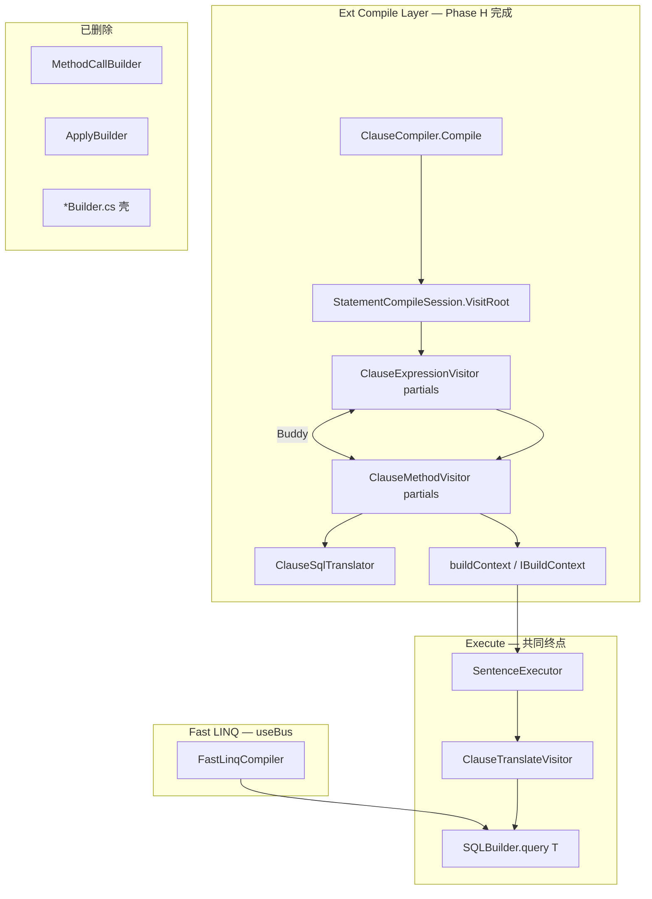

# mooSQL LINQ 全景分析与项目对比

> **更新日期：2026-06-06**  
> 基于 **Phase H（MethodCallBuilder 彻底清理）** 与 **测试基线 34/34** 后的代码状态整理。  
> 涵盖 **Fast LINQ**（`pure/src/linq`，本 ORM 特色 / useBus）与 **Ext LINQ**（`ext/src/linq`，对标 EF / 标准 Queryable）两条并行主线。

---

## 一、架构目标：双轨并行

mooSQL 的 LINQ 不是「新替旧」，而是 **两条长期共存的主线**：

| 主线 | 定位 | 入口 | 工厂 / 编译器 | 演进 |
|------|------|------|---------------|------|
| **Fast LINQ** | **本 ORM 特色**，Bus 扩展与项目实践深度结合 | `useBus` / `useDbBus` → `IDbBus<T>` | `FastLinqFactory` → `FastLinqCompiler` | **持续增强**，业务默认推荐 |
| **Ext LINQ** | **对标 EF Core、SqlSugar Queryable** 等通用能力 | `useQueryable` / `AsQueryable` → `IDbQuery<T>` | `EntityVisitFactory` → `EntityVisitCompiler` | 能力对齐、Statement 级测试、Queryable 生态 |

### 入口对照

```csharp
// Fast — mooSQL 特色（BusQueryable：Set / DoUpdate / LeftJoin / ToPageList …）
var bus = db.useDbBus<User>();
bus.Where(u => u.Id > 0).ToPageList(1, 20);

// Ext — 与 EF / 其他 ORM 相同的 Queryable 习惯
var table = db.useQueryable<User>();   // 或 db.AsQueryable<User>()
table.Where(u => u.Id > 0).Take(20).ToList();
```

### 编译器关系

| 路径 | 工厂 | 编译器 | 所属主线 |
|------|------|--------|----------|
| **Fast LINQ** | `FastLinqFactory` | `FastLinqCompiler` | useBus 特色路径 |
| **Ext LINQ** | `EntityVisitFactory` | `EntityVisitCompiler` | Ext 标准 Queryable |

`EntityVisitCompiler` 的 `DoCompile` 走 `SentenceExecutor`：

```csharp
// ext/src/linq/core/EntityVisitCompiler.cs
public override Func<QueryContext, TResult> DoCompile<TResult>(Expression expression, QueryContext context)
{
    var query = QueryMate.GetQuery<TResult>(DB, ref expression, out _);
    query.DBLive = DB;
    query.srcExp = expression;

    return ctx =>
    {
        ctx.DB ??= DB;
        return SentenceExecutor.Execute<TResult>(query, ctx, expression);
    };
}
```

**Pure 层生产入口**（`DBInstance.useDbBus<T>()`）注入 `FastLinqFactory`；Ext 集成测试使用 `EntityVisitFactory`（`Tests/src/TestHelpers/LinqSqliteTestHelper.cs`）。

**结论**：Fast 与 Ext **编译中间层不同，执行终点相同**（`SQLBuilder.query<T>()`）；二者 **并行发展**，而非合并为单一路径。

---

## 二、代码规模与目录（2026-06 实测）

| 区域 | `.cs` 文件数 | 说明 |
|------|-------------|------|
| **Ext LINQ 合计** | **413** | `ext/src/linq` 全量 |
| `translator/` | 58 | 双访问器、编译收尾、执行、SqlPlan |
| `buildContext/` | 41 | `IBuildContext` 实现 + `UpdateBuilder` 辅助 |
| `clauseSqlTranslator/` | 14 | SQL 语义引擎（原 ExpressionBuilder 拆分体） |
| `sequence/` | 3 | 仅 `BuildSequenceResult` + 2 个 context 基类（**methodCall/ 已删除**） |
| **Pure Fast LINQ** | **36** | `pure/src/linq` |

### Ext 编译层目录地图

```
ext/src/linq/
├── core/                    # EntityVisitCompiler、编译/执行过程文档
├── translator/              # ★ 编译编排 + 执行
│   ├── ClauseExpressionVisitor*.cs   # 6 partial：序列根
│   ├── ClauseMethodVisitor*.cs       # ~30 partial：全部 LINQ 算子
│   ├── ClauseCompiler.cs / StatementCompileSession.cs
│   ├── ClausePredicateVisitor.cs     # Where 谓词（Like/LikeLeft…）
│   ├── SentenceExecutor*.cs            # Execute 层
│   └── plan/                           # SqlPlan / StatementStructure
├── src/linq/builder/
│   ├── buildContext/        # ★ IBuildContext（41 文件）
│   ├── clauseSqlTranslator/ # ★ SQL 工具（MakeExpression / BuildWhere…）
│   └── sequence/            # 遗留最小壳（3 文件）
├── src/linq/query/          # QueryMate、ExpressionQuery
├── src/sqlBuilder/          # Statement → SQLBuilder 辅助
└── src/outcast/             # 公开 API 垫片（待 rename → publicapi/）
```

---

## 三、Ext LINQ 当前架构（Phase 2 + Phase H）

### 旧设计（Phase 1，已废弃）

```
Expression
  → BuildSequence（Statement）
  → BuildQuery（第二编译：投影 + BuildMapper）
  → SetRunQuery（DbDataReader Mapper）
  → InitPreambles（前置查询）
  → QueryRunner.BasicResultEnumerable
```

### 新设计（Phase 2，当前）

```
Expression
  → StatementCompileSession.VisitRoot + ClauseCompiler   // 仅编译
  → SentenceBag（Statement + NavColumns）
  → SentenceExecutor                                     // 统一执行
      → ClauseTranslateVisitor → SQLBuilder
      → kit.query<T>().ToList()
      → NavColumnLoader（LoadWith）
```

### Phase H：MethodCallBuilder 彻底清理（2026-06 完成）

**唯一合法编译路径**：

```
VisitRoot
  → ClauseExpressionVisitor（partial）
      → CallUntil → ClauseMethodVisitor.VisitXxx
  → ResolveSourceContext（Buddy 优先 → TryBuildSequence 回退）
  → ClauseSqlTranslator 辅助
  → IBuildContext
  → StatementExpression → SentenceBag
```

| 已删除 | 替代 |
|--------|------|
| `ISequenceBuilder` | `ClauseExpressionVisitor.*` 序列根 partial |
| `MethodCallBuilder` + `ApplyBuilder` | `ClauseMethodVisitor.*.cs` 内联 `VisitXxxCore` |
| `*Builder.cs` 壳（~60+ 文件） | 逻辑迁入 visitor partial；Context 迁入 `buildContext/` |
| `BuildsMethodCall` 特性 | 显式 `VisitXxx` 注册 |
| `methodCall/` 目录 | 仅保留 `buildContext/UpdateBuilder.cs`（DML set-expression 静态辅助） |

`ClauseMethodVisitor.Bindings.cs` 现 **仅保留** `VisitAlias` 透传。

### 双访问器组件职责

| 组件 | 职责 |
|------|------|
| `StatementCompileSession` | 双访问器装配 + 统一 `VisitRoot` |
| `ClauseExpressionVisitor` | 序列根 partial：EntityRoot / Enumerable / Scalar / ContextRef / Table / MethodChain |
| `ClauseMethodVisitor` | 全部算子 `VisitXxx` + `BuildXxxCore`（~30 个 partial） |
| `ClauseCompileContext` | `StatementResult` 唯一成功槽 → `ToSentenceBag` |
| `ClauseSqlTranslator` | SQL 语义（MakeExpression / ConvertToSql / BuildWhere 等） |
| `ClausePredicateVisitor` | Where/Having 谓词；Like / LikeLeft 统一 `Like` IR |
| `ClauseCompiler` | 编译收尾 + `ApplyLikePatternSubstitutes` |
| `LinqStatementCompiler` | 公开 API：只编译 → `SqlPlan` |
| `SentenceExecutor` | Statement → SQL → 执行 |

### 算子覆盖（ClauseMethodVisitor partial）

| 类别 | partial 文件 | 状态 |
|------|-------------|------|
| 查询核心 | Where, Select, OrderBy, TakeSkip, Join, Distinct, GroupBy, GroupJoin, SelectMany | ✅ |
| 量化/集合 | AllAny, Contains, FirstSingle, DefaultIfEmpty, ElementAt, OfType, Aggregate | ✅ |
| 集合运算 | SetOp, LoadWith | ✅ |
| DML | Insert, Update, Delete, InsertOrUpdate, MultiInsert, Dml, AsUpdatable | ✅ |
| Merge | Merge（全链内联，原 12 个 MergeBuilder partial） | ✅ |
| 元数据 | QueryMeta, TableMeta, Table | ✅ |
| 扩展 | MooExt, Async, Statement | ✅ |

### 已删除的编译期职责

| 已删除 | 原因 |
|--------|------|
| `BuildMapper` / `DbDataReader` 行映射 | 实体映射改由 `query<T>()` 完成 |
| `Preamble` / `InitPreambles` | 执行阶段不再依赖前置查询数组 |
| `SetRunQuery` 在编译期绑定执行委托 | 执行统一由 `SentenceExecutor` 负责 |
| `SentenceBag.finalExp` | 参数解析仅用 `srcExp` |
| `ExpressionBuilder.BuildQuery<T>()` | 第二编译阶段不再需要 |

### 近期修复（2026-06-06）

`Expressions.Members` 懒加载曾被注释，导致 `Where` / `Like` 编译时 `ConvertMemberInternal` 空引用。**已恢复 `LoadMembers()`**，用 `_commonMembers` 初始化 `Members[""]`。测试由 15/34 恢复为 **34/34**。

---

## 四、Fast LINQ（`pure/src/linq`）—— useBus 主线

Fast 路径经 **`useBus` / `useDbBus`** 进入 `IDbBus<T>`，编译为 **单阶段、直达 SQLBuilder**：

```
Expression
  → FastExpressionTranslatVisitor（MethodCall → CallUntil）
  → FastMethodVisitor（VisitWhere/Select/Join…）
  → FastCompileContext + LayerContext
  → 直接写 SQLBuilder（from/where/join/select…）
  → onRunQuery / onExecute 委托执行
```

### 与 Ext 的差异

| 维度 | Fast LINQ | Ext LINQ |
|------|-----------|----------|
| 中间产物 | 无独立 Statement，直接操作 `SQLBuilder` | `SentenceBag` + `SelectQueryClause` |
| 编译器复杂度 | 轻（**36** 文件） | 重（**413** 文件） |
| 分发模型 | `FastMethodVisitor` 单访问器 | Buddy 双访问器 + `IBuildContext` |
| 可 inspect / 缓存 | 有限（`FastLinqParseCache`） | `SqlPlan`、`LinqStatementCompiler`、`IsCacheable` |
| LINQ 能力面 | Where/Join/Update/Delete/分页/导航等 | 更广：LoadWith、Merge、SetOp、InsertOrUpdate、Association to-one 等 |
| 执行路径 | `FastMethodVisitor` 内 `kit.query<T>()` | `SentenceExecutor` → `ClauseTranslateVisitor` → `kit.query<T>()` |

### Fast 模块目录

```
pure/src/linq/
├── basis/          # DbContext、EntityQueryProvider、BaseQueryCompiler
├── basis/bus/      # EnDbBus、EntityQueryable、IDbBus
├── queryable/      # BusQueryable（Where/Join/Set/DoUpdate/DoDelete 等扩展）
├── translator/     # BaseTranslateVisitor
├── fast/           # FastLinqCompiler、FastMethodVisitor、FastCompileContext
├── extensions/     # WhereFieldExtensions、ExpressionCompileExt
└── basis/outputs/  # PageOutput、UpdateOutput
```

---

## 五、与整体项目的对比

### 分层关系

```
应用层
  业务查询 ──useBus / useDbBus──→ Fast LINQ（特色主线，持续增强）
  EF式Queryable ──useQueryable / AsQueryable──→ Ext LINQ（对标 EF / 通用 Queryable）
  SQLClip / SQLBuilder ──链式 API──→ 直接构建
        ↓
  SQLBuilder（中枢）
        ↓
  ClauseTranslateVisitor（Ext 专用桥梁）/ Dialect / SQLExpression
        ↓
  DBExecutor / ADO.NET
```

### 四种访问方式对比

| 维度 | **Fast LINQ** | **Ext LINQ** | **SQLClip** | **SQLBuilder** | **Repository** |
|------|---------------|--------------|-------------|----------------|----------------|
| 写法 | `IDbBus` + `BusQueryable` 扩展 | 标准 `IQueryable` / `IDbQuery<T>` | 链式 + 字段选择器 Lambda | 贴近 SQL 链式 | 实体 CRUD 门面 |
| 入口 | **`useBus` / `useDbBus`** | **`useQueryable` / `AsQueryable`** | `useClip` | `useSQL` | `useRepo` |
| 编译 | 表达式 → 直接写 Builder | 表达式 → Statement → Builder | 无编译，直接写 Builder | 无 | 内部调 Fast useBus |
| 能力广度 | 中（偏项目实践） | **高**（Merge/LoadWith/UPSERT…） | 中 | **最全** | 常见场景 |
| 可测试性 | 中 | **高**（Statement 级断言、`SqlPlan`） | 高 | 高 | 中 |
| 定位 | **ORM 特色、默认业务路径** | **对标 EF / 通用 Queryable** | 类型安全片段 | 复杂 SQL | CRUD |

### 项目选型建议

| 场景 | 推荐 |
|------|------|
| 简单 CRUD | Repository |
| 复杂查询、动态 SQL | SQLBuilder |
| 类型安全、可控 Lambda | SQLClip |
| **mooSQL 特色**：表达式化 Update/Delete、Bus Join、分页、InjectSQL | **`useBus`（Fast LINQ）** |
| **EF 式标准 Queryable**、LoadWith/Merge/UPSERT、Statement 级测试 | **Ext LINQ（`useQueryable` / `AsQueryable`）** |

---

## 六、测试与质量基线

**项目**：`Tests/TestLinq.csproj`（net6.0，SQLite fixture）

| 测试类 | 数量 | 覆盖 |
|--------|------|------|
| `LinqCompileTests` | 28 | Where/Like/OrderBy/Take/Skip/Count/Association 编译 + SQLite 执行 |
| `StatementStructureTests` | 4 | `LinqStatementCompiler` → SqlPlan / Join 结构 |
| 其他（Dialect/SQLBuilder 等） | 2 | 方言与辅助 |

**当前基线**：**34 通过 / 0 失败**（2026-06-06）

验收命令：

```bash
dotnet build ext/mooSQL.Ext.csproj -f net6.0
dotnet test Tests/TestLinq.csproj -f net6.0
```

---

## 七、演进方向



### Fast LINQ（useBus）

- 持续完善 `BusQueryable` 扩展与 `FastMethodVisitor` 语义
- 性能与编译缓存（`FastLinqParseCache`）
- 与 Repository、权限、SQLBuilder 的项目集成

### Ext LINQ（标准 Queryable）

#### 已完成

- Compile / Execute 分离；`SentenceExecutor` 统一执行
- 双访问器 + 全部算子内联（Phase H）
- `ClausePredicateVisitor`：Like / LikeLeft 编译与 SQLite 执行
- Take/Skip SQL 下推；`setPage` 归一化
- `NavColumnLoader`、`SqlPlan`、`StatementStructureTests`
- **`Expressions.LoadMembers` 修复** → 测试全绿

#### 待办（摘自 `src/README.md`）

- Jet 等无原生 OFFSET 方言的 Take/Skip 客户端截断 fallback
- `outcast/` → `publicapi/` 重命名
- SQLClip ↔ Expression 双向互操作
- 真异步流式 `IAsyncEnumerable`
- 更多方言矩阵文档与 EF 方法对齐

---

## 八、简要结论

| 问题 | 答案 |
|------|------|
| **最大变化是什么？** | Ext 完成 **Compile/Execute 分离** + **MethodCallBuilder 全量清理**；编译仅经双访问器 + `IBuildContext` |
| **还有两套 LINQ 吗？** | **是，且为架构目标**：Fast（useBus）与 Ext（标准 Queryable）**并行** |
| **Ext 编译器入口？** | `EntityVisitFactory` → `EntityVisitCompiler` → `QueryMate.GetQuery` → `ClauseCompiler` |
| **useBus 走哪条？** | **Fast LINQ**（`FastLinqFactory`） |
| **Ext 入口？** | **`useQueryable` / `AsQueryable`** → `IDbQuery<T>` |
| **与 SQLBuilder 关系？** | 二者执行终点均为 `SQLBuilder.query<T>()`；Ext 多一层 Statement + `ClauseTranslateVisitor` |
| **测试状态？** | **34/34**（SQLite 集成 + Statement 结构） |

---

## 九、相关文档索引

| 文档 | 路径 | 内容 |
|------|------|------|
| **双访问器对齐 FastLinq** | `ext/src/linq/双访问器对齐FastLinq-迁移清单.md` | Phase A～H 清单；MethodCallBuilder 清理验收 |
| Ext LINQ 三层架构 | `ext/src/linq/src/README.md` | Compile → SentenceBag → Execute |
| 编译过程解析 | `ext/src/linq/core/ClauseCompiler-构建SentenceBag解析.md` | `StatementCompileSession`、`ClauseCompiler` |
| 执行过程解析 | `ext/src/linq/core/EntityVisitCompiler-执行过程解析.md` | `SentenceExecutor` |
| Fast LINQ 架构 | `doc/docs/moohelp/arch/linq-architecture.md` | 双轨定位 + FastMethodVisitor |
| SQLBuilder API | `pure/src/ado/builder/API说明文档.md` | 链式 API 参考 |

### 调试入口

```csharp
// 公开 API：编译为 SqlPlan（不执行）
var result = LinqStatementCompiler.Compile(db, queryable.Expression);
var structure = result.PrimaryStructure; // HasWhere, Joins, TakeValue…
var sql = result.Plan.SqlPreview;

// 内部调试（同程序集）
var bag = QueryMate.GetQuery<MyEntity>(db, ref expression, out _);
// bag.Sentences[0].Statement → SelectQueryClause
// bag.NavColumns → LoadWith 注册列
```
