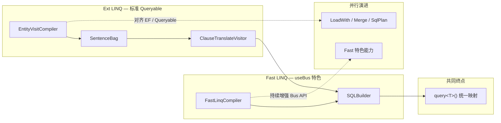

# mooSQL LINQ 全景分析与项目对比

> **更新日期：2026-06**  
> 基于 Phase 2 重构后的代码状态整理。涵盖 **Fast LINQ**（`pure/src/linq`，本 ORM 特色 / useBus）与 **Ext LINQ**（`ext/src/linq`，对标 EF / 标准 Queryable）两条并行主线。

---

## 一、架构目标：双轨并行

mooSQL 的 LINQ 不是「新替旧」，而是 **两条长期共存的主线**：

| 主线 | 定位 | 入口 | 工厂 / 编译器 | 演进 |
|------|------|------|---------------|------|
| **Fast LINQ** | **本 ORM 特色**，Bus 扩展与项目实践深度结合 | `useBus` / `useDbBus` → `IDbBus<T>` | `FastLinqFactory` → `FastLinqCompiler` | **持续增强**，业务默认推荐 |
| **Ext LINQ** | **对标 EF Core、SqlSugar Queryable** 等通用能力 | `useQueryable` / `AsQueryable` → `IDbQuery<T>` | `EntityLinqFactory` / `EntityVisitFactory` → `EntityQueryCompiler` / `EntityVisitCompiler` | 能力对齐、Statement 级测试、Queryable 生态 |

### 入口对照

```csharp
// Fast — mooSQL 特色（BusQueryable：Set / DoUpdate / LeftJoin / ToPageList …）
var bus = db.useDbBus<User>();
bus.Where(u => u.Id > 0).ToPageList(1, 20);

// Ext — 与 EF / 其他 ORM 相同的 Queryable 习惯
var table = db.useQueryable<User>();   // 或 db.AsQueryable<User>() / DBCash.useQueryable<User>(n)
table.Where(u => u.Id > 0).Take(20).ToList();
```

### 编译器关系

项目内 **三套编译器类名**，但分属两条主线：

| 路径 | 工厂 | 编译器 | 所属主线 |
|------|------|--------|----------|
| **Fast LINQ** | `FastLinqFactory` | `FastLinqCompiler` | useBus 特色路径 |
| **Entity LINQ** | `EntityLinqFactory` | `EntityQueryCompiler` | Ext 标准 Queryable |
| **Entity Visit** | `EntityVisitFactory` | `EntityVisitCompiler` | Ext（与 EntityQueryCompiler **实现相同**，工厂名区分场景） |

`EntityQueryCompiler` 与 `EntityVisitCompiler` 的 `DoCompile` **已完全一致**，均走 `SentenceExecutor`：

```csharp
// ext/src/linq/core/EntityQueryCompiler.cs（EntityVisitCompiler 相同）
public override Func<QueryContext, TResult> DoCompile<TResult>(Expression expression, QueryContext context)
{
    var query = QueryMate.GetQuery<TResult>(DB, ref expression, out _);
    query.DBLive = DB;
    query.srcExp = expression;

    return ctx =>
    {
        ctx.DB ??= DB;
        return SentenceExecutor.Execute<TResult>(query, ctx, expression);
    };
}
```

**Pure 层生产入口**（`DBInstance.useDbBus<T>()`）注入 `FastLinqFactory`：

```csharp
// pure/src/utils/door/DBQueryableExtension.cs
var fac = new FastLinqFactory();
```

**Ext 集成测试**使用 `EntityVisitFactory`（`Tests/src/TestHelpers/LinqSqliteTestHelper.cs`），验证标准 Queryable 编译链，**不表示 Ext 将取代 Fast 成为 useBus 默认实现**。

**结论**：Fast 与 Ext **编译中间层不同，执行终点相同**（`SQLBuilder.query<T>()`）；二者 **并行发展**，而非合并为单一路径。

---

## 二、Ext LINQ Phase 2 核心变化

### 旧设计（Phase 1，已废弃）

```
Expression
  → BuildSequence（Statement）
  → BuildQuery（第二编译：投影 + BuildMapper）
  → SetRunQuery（DbDataReader Mapper）
  → InitPreambles（前置查询）
  → QueryRunner.BasicResultEnumerable
```

### 新设计（Phase 2，当前）

```
Expression
  → StatementCompileSession.VisitRoot + ClauseCompiler   // 仅编译
  → SentenceBag（Statement + NavColumns）
  → SentenceExecutor                                     // 统一执行
      → ClauseTranslateVisitor → SQLBuilder
      → kit.query<T>().ToList()
      → NavColumnLoader（LoadWith）
```

### 已删除的职责

| 已删除 | 原因 |
|--------|------|
| `BuildMapper` / `DbDataReader` 行映射 | 实体映射改由 `query<T>()` 完成 |
| `Preamble` / `InitPreambles` | 执行阶段不再依赖前置查询数组 |
| `SetRunQuery` 在编译期绑定执行委托 | 执行统一由 `SentenceExecutor` 负责 |
| `SentenceBag.finalExp` | 参数解析仅用 `srcExp` |
| `ExpressionBuilder.BuildQuery<T>()` | 第二编译阶段不再需要 |

### 新增/强化的 Pure 层能力

- **`ClauseTranslateVisitor`**（`pure/src/ado/SQL/visitors/`）：把 `SelectQueryClause` 等 Statement 结构翻译成 `SQLBuilder`
- **`Dialect.clauseTranslator`**：方言持有翻译器实例

执行核心（`ext/src/linq/translator/SentenceExecutor.cs`）：

```
BuildSqlBuilder(bag, db, expression, parameters)
  → QueryMate.SetParameters(...)
  → db.dialect.clauseTranslator.Prepare(db)
  → translator.Visit(sentence.Statement)
  → SQLBuilderClause.Builder
```

这与 Fast LINQ 的终点一致：**实体映射只走 `SQLBuilder.query<T>()`**，不再维护双轨 Mapper。

### Ext 编译层结构

| 组件 | 职责 |
|------|------|
| `StatementCompileSession` | 双访问器装配 + 统一 `VisitRoot`（根编译入口） |
| `ClauseExpressionVisitor` + `ClauseMethodVisitor` | Buddy 双访问器，替代原巨型编排类 |
| `ClauseCompiler` | 编译收尾 → `SentenceBag`；`ApplyLikePatternSubstitutes` |
| `ClauseExpressionVisitor.VisitXxx` | 序列根与非注册 MethodCall 扩展的 Builder 分发 |
| `ClausePredicateVisitor` | Where/Having 谓词（Like/LikeLeft/InList/IsNull；统一 `Like` IR） |
| `LinqStatementCompiler` | **公开 API**：只编译不执行，产出 `SqlPlan` |
| `SentenceExecutor` | Statement → SQL → 执行 |

阶段 1–4 清理（死代码删除、Builder 内联、执行层统一、目录整理）详见 `src/README.md`。

---

## 三、Fast LINQ（`pure/src/linq`）—— 本 ORM 特色，useBus 主线

Fast 路径是 mooSQL **自研特色查询层**：经 **`useBus` / `useDbBus`** 进入 `IDbBus<T>`，通过 `BusQueryable` 提供 `Set`、`DoUpdate`、`LeftJoin`、`ToPageList` 等与 SQLBuilder 深度集成的扩展。编译为 **单阶段、直达 SQLBuilder**：

```
Expression
  → FastExpressionTranslatVisitor（MethodCall → CallUntil）
  → FastMethodVisitor（VisitWhere/Select/Join…）
  → FastCompileContext + LayerContext
  → 直接写 SQLBuilder（from/where/join/select…）
  → onRunQuery / onExecute 委托执行
```

### 与 Ext 的差异

| 维度 | Fast LINQ | Ext LINQ (Phase 2) |
|------|-----------|---------------------|
| 中间产物 | 无独立 Statement，直接操作 `SQLBuilder` | `SentenceBag` + `SelectQueryClause` |
| 编译器复杂度 | 轻（~36 文件） | 重（~470 文件，含完整 Builder 体系） |
| 可 inspect / 缓存 | 有限（`FastLinqParseCache`） | `SqlPlan`、`LinqStatementCompiler`、`IsCacheable` |
| LINQ 能力面 | Where/Join/Update/Delete/分页/导航等 | 更广：LoadWith、Merge、SetOp、InsertOrUpdate、Association to-one 等 |
| 执行路径 | `FastMethodVisitor` 内 `kit.query<T>()` | `SentenceExecutor` → `ClauseTranslateVisitor` → `kit.query<T>()` |

### Fast 模块目录

```
pure/src/linq/
├── basis/          # DbContext、LinqDbFactory、EntityQueryProvider、BaseQueryCompiler
├── basis/bus/      # EnDbBus、EntityQueryable、IDbBus
├── queryable/      # BusQueryable（Where/Join/Set/DoUpdate/DoDelete 等扩展）
├── translator/     # BaseTranslateVisitor
├── fast/           # FastLinqCompiler、FastMethodVisitor、FastCompileContext
├── extensions/     # WhereFieldExtensions、ExpressionCompileExt
└── basis/outputs/  # PageOutput、UpdateOutput
```

---

## 四、与整体项目的对比

### 分层关系

```
应用层
  业务查询 ──useBus / useDbBus──→ Fast LINQ（特色主线，持续增强）
  EF式Queryable ──useQueryable / AsQueryable──→ Ext LINQ（对标 EF / 通用 Queryable）
  SQLClip / SQLBuilder ──链式 API──→ 直接构建
        ↓
  SQLBuilder（中枢）
        ↓
  ClauseTranslateVisitor（Ext 专用桥梁）/ Dialect / SQLExpression
        ↓
  DBExecutor / ADO.NET
```

### 四种访问方式对比

| 维度 | **Fast LINQ** | **Ext LINQ** | **SQLClip** | **SQLBuilder** | **Repository** |
|------|---------------|--------------|-------------|----------------|----------------|
| 写法 | `IDbBus` + `BusQueryable` 扩展 | 标准 `IQueryable` / `IDbQuery<T>` | 链式 + 字段选择器 Lambda | 贴近 SQL 链式 | 实体 CRUD 门面 |
| 入口 | **`useBus` / `useDbBus`** | **`useQueryable` / `AsQueryable`** | `useClip` | `useSQL` | `useRepo` |
| 编译 | 表达式 → 直接写 Builder | 表达式 → Statement → Builder | 无编译，直接写 Builder | 无 | 内部调 Fast useBus |
| 能力广度 | 中（偏项目实践） | **高**（Merge/LoadWith/UPSERT…） | 中 | **最全** | 常见场景 |
| 可测试性 | 中 | **高**（Statement 级断言、`SqlPlan`） | 高 | 高 | 中 |
| 定位 | **ORM 特色、默认业务路径** | **对标 EF / 通用 Queryable** | 类型安全片段 | 复杂 SQL | CRUD |
| 与方言关系 | 经 SQLBuilder | 经 Statement + `ClauseTranslateVisitor` + SQLBuilder | 经 SQLBuilder | 直接 | 经 Fast LINQ |

### 与 `SQLExpression.dml.cs` 的关系

`pure/src/ado/data/dialect/SQLExpression.dml.cs` 属于 **方言 DML 表达式生成**（INSERT/UPDATE/DELETE 的库别语法）。无论 Fast 还是 Ext，最终都通过 `SQLBuilder` 落到方言层；Ext 多了一步 `ClauseTranslateVisitor` 把 Statement 结构「灌进」Builder，再由 `SQLExpression` / `Dialect` 生成最终 SQL。

### 项目选型建议

| 场景 | 推荐 |
|------|------|
| 简单 CRUD | Repository |
| 复杂查询、动态 SQL | SQLBuilder |
| 类型安全、可控 Lambda | SQLClip |
| **mooSQL 特色**：表达式化 Update/Delete、Bus Join、分页、InjectSQL | **`useBus`（Fast LINQ）** |
| **EF 式标准 Queryable**、LoadWith/Merge/UPSERT、Statement 级测试 | **Ext LINQ（`useQueryable` / `AsQueryable`）** |

---

## 五、演进方向



### Fast LINQ（useBus）

- 持续完善 `BusQueryable` 扩展与 `FastMethodVisitor` 语义
- 性能与编译缓存（`FastLinqParseCache`）
- 与 Repository、权限、SQLBuilder 的项目集成

### Ext LINQ（标准 Queryable）

#### 已完成（Phase 2 + 分发层扫尾）

- Compile / Execute 分离
- `StatementCompileSession` 根入口；`BuildResult` 过渡槽已删除
- `ResolveSourceContext` 统一子序列解析（Buddy 优先）
- `SentenceExecutor` 统一执行
- `ClauseMethodVisitor` 双访问器 + 高频算子内联（含 ThenBy）
- `ClausePredicateVisitor`：Like / LikeLeft 编译与 SQLite 执行
- `LinqStatementCompiler` 公开编译 API
- SQLite 端到端测试（`LinqCompileTests` 25 项）
- `NavColumnLoader`、`SqlPlan`、`StatementStructureTests`

### 未完成项（摘自 `src/README.md`）

- Take/Skip 非对齐分页、仅 Skip
- `outcast/` → `publicapi/` 重命名
- SQLClip ↔ Expression 双向互操作
- 真异步流式 `IAsyncEnumerable`
- Ext 侧更多 EF / 通用 Queryable 方法对齐与方言矩阵文档

---

## 六、简要结论

| 问题 | 答案 |
|------|------|
| **最大变化是什么？** | Ext LINQ 完成 **Compile / Execute 分离**；废弃 Mapper/Preamble；统一 `SentenceExecutor` + `query<T>()` |
| **还有两套 LINQ 吗？** | **是，且为架构目标**：Fast（useBus 特色）与 Ext（标准 Queryable）**并行**，编译路径不同、执行终点相同 |
| **EntityQueryCompiler vs EntityVisitCompiler？** | 当前 **代码相同**，仅工厂类名不同 |
| **useBus 走哪条？** | **Fast LINQ**（`FastLinqFactory`），mooSQL 特色主线 |
| **Ext 入口是什么？** | **`useQueryable` / `AsQueryable`** → `IDbQuery<T>`，对标 EF 与其他 ORM |
| **与整体项目关系？** | Fast 为业务默认；Ext 补齐通用 Queryable 与可测试编译层；SQLBuilder 仍是唯一执行中枢 |
| **文档同步情况** | 本文件、`linq-architecture.md`、`src/README.md` 已对齐双轨定位 |

---

## 七、相关文档索引

| 文档 | 路径 | 内容 |
|------|------|------|
| **双访问器对齐 FastLinq** | `ext/src/linq/双访问器对齐FastLinq-迁移清单.md` | 分发层对齐计划、Phase A～F 清单与验收 |
| Ext LINQ 三层架构 | `ext/src/linq/src/README.md` | Compile → SentenceBag → Execute 完整说明 |
| 编译过程解析 | `ext/src/linq/core/ClauseCompiler-构建SentenceBag解析.md` | `StatementCompileSession`、`ClauseCompiler`、无 BuildQuery/Mapper |
| 执行过程解析 | `ext/src/linq/core/EntityVisitCompiler-执行过程解析.md` | `SentenceExecutor`、无 Preambles |
| Fast LINQ 架构 | `doc/docs/moohelp/arch/linq-architecture.md` | 双轨定位 + `pure/src/linq` / FastMethodVisitor |
| SQLBuilder API | `pure/src/ado/builder/API说明文档.md` | 链式 API 参考 |

### 调试入口

```csharp
// 公开 API：编译为 SqlPlan（不执行）
var result = LinqStatementCompiler.Compile(db, queryable.Expression);
var structure = result.PrimaryStructure; // HasWhere, Joins, TakeValue…
var sql = result.Plan.SqlPreview;

// 内部调试（同程序集）
var bag = QueryMate.GetQuery<MyEntity>(db, ref expression, out _);
// bag.Sentences[0].Statement → SelectQueryClause
// bag.NavColumns → LoadWith 注册列
```
