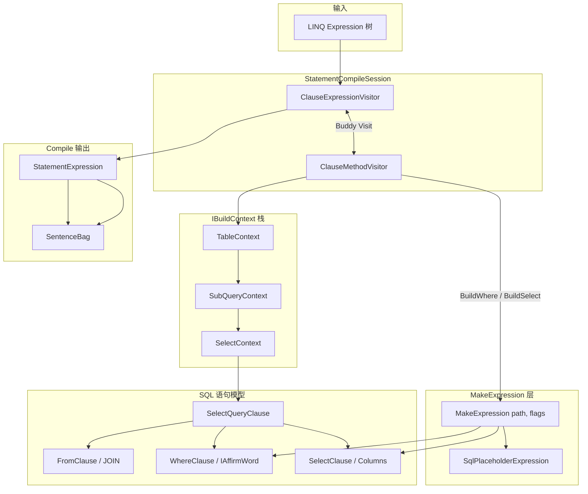

# Ext LINQ 编译层开发指南：双访问器与 MakeExpression

> **受众**：需要修改 Ext LINQ 编译逻辑、新增算子、排查 Where/Select/Join 编译问题的开发人员。  
> **前置阅读**：[`src/README.md`](../src/README.md)（三层架构）、[`ClauseCompiler-构建SentenceBag解析.md`](ClauseCompiler-构建SentenceBag解析.md)（Compile → SentenceBag）。  
> **更新日期**：2026-06-06

---

## 1. 编译层在整体中的位置

Ext LINQ 把 **Compile（编译）** 与 **Execute（执行）** 彻底分开：

```
用户 LINQ 表达式树 (System.Linq.Expressions)
        │
        ▼  Layer 1 — Compile（本文重点）
   SentenceBag + SelectQueryClause（SQL 语句结构 / Statement 模型）
        │
        ▼  Layer 2 — Execute（另见 EntityVisitCompiler-执行过程解析.md）
   ClauseTranslateVisitor → SQLBuilder → query<T>()
```

**Layer 1 的职责**：把 `Expression` 翻译成 **Statement 模型**（以 `SelectQueryClause` 为核心），不生成 SQL 字符串，也不执行查询。

| 产物 | 类型 | 含义 |
|------|------|------|
| `SelectQueryClause` | `mooSQL.data.model` | SELECT 语句 AST：From / Where / Join / GroupBy / OrderBy / Select 子句 |
| `IBuildContext` | `buildContext/*` | 维护上述 AST 与当前序列的投影、别名、父子关系 |
| `StatementExpression` | 编译链上的扩展表达式节点 | 把成功的 `IBuildContext` 折叠回表达式树 |
| `SentenceBag<T>` | 编译最终输出 | Statement + 参数 + NavColumns 等元数据 |

---

## 2. Layer 1 总流程

```
QueryMate.GetQuery<T>()
  → ClauseCompiler.Build<T>()
       → new ClauseSqlTranslator(...)          // SQL 语义引擎 + 参数上下文
       → new BuildInfo(..., new SelectQueryClause())
       → StatementCompileSession.Create(...)
            ├─ ClauseCompileContext            // 共享编译状态
            ├─ ClauseMethodVisitor  (Buddy) ←→ ClauseExpressionVisitor
            └─ VisitRoot(expression)           // 始终从 ExpressionVisitor 进入
       → StatementExpression
       → ClauseCompileContext.ToSentenceBag<T>()
```

入口代码：

```csharp
// ext/src/linq/translator/ClauseCompiler.cs
var buildInfo = new BuildInfo((IBuildContext?)null, expression, new SelectQueryClause());
var session = StatementCompileSession.Create(builder, buildInfo);
var resultExpr = session.VisitRoot(expression);
// resultExpr is StatementExpression → ToSentenceBag
```

---

## 3. 双访问器（Buddy）模型

### 3.1 为什么需要两个 Visitor

LINQ 表达式树里有两类节点需要不同处理方式：

| 节点类型 | 典型例子 | 由谁处理 |
|----------|----------|----------|
| **Expression 节点** | `Constant`（Queryable 根）、`ContextRef`、`Lambda` | `ClauseExpressionVisitor` |
| **MethodCall 节点** | `.Where()`、`.Select()`、`.Join()` | `ClauseMethodVisitor`（经 `CallUntil` 强类型分发） |

若用一个 Visitor 承担全部职责，MethodCall 分发与序列根识别会耦合成巨型 switch。双访问器对齐 Fast LINQ 的 `FastExpressionTranslatVisitor` + `FastMethodVisitor` 形态。

### 3.2 Buddy 互绑

```csharp
// ext/src/linq/translator/StatementCompileSession.cs
var methodVisitor = new ClauseMethodVisitor { Context = context };
var expressionVisitor = new ClauseExpressionVisitor(methodVisitor) { Context = context };
methodVisitor.Buddy = expressionVisitor;
```

- **ExpressionVisitor** 是 **根入口**（`VisitRoot` 只调它）。
- **MethodVisitor** 处理算子时，需要 **先编译子序列**（`Arguments[0]`），通过 `Buddy.Visit(...)` 回调 ExpressionVisitor。
- 这形成 **递归的双向协作**，而非两条独立管道。

### 3.3 成功产物的回传机制

编译成功后，算子不会直接返回 `IBuildContext`，而是包装为表达式树上的节点，便于 Buddy 递归：

```
ClauseMethodVisitor.VisitWhere(...)
  → BuildWhere(...) 得到 IBuildContext
  → ToStatementCallOr(method, context)
       → Context.StatementResult = StatementExpression.FromBuildContext(context)
       → return new StatementCall { Value = StatementResult }
  → ClauseExpressionVisitor.VisitMethodCall 收到 StatementCall.Value
       → return StatementExpression   // 折叠进表达式树
```

关键类型：

| 类型 | 作用 |
|------|------|
| `StatementExpression` | 携带 `IBuildContext`；`ToStatement()` → `BaseSentence` |
| `StatementCall` | MethodVisitor 向 ExpressionVisitor 回传的载体 |
| `ClauseCompileContext.StatementResult` | 当前编译成功槽（每个算子成功后写入） |

---

## 4. Expression → SQL 模型：完整走读

以典型查询为例：

```csharp
db.useQueryable<User>().Where(u => u.Age > 20)
```

表达式树（由外向内）：

```
MethodCallQueryable.Where(
  source: Constant(EntityQueryable<User>),
  predicate: Lambda(u => u.Age > 20)
)
```

### 步骤 0：会话创建

`StatementCompileSession.Create` 调用 `ExpandToRoot` 必要时展开包装，创建空的 `SelectQueryClause` 作为根 `BuildInfo.SelectQuery`。

### 步骤 1：VisitRoot 进入 ExpressionVisitor

`VisitMethodCall(Where)`：

1. `CallUntil.CreateCall(node)` → `WhereCall`
2. `WhereCall.Accept(ClauseMethodVisitor)` → `VisitWhere`

### 步骤 2：MethodVisitor 解析子序列 — ResolveSourceContext

```csharp
// ext/src/linq/translator/ClauseMethodVisitor.Statement.cs
protected IBuildContext? ResolveSourceContext(MethodCallExpression methodCall, BuildInfo buildInfo, ...)
{
    // 优先：Buddy 访问 Arguments[0]
    if (Buddy != null)
    {
        var visited = Buddy.Visit(methodCall.Arguments[0]);
        if (visited is StatementExpression stmt)
            return stmt.BuildContext;
    }
    // 回退：嵌套 TryBuildSequence（子查询等）
    var sequenceResult = Context.Translator.TryBuildSequence(sequenceBuildInfo);
    return sequenceResult.BuildContext;
}
```

对 `Where` 的 `Arguments[0]` = `EntityQueryable<User>` 常量：

### 步骤 3：ExpressionVisitor 识别序列根

`VisitConstant` → `TryVisitEntityRoot`：

```csharp
// ext/src/linq/translator/ClauseExpressionVisitor.EntityRoot.cs
var tableContext = new TableContext(builder, buildInfo, entityType);
// TableContext 构造时：SelectQuery.From 加入实体表 TableWord
return BuildSequenceResult.FromContext(tableContext);
```

此时 **SQL 模型** 已有：

```
SelectQueryClause
  From.Tables  → [ moo_t_user 的 TableWord ]
  Where        → （空）
  Select       → （默认 * / 待投影）
```

`TableContext` 即第一个 `IBuildContext`，其 `SelectQuery` 指针指向上述 AST。

### 步骤 4：MethodVisitor 应用 Where 算子

```csharp
// ext/src/linq/translator/ClauseMethodVisitor.Where.cs
var condition = methodCall.Arguments[1].UnwrapLambda();  // u => u.Age > 20
var result = Context.Translator.BuildWhere(..., sequence, condition, ...);
return ToStatementCallOr(method, result);
```

`BuildWhere`（`ClauseSqlTranslator`）内部：

1. 必要时包 `SubQueryContext`（Distinct/Take/Skip 等场景）
2. `SequenceHelper.PrepareBody` 把 Lambda 参数 `u` 绑定到 `sequence` 的别名
3. `ClausePredicateVisitor.BuildSearchCondition` 解析 `u.Age > 20`
4. 将 `SearchConditionWord` 写入 `SelectQuery.Where`

**此时 SQL 模型变为**：

```
SelectQueryClause
  From  → [ user 表 ]
  Where → SearchConditionWord( age > 20 )   // IAffirmWord / IExpWord 树
```

### 步骤 5：折叠为 StatementExpression → SentenceBag

`VisitWhere` 返回 `StatementCall` → ExpressionVisitor 得到 `StatementExpression(TableContext/SubQueryContext)`。

`ClauseCompiler.Compile` 末尾：

```csharp
session.Context.ToSentenceBag<T>(stmt, expression);
// stmt.ToStatement() → buildContext.GetResultStatement() → SelectQueryClause 包装为 BaseSentence
```

---

## 5. IBuildContext 与 SelectQueryClause（SQL 模型）

### 5.1 IBuildContext 是什么

`IBuildContext` 是 **「当前 LINQ 序列段」的编译环境**：

```csharp
// ext/src/linq/src/linq/builder/interfaces/IBuildContext.cs
internal interface IBuildContext
{
    ClauseSqlTranslator Builder { get; }
    SelectQueryClause   SelectQuery { get; }   // ★ 关联的 SQL 语句 AST
    Type                ElementType { get; }   // 序列元素类型 User / DTO / anonymous
    Expression?         Expression { get; }    // 对应的 LINQ 子表达式
    IBuildContext?      Parent { get; set; }

    Expression MakeExpression(Expression path, ProjectFlags flags);
    BaseSentence GetResultStatement();
    // ...
}
```

每个 LINQ 算子通常 **新建或包装** 一个 Context，在 `SelectQuery` 上追加语义：

| Context | 算子 | 对 SelectQueryClause 的主要写入 |
|---------|------|--------------------------------|
| `TableContext` | 根 `useQueryable<T>()` | `From` 加表 |
| `SubQueryContext` | Where 需要子查询包装 | 嵌套 SELECT |
| `SelectContext` | `.Select(...)` | `Select.Columns` 投影 |
| `GroupByContext` | `.GroupBy(...)` | `GroupBy` + 聚合 |
| `PassThroughContext` | OrderBy/Take 等 | `OrderBy` / `Select.TakeValue` |
| `MergeContext` | `.Merge()` | MERGE 语句结构 |

### 5.2 SelectQueryClause 结构

定义于 Pure 层 `pure/src/ado/SQL/define/selects/SelectQueryClause.cs`：

```
SelectQueryClause
├── Select   (SelectClause)      — 列、DISTINCT、TOP/TAKE/SKIP
├── From     (FromClause)         — 表、JOIN 链
├── Where    (WhereClause)        — SearchConditionWord
├── GroupBy  (GroupByClause)
├── Having   (HavingClause)
└── OrderBy  (OrderByClause)
```

子句内的条件/表达式节点类型为 **`IExpWord` / `IAffirmWord`**（Pure SQL AST），不是字符串。  
Layer 1 编译结束时，这些树已完整；Layer 2 的 `ClauseTranslateVisitor` 再将其 **灌入 `SQLBuilder`** 生成方言 SQL。

### 5.3 BuildInfo

`BuildInfo` 是 **一次 Visit 的输入快照**（表达式 + 共享/独立的 SelectQuery + 父 Context）：

```csharp
// ext/src/linq/src/linq/builder/buildContext/BuildInfo.cs
internal sealed class BuildInfo
{
    public IBuildContext? Parent { get; set; }
    public Expression     Expression { get; set; }
    public SelectQueryClause SelectQuery { get; set; }
    public bool IsSubQuery => Parent != null;
    // IsTest, IsAggregation, JoinType ...
}
```

---

## 6. MakeExpression：Lambda 路径解析引擎

### 6.1 含义

`MakeExpression` 负责回答：

> **在当前 IBuildContext 下，Lambda 里的某个表达式片段（path）对应 SQL 模型里的什么？**

它 **不直接产出 SQL 字符串**，而是产出 **可继续编译的中间表达式**，常见结果：

- `SqlPlaceholderExpression` — 绑定到 `SelectQuery` 中某一列/表达式的占位符
- `ContextRefExpression` — 指向某个 Context 的根引用
- `SqlErrorExpression` — 无法翻译

### 6.2 两层 API

**总调度**（`ClauseSqlTranslator`）：

```csharp
// ext/src/linq/src/linq/builder/clauseSqlTranslator/ClauseSqlTranslator.SqlBuilder.MakeExpression.cs
public Expression MakeExpression(IBuildContext? forContext, Expression path, ProjectFlags flags)
```

职责：沿 `MemberExpression` 链向上找 `ContextRefExpression` → 切换到正确的 Context → 递归 → 处理关联/子查询/可空类型 → 缓存。

**上下文实现**（`IBuildContext`）：

```csharp
Expression MakeExpression(Expression path, ProjectFlags flags);
```

例如 `TableContext` 遇到 `u.Name`：

```csharp
// ext/src/linq/src/linq/builder/buildContext/TableContext.cs
var sql = GetField(member, false);   // 实体列 → IExpWord
return ClauseSqlTranslator.CreatePlaceholder(this, sql, path, trackingPath: path);
```

### 6.3 ProjectFlags（解析意图）

```csharp
// ext/src/linq/src/linq/builder/enums/ProjectFlags.cs
enum ProjectFlags
{
    SQL = 0x01,              // 产出可下推 SQL 的占位符
    Expression = 0x02,       // 构建 LINQ 表达式树（如完整实体）
    Root = 0x04,             // 只解析根，不展开字段
    ExtractProjection = 0x08,// Select 投影提取
    AssociationRoot = 0x80,  // 关联导航
    Table = 0x100,           // 查找表引用
    Test = 0x40,             // 仅验证可翻译性
    Keys = 0x20,             // 只要键字段
    // ...
}
```

同一 `u.Name`，`ProjectFlags.SQL` 下 → 列占位符；`ProjectFlags.Table` 下 → 可能只返回 `ContextRefExpression`。

### 6.4 与 ConvertToSql / BuildSqlExpression 的关系

| 方法 | 层级 | 作用 |
|------|------|------|
| **`MakeExpression`** | 表达式树 | 路径 → 上下文绑定的中间节点 |
| **`BuildSqlExpression`** | 表达式树 | `BuildVisitor` 进一步构建 SQL 表达式 |
| **`ConvertToSql`** | SQL AST | 中间节点 → **`IExpWord`**，写入 Statement |

调用链（Where 谓词 `u.Age > 20`）：

```
BuildWhere
  → ClausePredicateVisitor.BuildSearchCondition(expr)
       → ClauseSqlTranslator.BuildSearchCondition
            → ConvertPredicate / ConvertCompareExpression
                 → ConvertToSql(sequence, u.Age)
                      → MakeExpression(context, u.Age, ProjectFlags.SQL)   // ★ 先解析路径
                      → 列占位符 → IExpWord
                 → ConvertToSql(..., 20)
                 → 合成 IAffirmWord(>)
  → SelectQuery.Where.ConcatSearchCondition(sc)
```

### 6.5 Select 中的 MakeExpression

`.Select(u => new { u.Name, u.Age })` 在 `VisitSelect` 里也会调用：

```csharp
// ext/src/linq/translator/ClauseMethodVisitor.Select.cs
_ = Context.Translator.MakeExpression(sequence,
    new ContextRefExpression(sequence.ElementType, sequence),
    ProjectFlags.ExtractProjection);
var context = new SelectContext(..., body, sequence, ...);
```

`SelectContext` 在 `CompleteColumns` / `MakeExpression` 中把投影 Lambda 的每个成员解析为 `Select.Columns` 条目。

---

## 7. 算子编译模式（开发者模板）

每个 LINQ 算子在 `ClauseMethodVisitor.*.cs` 中遵循同一模式：

```
VisitXxx(MethodCall method)
  1. CanBuildXxx(methodCall)           // 静态守卫
  2. buildInfo = Context.CreateBuildInfo(methodCall)
  3. sequence = ResolveSourceContext(methodCall, buildInfo)   // Buddy 解析 Arguments[0]
  4. 调用 ClauseSqlTranslator 辅助 或 直接构造 XxxContext
  5. （Context 内或 Translator 内）MakeExpression / ConvertToSql 解析 Lambda
  6. return ToStatementCallOr(method, resultContext)
```

| 算子 | partial 文件 | SQL 模型写入点 |
|------|-------------|----------------|
| Where / Having | `ClauseMethodVisitor.Where.cs` | `SelectQuery.Where` / `Having` |
| Select | `ClauseMethodVisitor.Select.cs` | `Select.Columns` |
| OrderBy | `ClauseMethodVisitor.OrderBy.cs` | `OrderBy.Items` |
| Take / Skip | `ClauseMethodVisitor.TakeSkip.cs` | `Select.TakeValue` / `SkipValue` |
| Join | `ClauseMethodVisitor.Join.cs` | `From` JOIN 链 |
| GroupBy | `ClauseMethodVisitor.GroupBy.cs` | `GroupBy` + 子查询 Context |

**新增算子步骤**：

1. 在 `pure/src/ado/call/methods/` 确保有对应 `XxxCall`（若需 CallUntil 分发）
2. 新建 `ClauseMethodVisitor.Xxx.cs`，实现 `VisitXxx`
3. 如需新状态，在 `buildContext/` 添加 `XxxContext`
4. 复杂 Lambda 解析复用 `ClauseSqlTranslator.MakeExpression` / `ConvertToSql`
5. 在 `Tests/TestLinq` 添加编译或 SQLite 执行测试

---

## 8. 端到端数据流图



---

## 9. 与 Layer 2（Execute）的衔接

Compile 结束后 **不做** 以下事情：

- 不调用 `SQLBuilder.toSelect()`
- 不打开数据库连接
- 不物化 `List<T>`

这些在 `SentenceExecutor` 中完成：`Statement` → `ClauseTranslateVisitor` → `SQLBuilder.query<T>()`。

调试时区分两层：

```csharp
// Layer 1：只看 Statement 结构
var bag = QueryMate.GetQuery<User>(db, ref expr, out _);
var sq = bag.Sentences[0].Statement.SelectQuery;
// sq.Where / sq.From / sq.OrderBy ...

// 公开 API：编译为 SqlPlan（不执行）
var plan = LinqStatementCompiler.Compile(db, queryable.Expression);
```

---

## 10. 常见问题

### Q1：`ResolveSourceContext` 返回 null？

- Buddy 未能把 `Arguments[0]` 编译成 `StatementExpression`（根未识别、算子未注册）
- 检查 `ClauseExpressionVisitor.*.cs` 是否覆盖该根类型
- 检查 `CallUntil` 是否生成对应 `XxxCall`

### Q2：Where 编译 NullReference / SqlError？

- 谓词路径 `MakeExpression` 失败（成员未映射、不支持的 MethodCall）
- 查 `Expressions.Members` 是否初始化（`_commonMembers` → `LoadMembers()`）
- 用 `ProjectFlags.Test` 在 `BuildInfo.IsTest` 路径验证

### Q3：Statement 有了但 SQL 不对？

- 问题可能在 Layer 2：`ClauseTranslateVisitor` 或方言
- 先用 `SentenceExecutor.GetSqlText` / `LinqStatementCompiler` 对比 Statement 与 SQL

### Q4：Modify 应改哪个文件？

| 改什么 | 去哪 |
|--------|------|
| 新增 LINQ 算子 | `ClauseMethodVisitor.Xxx.cs` + 可选 `buildContext/XxxContext.cs` |
| Lambda 成员 → 列 | `TableContext.MakeExpression` / `ClauseSqlTranslator.MakeExpression` |
| 谓词 / Like / InList | `ClausePredicateVisitor` + `ClauseSqlTranslator.SqlBuilder.Predicate.cs` |
| 关联导航 | `MakeExpression` 中 `TryCreateAssociation` |
| SQL 方言差异 | Pure 层 `ClauseTranslateVisitor` / `Dialect`（非编译层） |

---

## 11. 关键源文件索引

| 主题 | 路径 |
|------|------|
| 编译入口 | `ext/src/linq/translator/ClauseCompiler.cs` |
| 双访问器会话 | `ext/src/linq/translator/StatementCompileSession.cs` |
| 表达式 Visitor | `ext/src/linq/translator/ClauseExpressionVisitor.cs` + `ClauseExpressionVisitor.*.cs` |
| 算子 Visitor | `ext/src/linq/translator/ClauseMethodVisitor*.cs` |
| 子序列解析 | `ext/src/linq/translator/ClauseMethodVisitor.Statement.cs` |
| 编译共享状态 | `ext/src/linq/translator/ClauseCompileContext.cs` |
| 成功产物节点 | `ext/src/linq/src/linq/expressons/exps/StatementExpression.cs` |
| SQL 语义引擎 | `ext/src/linq/src/linq/builder/clauseSqlTranslator/` |
| MakeExpression | `.../ClauseSqlTranslator.SqlBuilder.MakeExpression.cs` |
| ConvertToSql | `.../ClauseSqlTranslator.SqlBuilder.BuildExpression.cs` |
| IBuildContext | `ext/src/linq/src/linq/builder/buildContext/` |
| SelectQuery AST | `pure/src/ado/SQL/define/selects/SelectQueryClause.cs` |
| 谓词扩展 | `ext/src/linq/translator/ClausePredicateVisitor.cs` |

---

## 12. 相关文档

| 文档 | 内容 |
|------|------|
| [`LINQ全景分析与项目对比.md`](../LINQ全景分析与项目对比.md) | Fast / Ext 双轨、规模、测试基线 |
| [`双访问器对齐FastLinq-迁移清单.md`](../双访问器对齐FastLinq-迁移清单.md) | 迁移 Phase A～H |
| [`ClauseCompiler-构建SentenceBag解析.md`](ClauseCompiler-构建SentenceBag解析.md) | Compile 收尾、TryBuildSequence |
| [`EntityVisitCompiler-执行过程解析.md`](EntityVisitCompiler-执行过程解析.md) | Layer 2 Execute |
